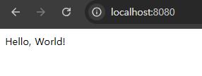

# (예제) 백엔드(Spring Boot) 서버를 파드(Pod)로 띄워보기

---

## 1. 스프링부트 프로젝트 작성

### 1.1 프로젝트 생성
- Spring Boot 프로젝트 생성(spring initializr)
- 의존성 : spring-boot-starter-web


### 1.2 API 작성
```kotlin
@RestController
class AppController {
    
    @GetMapping("/")
    fun hello() = "Hello, World!"
}
```

### 1.3 실행 확인


- `http://localhost:8080/` 로 요청을 보내보면 성공적으로 문자열 응답이 오는 것을 확인

### 1.4 빌드
```shell
./gradlew clean build
```

### 1.5 빌드 결과물 확인
```shell
$ cd build/libs

$ ls -al
total 25228
drwxr-xr-x 1 ttasjwi 197121        0  2월 16 13:26 ./
drwxr-xr-x 1 ttasjwi 197121        0  2월 16 13:26 ../
-rw-r--r-- 1 ttasjwi 197121 25823971  2월 16 13:26 demo-0.0.1-SNAPSHOT.jar
-rw-r--r-- 1 ttasjwi 197121     3189  2월 16 13:26 demo-0.0.1-SNAPSHOT-plain.jar
```

---

## 2. 도커 이미지 생성

### 2.1 Dockerfile 작성
```Dockerfile
FROM amazoncorretto:21-alpine3.20-jdk
COPY build/libs/*SNAPSHOT.jar app.jar

ENTRYPOINT ["java", "-jar", "app.jar"]
```
- 앞에서 jar 파일 빌드를 해놔야한다.

### 2.2 Dockerfile 을 기반으로 도커 이미지 빌드
```shell
docker build -t spring-server .
```

### 2.3 도커 이미지 확인
```shell
docker image ls
```

---

## 3. 파드 매니페스트 파일 작성
**spring-pod.yaml**
```yaml
apiVersion: v1
kind: Pod
metadata:
  name: spring-pod
spec:
  containers:
    - name: spring-container
      image: spring-server
      ports:
        - containerPort: 8080
```

---

## 4. 매니페스트 파일을 기반으로 파드(Pod) 생성하기
```shell
kubectl apply -f spring-pod.yaml
```

---

## 5. 파드 생성 확인
```shell
$ kubectl get pods
NAME         READY   STATUS         RESTARTS   AGE
spring-pod   0/1     ErrImagePull   0          12s

$ kubectl get pods
NAME         READY   STATUS             RESTARTS   AGE
spring-pod   0/1     ImagePullBackOff   0          20s

$ docker image ls
REPOSITORY                                TAG                                                                           IMAGE ID       CREATED          SIZE
spring-server                             latest                                                                        ae196f6d08c0   16 minutes ago   342MB
```
- `STATUS` 를 보면 `ImagePullBackOff` 라고 떠있다. 
  - 이미지를 Pull 받아오는 과정 중에 문제가 생긴 것이다.
- `docker image ls` 명령어를 입력해서 이미지를 확인해봤더니 `spring-server` 이미지가 정상적으로 있다. 그런데 왜 `ImagePullBackOff`라는 에러가 떴을까?
- 이는 쿠버네티스의 이미지 풀 정책(imagePullPolicy) 때문인데 뒤에서 이 부분을 다루겠다.

---

