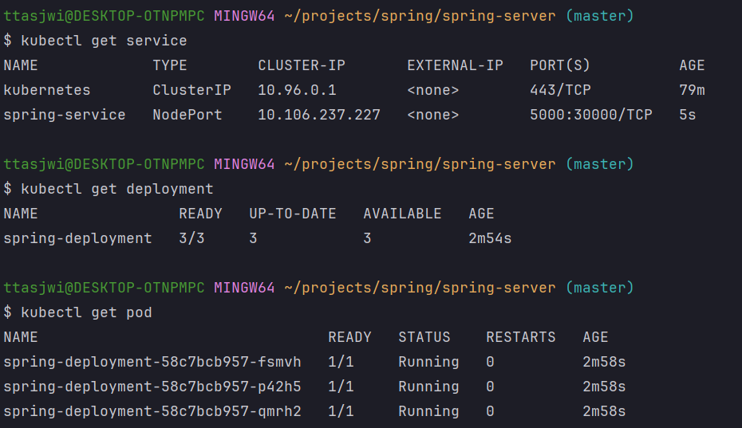

# (예제) 백엔드(Spring Boot) 서버에 환경변수 등록해 사용하기

---

## 1. 백엔드(Spring Boot) 서버에 환경변수 등록해 사용하기

### 1.1 프로젝트 생성
- 프로젝트명: spring-server
- 의존성
  - Spring Web

### 1.2 프로퍼티 클래스 스캔 활성화
```kotlin
@ConfigurationPropertiesScan
@SpringBootApplication
class SpringServerApplication

fun main(args: Array<String>) {
    runApplication<SpringServerApplication>(*args)
}
```

### 1.3 컨트롤러 작성
```kotlin
@RestController
class AppController(
    private val accountProperties: AccountPasswordProperties
) {

    @GetMapping("/")
    fun home(): String {
        return "My Account : (username=${accountProperties.username}, password=${accountProperties.password})"
    }
}

@ConfigurationProperties(prefix ="security")
class AccountPasswordProperties(
    val username: String = "default",
    val password: String = "default",
)
```

### 1.4 프로젝트 실행


### 1.5 프로젝트 빌드
```shell
./gradlew clean build
```

---

## 2. 도커 이미지 빌드

### 2.1 `Dockerfile`
```Dockerfile
FROM amazoncorretto:21-alpine3.20-jdk
COPY build/libs/*SNAPSHOT.jar app.jar

ENTRYPOINT ["java", "-jar", "app.jar"]
```

### 2.2 도커 이미지 빌드
```shell
docker build -t spring-server .
```

### 2.3 이미지 확인
```shell
docker image ls "spring-server"
```

---

## 3. 디플로이먼트 생성
### 3.1 매니페스트 파일 작성
```yaml
apiVersion: apps/v1
kind: Deployment
metadata:
  name: spring-deployment

spec:
  replicas: 3
  selector:
    matchLabels:
      app: backend-app

  # 정의할 Pod
  template:
    metadata:
      labels:
        app: backend-app
    spec:
      containers:
        - name: spring-container
          image: spring-server
          imagePullPolicy: IfNotPresent
          ports:
            - containerPort: 8080
          env: # 환경변수 등록
            - name: SECURITY_USERNAME
              value: ttasjwi
            - name: SECURITY_PASSWORD
              value: pwd1234
```

### 3.2 디플로이먼트 생성
```shell
kubectl apply -f spring-deployment.yaml
```

---

## 4. 서비스 생성

### 4.1 매니페스트 파일(`spring-service.yaml`) 작성
```yaml
apiVersion: v1
kind: Service

metadata:
  name: spring-service

# Service 세부 정보
spec:
  type: NodePort
  selector:
    app: backend-app
  ports:
    - protocol: TCP
      targetPort: 8080 # 매핑하기 위한 파트의 포트 번호
      port: 5000 # 쿠버네티스 내부에서 Service 에 접속하기 위한 포트 번호(Service)
      nodePort: 30000 # 외부에서 사용자들이 접근하게 될 포트
```

### 4.2 서비스 생성
```shell
kubectl apply -f spring-service.yaml
```

### 4.3 확인
```shell
kubectl get service
```


---

## 5. 환경변수가 잘 적용됐는 지 확인해보기

### 5.1 `http://localhost:30000/` 으로 접속해보기


### 5.2 파드 내부로 접속해서 확인해보기
```shell
kubectl get pods # 파드명 확인

# kubectl exec -it [파드명] -- bash(sh) : 파드 내부로 접속하기
kubectl exec -it spring-deployment-58c7bcb957-fsmvh -- bash

# env : 환경변수 조회
env
```


---
