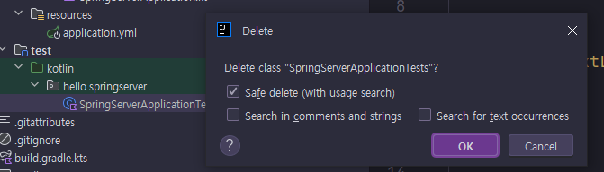
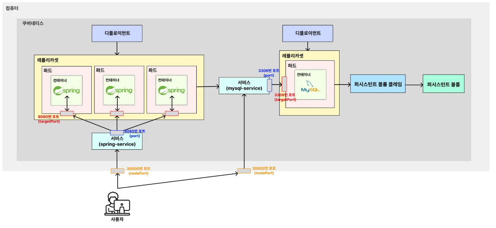

# (예제) 백엔드(Spring Boot) 서버와 MySQL 연동하기

---

### 1. 스프링 프로젝트 구성

#### 1.1 프로젝트 생성
- 프로젝트명: spring-server
- 의존성
  - Spring Web
  - Spring Data JPA
  - MySQL

#### 1.2 설정파일 작성
**application.yml**
```yaml
spring:
  datasource:
    url: jdbc:mysql://${DB_HOST}:${DB_PORT}/${DB_NAME}
    username: ${DB_USERNAME}
    password: ${DB_PASSWORD}
    driver-class-name: com.mysql.cj.jdbc.Driver
```

#### 1.3 컨트롤러 작성
```kotlin
@RestController
class AppController {

    @GetMapping("/")
    fun home(): String {
        return "Hello, World!"
    }
}
```

#### 1.4 불필요한 테스트코드 제거


- 테스트코드 실행 시 MySQL 설정을 끌어와서 실행되는데, 실습 편의를 위해 테스트코드를 제거

#### 1.5 프로젝트 빌드
```shell
./gradlew clean build
```

---

### 2. 컨테이너 이미지 빌드

#### 2.1 Dockerfile
```Dockerfile
FROM amazoncorretto:21-alpine3.20-jdk
COPY build/libs/*SNAPSHOT.jar app.jar

ENTRYPOINT ["java", "-jar", "app.jar"]
```

#### 2.2 이미지 빌드
```shell
docker build -t spring-server .
```

---

### 3. 스프링 서버를 띄우기 위한 매니페스트 파일 작성

#### 3.1 컨피그맵(`spring-config.yaml`)
```yaml
apiVersion: v1
kind: ConfigMap

# ConfigMap 기본 정보
metadata:
  name: spring-config # ConfigMap 정보

# Key, Value 형식으로 설정값 저장
data:
  db-host: "mysql-service"
  db-port: "3306"
  db-name: "kub_practice"
```
- 호스트를 "localhost" 와 같이 작성할 필요 없이, 쿠버네티스 내부에서 사용하는 "mysql-service" 이름으로 기입해도 된다.
- db-port 의 3306 은 쿠버네티스 서비스 포트를 가리킨다.


#### 3.2 시크릿(`spring-secret.yaml`)
```yaml
apiVersion: v1
kind: Secret

# Secret 기본 정보
metadata:
  name: spring-secret # Secret 이름

# Key, Value 형식으로 값 저장
stringData:
  db-username: "root"
  db-password: "db1004"
```

#### 3.3 디플로이먼트(`spring-deployment.yaml`)
```yaml
apiVersion: apps/v1
kind: Deployment

# Deployment 기본 정보
metadata:
  name: spring-deployment # Deployment 이름

# Deployment 세부 정보
spec:
  replicas: 3 # 생성할 파드의 복제본 개수
  selector:
    matchLabels:
      app: backend-app # 아래에서 정의한 Pod 중 'app: backend-app' 이라는 값을 가진 파드를 선택

  # 배포할 Pod 정의
  template:
    metadata:
      labels: # 레이블 (= 카테고리)
        app: backend-app
    spec:
      containers:
        - name: spring-container # 컨테이너 이름
          image: spring-server # 컨테이너를 생성할 때 사용할 이미지
          imagePullPolicy: IfNotPresent # 로컬에서 이미지를 먼저 가져온다. 없으면 레지스트리에서 가져온다.
          ports:
            - containerPort: 8080 # 컨테이너에서 사용할 포트번호를 명시적으로 표현
          env:
            - name: DB_HOST
              valueFrom:
                configMapKeyRef:
                  name: spring-config
                  key: db-host
            - name: DB_PORT
              valueFrom:
                configMapKeyRef:
                  name: spring-config
                  key: db-port
            - name: DB_NAME
              valueFrom:
                configMapKeyRef:
                  name: spring-config
                  key: db-name
            - name: DB_USERNAME
              valueFrom:
                secretKeyRef:
                  name: spring-secret
                  key: db-username
            - name: DB_PASSWORD
              valueFrom:
                secretKeyRef:
                  name: spring-secret
                  key: db-password
```

#### 3.4 서비스(`spring-service.yaml`)
```yaml
apiVersion: v1
kind: Service

# Service 기본 정보
metadata:
  name: spring-service # Service 이름

# Service 세부 정보
spec:
  type: NodePort # Service의 종류
  selector:
    app: backend-app # 실행되고 있는 파드 중 'app: backend-app' 이라는 값을 가진 파드와 서비스를 연결
  ports:
    - protocol: TCP
      targetPort: 8080 # 매핑하기 위한 파드의 포트 번호
      port: 8080 # 쿠버네티스 내부에서 Service에 접속하기 위한 포트 번호 (Service)
      nodePort: 30000 # 외부에서 사용자들이 접근하게 될 포트 번호
```

---

### 4. 스프링 서버 관련 매니페스트 파일 실행하기
```shell
kubectl apply -f spring-config.yaml
kubectl apply -f spring-secret.yaml
kubectl apply -f spring-deployment.yaml
kubectl apply -f spring-service.yaml
```

---

### 5. MySQL 과 연결된 백엔드 서버가 잘 작동하는 지 확인하기


---

### 6. 그림으로 이해하기


---
