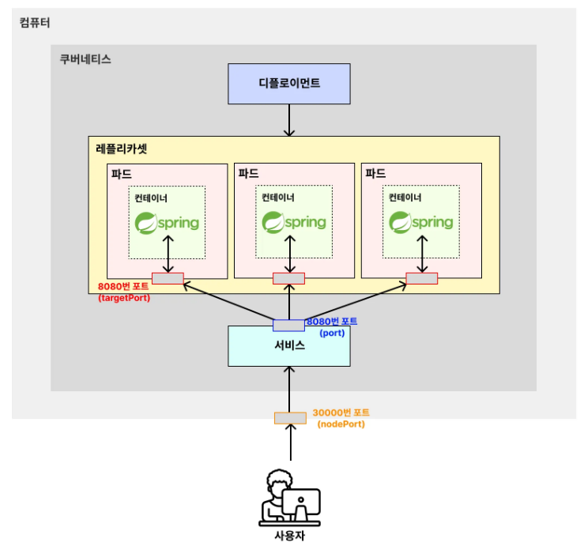
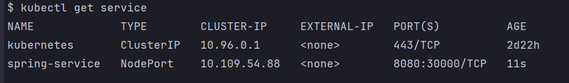

# (예제) 서비스(Service)를 활용해 백엔드(Spring Boot) 서버와 통신해보기
> 이전에 디플로이먼트를 활용해 백엔드 서버(Spring Boot) 3대를 띄웠다.  
> 하지만 디플로이먼트에 포함되어 있는 모든 파드에 골고루 요청을 분배하기 위해 서비스(Service)를 생성해야 한다.

---

### 서비스(Service)를 활용해 백엔드(Spring Boot)와 통신해보기
**서비스 매니페스트 파일(spring-service.yaml)**
```yaml
apiVersion: v1
kind: Service
metadata:
  name: spring-service # Service 이름
spec:
  type: NodePort # Service 종류
  selector:
    app: backend-app # 실행되고 있는 파드 중 'app: backend-app'이라는 값을 가진 파드와 서비스를 연결
  ports:
    - protocol: TCP # 서비스에 접속하기 위한 프로토콜
      port: 8080 # 쿠버네티스 내부에서 Service 에 접속하기 위한 포트 번호
      targetPort: 8080 # 매핑하기 위한 파드의 포트 번호
      nodePort: 30000 # 외부에서 사용자들이 접근하게 될 포트 번호
```
- 서비스의 종류
  - `NodePort`: 쿠버네티스 내부에서 해당 서비스에 접속하기 위한 포트를 열고, **외부에서 접속 가능**하도록 한다.
  - `ClusterIP` : 쿠버네티스 내부에서만 통신할 수 있는 IP 주소를 부여. 외부에서는 요청할 수 없다. (내부에서만 사용할 것들)
  - `LoadBalancer`: 외부의 로드밸런서(AWS의 로드밸런서 ELB 등)를 활용해 외부에서 접속할 수 있도록 연결한다.



---

### 매니페스트 파일을 기반으로 서비스(Service) 생성하기
```shell
kubectl apply -f spring-service.yaml
```

---

### 서비스가 생성됐는 지 확인
```shell
kubectl get service
```


---

### 잘 접속되는 지 확인


---
