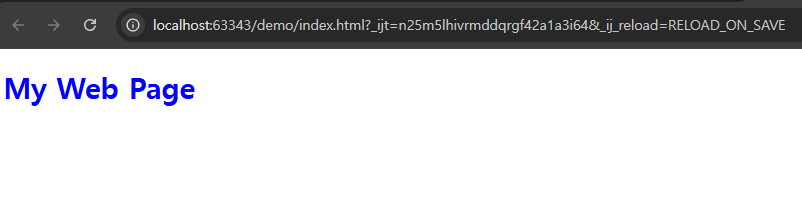
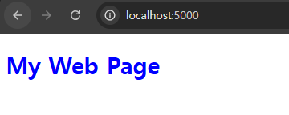

# (예제) 프론트엔드(HTML,CSS,Nginx) 서버를 파드(Pod)로 띄워보기

---


## 1. HTML, CSS 파일 만들기

### 1.1 `index.html`
```html
<!doctype html>
<html lang="ko">
<head>
    <meta charset="UTF-8">
    <title>Welcome</title>
    <link rel="stylesheet" href="style.css">
</head>
<body>
    <h1>My Web Page</h1>
</body>
</html>
```
- **주의**: Nginx의 기본 설정에 의하면 메인 페이지(첫 페이지)의 파일명을 index.html이라고 지어야 한다.

### 1.2 `style.css`
```css
h1 {
    color: blue;
}
```

### 1.3 브라우저에서 확인


---

## 2. 도커 이미지 생성

### 2.1 Dockerfile 작성
```Dockerfile
FROM nginx
COPY . /usr/share/nginx/html
```
- 참고: [nginx 도커 이미지](https://hub.docker.com/_/nginx)

### 2.2 Dockerfile 을 기반으로 도커 이미지 빌드
```shell
docker build -t my-web-server .
```

### 2.4 도커 이미지 확인
```shell
$ docker image ls
REPOSITORY                                TAG                                                                           IMAGE ID       CREATED          SIZE
my-web-server                             latest                                                                        ce9d820ed8b6   10 seconds ago   192MB  
```

---

## 3. 파드 매니페스트 파일 작성
**web-server-pod.yaml**
```yaml
apiVersion: v1
kind: Pod
metadata:
  name: web-server-pod

spec:
  containers:
    - name: web-server-container
      image: my-web-server
      ports:
        - containerPort: 80
      imagePullPolicy: IfNotPresent
```

---

## 4. 매니페스트 파일을 기반으로 파드(Pod) 생성하기
```shell
kubectl apply -f web-server-pod.yaml
```

---

## 5. 파드 생성 확인
```shell
$ kubectl get pods
NAME             READY   STATUS    RESTARTS   AGE
web-server-pod   1/1     Running   0          10s
```

---

## 6. 포트 포워딩으로 웹 서버가 실행됐는 지 확인
```shell
$ kubectl port-forward web-server-pod 5000:80
Forwarding from 127.0.0.1:5000 -> 80
Forwarding from [::1]:5000 -> 80
```


---

## 7. 파드 삭제
```shell
kubectl delete pod web-server-pod
```

---

