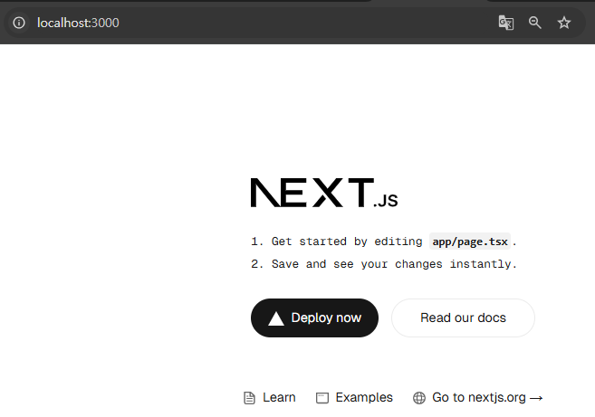

# (예제) 프론트엔드(Next.js) 서버를 파드(Pod)로 띄워보기

---

## 1. Next.js 프로젝트 작성

### 1.1 Next.js 프로젝트 생성
```shell
npx create-next-app@latest
```

### 1.2 Next.js 프로젝트 실행
```shell
npm run dev
```


---

## 2. 도커 이미지 생성

### 2.1 Dockerfile 작성
```Dockerfile
FROM node:20-alpine

WORKDIR /app

# 현 위치 파일들을 컨테이너의 /app 로 복사
COPY . .

RUN npm install

RUN npm run build

# 문서화 역할 (3000번 포트에서 실행됨 명시)
EXPOSE 3000

ENTRYPOINT [ "npm", "run", "start" ]
```

### 2.2 `.dockerignore`
```shell
node_modules
```
- 로컬의 `node_modules` 가 복사되지 않도록 함

### 2.3 Dockerfile 을 기반으로 도커 이미지 빌드
```shell
docker build -t next-server .
```

### 2.4 도커 이미지 확인
```shell
docker image ls
```

---

## 3. 파드 매니페스트 파일 작성
**next-pod.yaml**
```yaml
apiVersion: v1
kind: Pod
metadata:
  name: next-pod
spec:
  containers:
    - name: next-container
      image: next-server
      ports:
        - containerPort: 3000
      imagePullPolicy: IfNotPresent
```

---

## 4. 매니페스트 파일을 기반으로 파드(Pod) 생성하기
```shell
kubectl apply -f next-pod.yaml
```

---

## 5. 파드 생성 확인
```shell
$ kubectl get pods
NAME       READY   STATUS    RESTARTS   AGE
next-pod   1/1     Running   0          33s
```

---

## 6. 포트 포워딩으로 Next.js 서버가 실행됐는 지 확인
```shell
$ kubectl port-forward pod/nest-pod 3000:3000
Forwarding from 127.0.0.1:3000 -> 3000
Forwarding from [::1]:3000 -> 3000
```


---

## 7. 파드 삭제
```shell
kubectl delete pod next-pod
kutectl get pods
```

---
