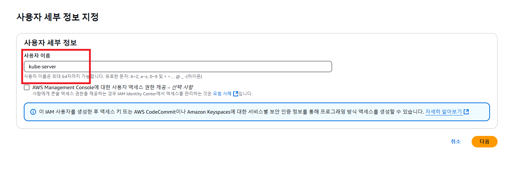
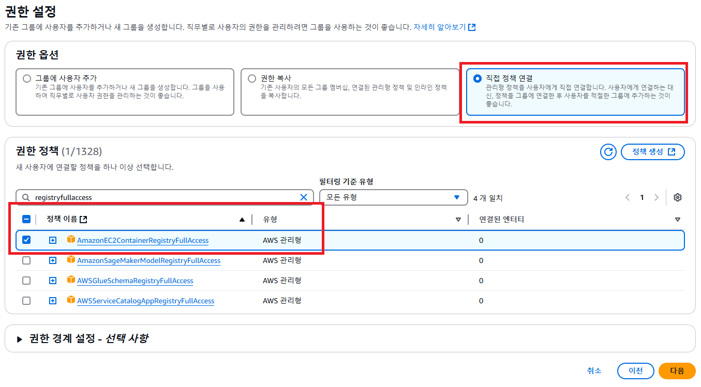
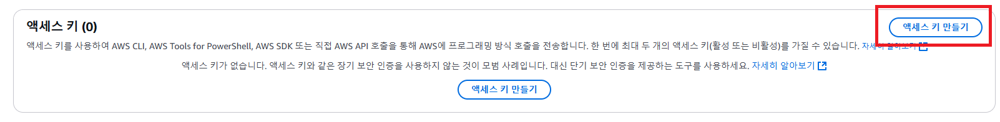
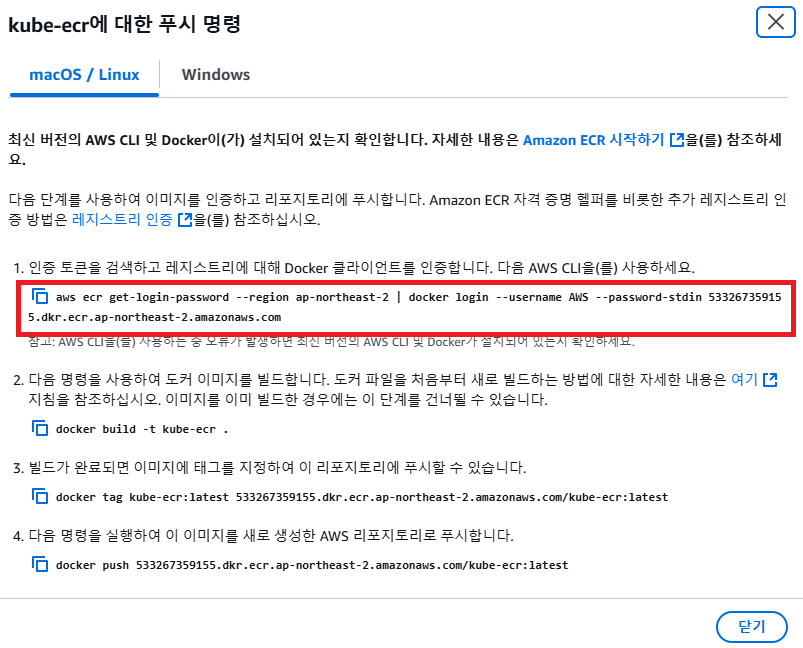

# EC2가 ECR로부터 이미지를 Pull 받아올 수 있게 권한 부여하기

---

### 1. EC2 에서 AWS CLI 설치
```shell
cd ~
sudo apt install unzip
curl "https://awscli.amazonaws.com/awscli-exe-linux-aarch64.zip" -o "awscliv2.zip"
unzip awscliv2.zip
sudo ./aws/install
aws --version # 잘 출력된다면 정상 설치된 상태
```
- Reference: [Installing or updating to the latest version of the AWS CLI](https://docs.aws.amazon.com/cli/latest/userguide/getting-started-install.html)

---

### 2. ECR에 접근할 IAM 사용자 만들기


- 사용자 생성(`kube-server`)



- AmazonEC2ContainerRegistryFullAccess 정책 연결
  - ECR에서 이미지를 풀링하기 위한 권한


---

### 3. ECR에 접근할 IAM 사용자 AccessKey 발급


- 액세스 키, 비밀 액세스 키는 잘 저장해둔다. (잃어버리지 말기)


---

### 4. EC2에서 AWS CLI 로 액세스 키 등록하기
```shell
$ aws configure

AWS Access Key ID [None]: <위에서 발급한 Key id>
AWS Secret Access Key [None]: <위에서 발급한 Secret Access Key>
Default region name [None]: ap-northeast-2
Default output format [None]:
```

---

### 5. EC2의 Docker 가 `kube-ecr` 에 접근할 수 있는 권한 얻기.


- ECR의 레포지토리 페이지로 들어가서 푸시 명령에서 첫 번째 명령어를 복사
- EC2에서 실행시켜야한다.
- 이렇게 하면 EC2의 Docker 클라이언트가 ECR에 접근할 수 있는 권한을 얻게 된다.

```shell
aws ecr get-login-password --region ap-northeast-2 | docker login --username AWS --password-stdin 533267359155.dkr.ecr.ap-northeast-2.amazonaws.com
```

---

### 6. EC2에서 쿠버네티스가 ECR 로부터 이미지를 받아올 때, 인증할 수 있도록 Secret 구성
```shell
kubectl create secret generic regcred --from-file=.dockerconfigjson=/home/ubuntu/.docker/config.json --type=kubernetes.io/dockerconfigjson
```
- 쿠버네티스에서 ECR 이미지를 Pull할 수 있도록 인증 정보를 저장하는 과정이다.
- Docker 인증 정보를 쿠버네티스 시크릿으로 저장
- 명령어 분석
  - `kubectl create secret generic regcred` 
    - regcred라는 이름의 쿠버네티스 시크릿을 생성
  - `--from-file=.dockerconfigjson=/home/ubuntu/.docker/config.json`
    - Docker 인증 정보(config.json)을 시크릿으로 변환
  - `--type=kubernetes.io/dockerconfigjson`
    - 시크릿 타입을 dockerconfigjson으로 지정 (쿠버네티스가 Docker 레지스트리 인증용으로 인식)

---

### 7. 잘 생성됐는 지 확인
```shell
kubectl get secret
```

---
