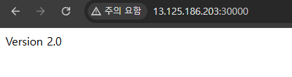

# EC2에 배포된 백엔드(Spring Boot) 서버 업데이트하기

---

### 1. 로컬 환경에서 Spring Boot 코드 수정하기
```kotlin
@RestController
class AppController {

    @GetMapping("/")
    fun home(): String {
        return "Version 2.0"
    }
}
```

---

### 2. 빌드 후, ECR 에 푸시
```shell
./gradlew clean build
docker build -t kube-ecr platform=linux/arm64 .

# [로컬 컴퓨터] ECR 접근권한 획득
aws ecr get-login-password --region ap-northeast-2 | docker login --username AWS --password-stdin 533267359155.dkr.ecr.ap-northeast-2.amazonaws.com

# 태그 적용
docker tag kube-ecr:latest 533267359155.dkr.ecr.ap-northeast-2.amazonaws.com/kube-ecr:2.0

docker push 533267359155.dkr.ecr.ap-northeast-2.amazonaws.com/kube-ecr:2.0
```

- ECR 푸시명령 참고

---

### 3. EC2의 매니페스트 파일 수정
**spring-deployment.yaml**
```yaml
# 생략

  template:
    metadata:
      labels: # 레이블 (= 카테고리)
        app: backend-app
    spec:
      containers:
        - name: spring-container # 컨테이너 이름
          image: 533267359155.dkr.ecr.ap-northeast-2.amazonaws.com/kube-ecr:2.0 # 여기 수정(이미지)
          ports:
# 생략
```

---

### 4. 수정한 매니페스트 파일을 기반으로 업데이트
```shell
kubectl apply -f spring-deployment.yaml
```

---

### 5. 업데이트 됐는 지 확인하기


---
