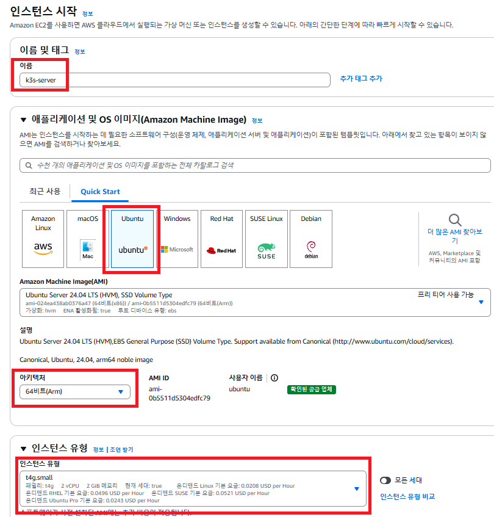

# EC2에서 도커,쿠버네티스 설치하기 (k3s)

---

### 설치 추천 사양
- [k3s Requirements](https://docs.k3s.io/installation/requirements)
  - k3s의 권장 설치 사양이 CPU 2 core, RAM 1 GB이다. 
  - 백엔드 서버도 같이 실행시킬 것을 고려해 AWS EC2 인스턴스는 t4g.small로 생성하자. 

---

### EC2 인스턴스 생성


- 이름 : k3s-server
- 이미지 : Ubuntu
- 아키텍처 : 64bit(Arm)
- 인스턴스 유형 : t4g.small


- rsa 키 페어 생성


- 보안그룹 추가
  - 유형: 사용자 지정 TCP
  - 포트범위 : 30000-30002
  - 원본 : 0.0.0.0/0


- 스토리지 구성 : 30GB

---

### Docker 설치
#### 1. 설치
```shell
sudo apt-get update && \
sudo apt-get install -y apt-transport-https ca-certificates curl software-properties-common && \
curl -fsSL https://download.docker.com/linux/ubuntu/gpg | sudo apt-key add - && \
sudo apt-key fingerprint 0EBFCD88 && \
sudo add-apt-repository "deb [arch=amd64] https://download.docker.com/linux/ubuntu $(lsb_release -cs) stable" && \
sudo apt-get update && \
sudo apt-get install -y docker-ce && \
sudo usermod -aG docker ubuntu && \
newgrp docker && \
sudo curl -L "https://github.com/docker/compose/releases/download/2.27.1/docker-compose-$(uname -s)-$(uname -m)" -o /usr/local/bin/docker-compose && \
sudo chmod +x /usr/local/bin/docker-compose && \
sudo ln -s /usr/local/bin/docker-compose /usr/bin/docker-compose
```

#### 2. 잘 설치됐는 지 확인하기
```shell
docker -v # Docker 버전 확인
docker compose version # Docker Compose 버전 확인
```

---

### k3s 설치하기
```shell
curl -sfL https://get.k3s.io | sh - # k3s 설치
sudo chmod 644 /etc/rancher/k3s/k3s.yaml # 권한 부여
sudo kubectl version # k3s 잘 설치됐는 지 확인
```

---
