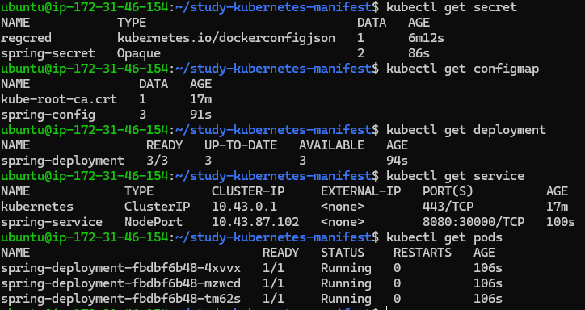
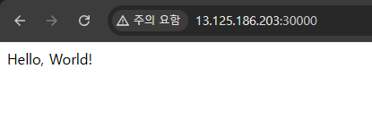
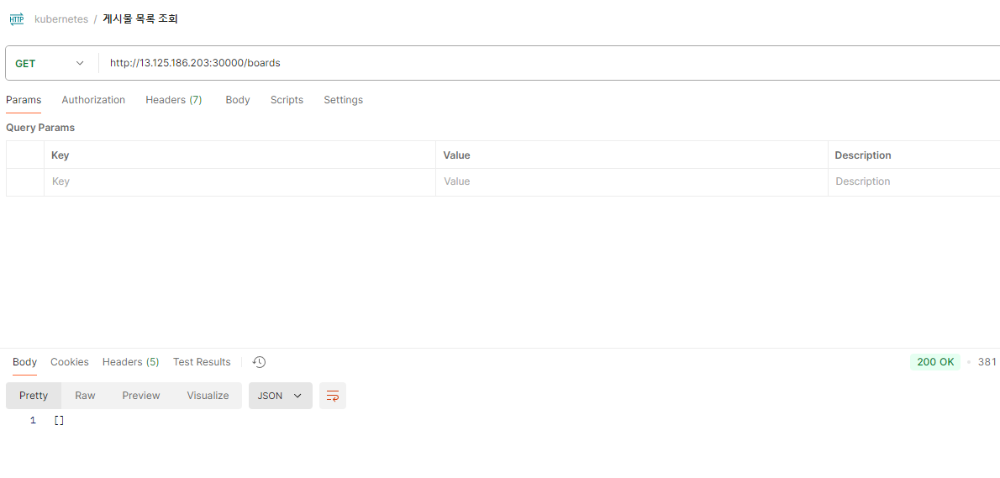
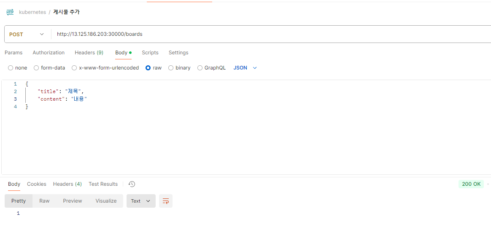
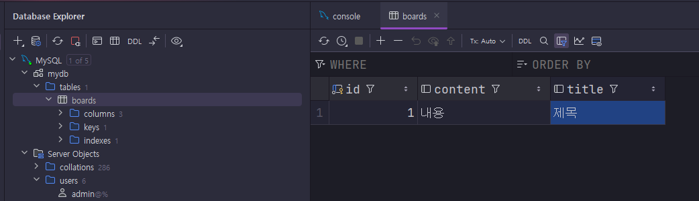
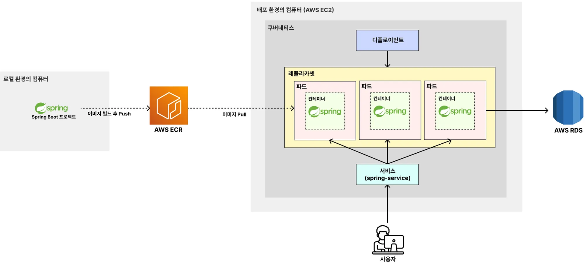

# EC2에서 쿠버네티스로 백엔드(Spring Boot) 서버 띄우기

---

### 1. 매니페스트 파일 클론
```shell
git clone https://github.com/ttasjwi/study-kubernetes-manifest.git
cd study-kubernetes-manifest
```

---

### 2. Deployment, ConfigMap, Secret 파일 수정
#### 2.1 spring-deployment.yaml
```yaml
apiVersion: apps/v1
kind: Deployment

# Deployment 기본 정보
metadata:
  name: spring-deployment # Deployment 이름

# Deployment 세부 정보
spec:
  replicas: 3 # 생성할 파드의 복제본 개수
  selector:
    matchLabels:
      app: backend-app # 아래에서 정의한 Pod 중 'app: backend-app'이라는 값을 가진 파드를 선택

  # 배포할 Pod 정의
  template:
    metadata:
      labels: # 레이블 (= 카테고리)
        app: backend-app
    spec:
      imagePullSecrets:
        - name: regcred
      containers:
        - name: spring-container # 컨테이너 이름
          image: 533267359155.dkr.ecr.ap-northeast-2.amazonaws.com/kube-ecr:1.0
          ports:
            - containerPort: 8080  # 컨테이너에서 사용하는 포트를 명시적으로 표현
          env:
            - name: DB_HOST
              valueFrom:
                configMapKeyRef:
                  name: spring-config
                  key: db-host
            - name: DB_PORT
              valueFrom:
                configMapKeyRef:
                  name: spring-config
                  key: db-port
            - name: DB_NAME
              valueFrom:
                configMapKeyRef:
                  name: spring-config
                  key: db-name
            - name: DB_USERNAME
              valueFrom:
                secretKeyRef:
                  name: spring-secret
                  key: db-username
            - name: DB_PASSWORD
              valueFrom:
                secretKeyRef:
                  name: spring-secret
                  key: db-password
```
- `spec.template.spec`
  - `imagePullSecrets` : 이미지를 Pull 할 때 해당 Secret 값을 활용해서 Private ECR 레지스트리에 접근한다. (regcred 이름)
  - `image` : ECR에 저장된 이미지의 주소 및 태그명

#### 2.2 spring-config.yaml
```yaml
apiVersion: v1
kind: ConfigMap

# ConfigMap 기본 정보
metadata:
  name: spring-config # ConfigMap 이름

# Key, Value 형식으로 설정값 저장
data:
  db-host: "rds.creiw82kitjn.ap-northeast-2.rds.amazonaws.com"
  db-port: "3306"
  db-name: "mydb"
```
- db-host 설정 수정 : RDS 엔드포인트

#### 2.3 spring-secret.yaml
```yaml
apiVersion: v1
kind: Secret
type: Opaque # 임의의 사용자 정의 데이터를 저장할 때 사용하는 타입

# Secret 기본 정보
metadata:
  name: spring-secret # Secret 이름

# Key, Value 형식으로 값 저장
stringData:
  db-username: "admin"
  db-password: "password"
```
- db-username : RDS 생성 시 사용자 이름
- db-password : RDS 생성 시 마스터 비밀번호

---

### 3. 매니페스트 파일을 통해 오브젝트 생성
```shell
kubectl apply -f spring-secret.yaml
kubectl apply -f spring-config.yaml
kubectl apply -f spring-deployment.yaml
kubectl apply -f spring-service.yaml
```

---

### 4. 잘 생성됐는 지 확인

#### 4.1 오브젝트 확인
```shell
kubectl get secret
kubectl get configmap
kubectl get deployment
kubectl get service
kubectl get pods
```



#### 4.2 API 작동 확인







#### 4.3 DB에 정상적으로 데이터가 저장되는 지 확인


- 실제 우리 서비스가 데이터베이스(RDS)와 잘 연동해서 동작함을 확인할 수 있다.

---

### 5. 아키텍처 다시 짚어보기


---
