# EKS 워커 노드 추가하기

---

### 1. 노드 그룹 추가하기
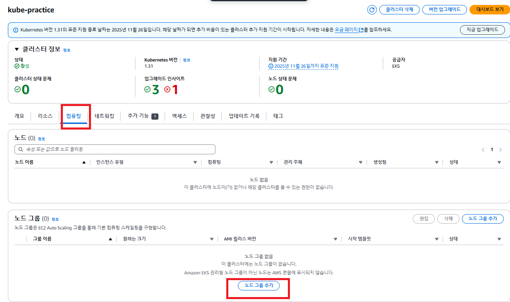

---

### 2. 노드 그룹 구성 셋팅하기
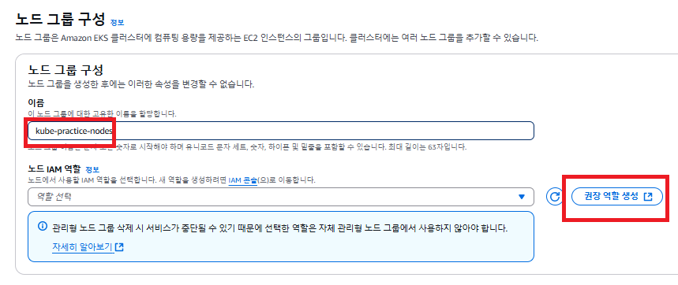

---

### 3. EKS 노드 그룹의 IAM Role 생성하기 
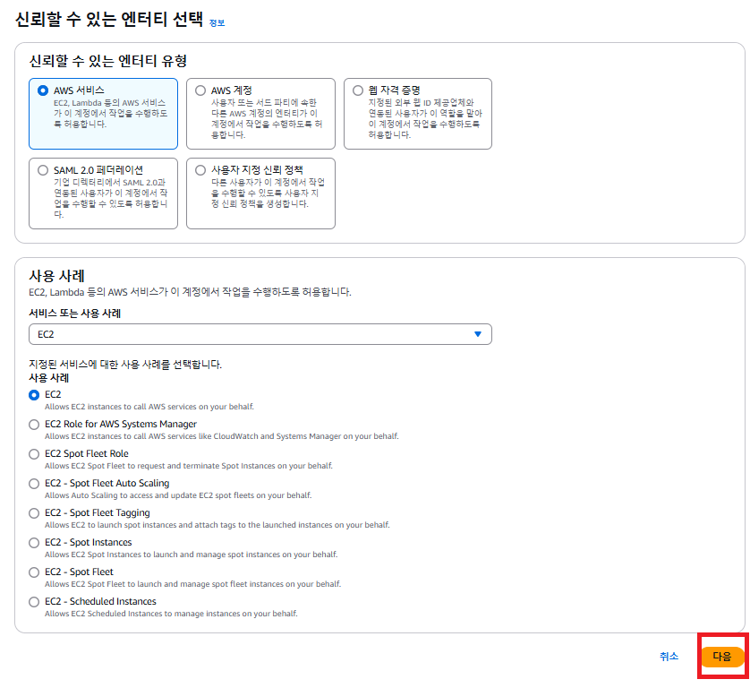

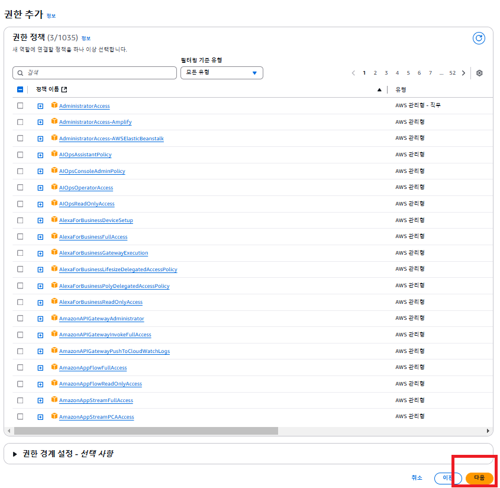

- 이미 기본 권한들이 추가되어 있어서 그냥 '다음' 을 누르면 된다.

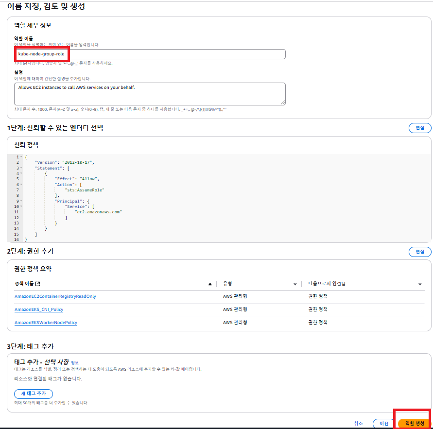

---

### 4. 방금 생성한 Role 선택해 지정하기
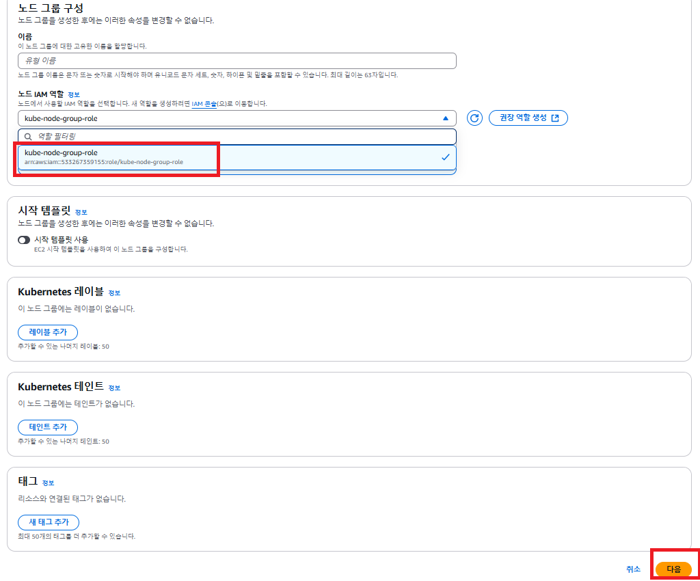

---

### 5. 컴퓨팅 및 조정 구성 설정하기
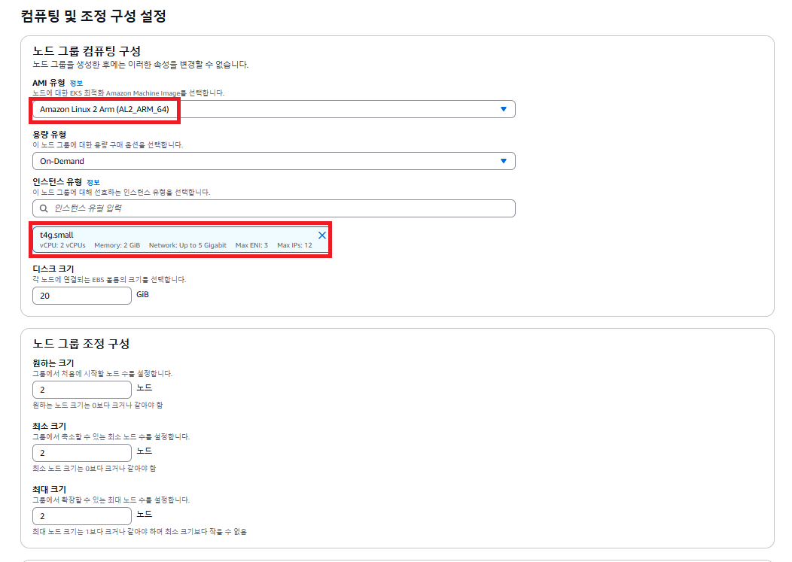

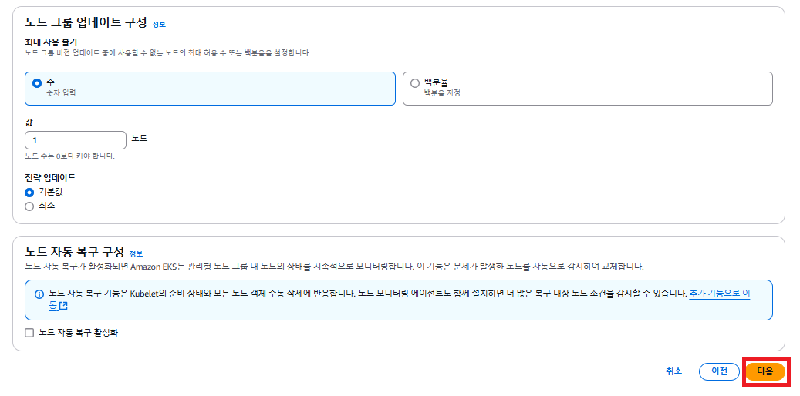

---

### 6. 나머지 옵션은 그대로 두기
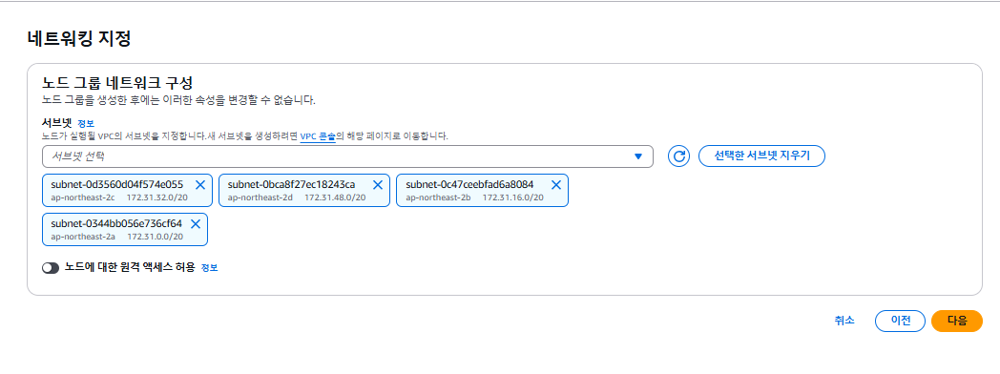

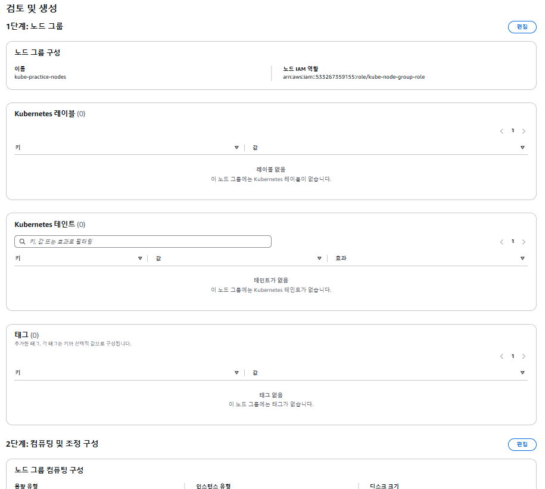

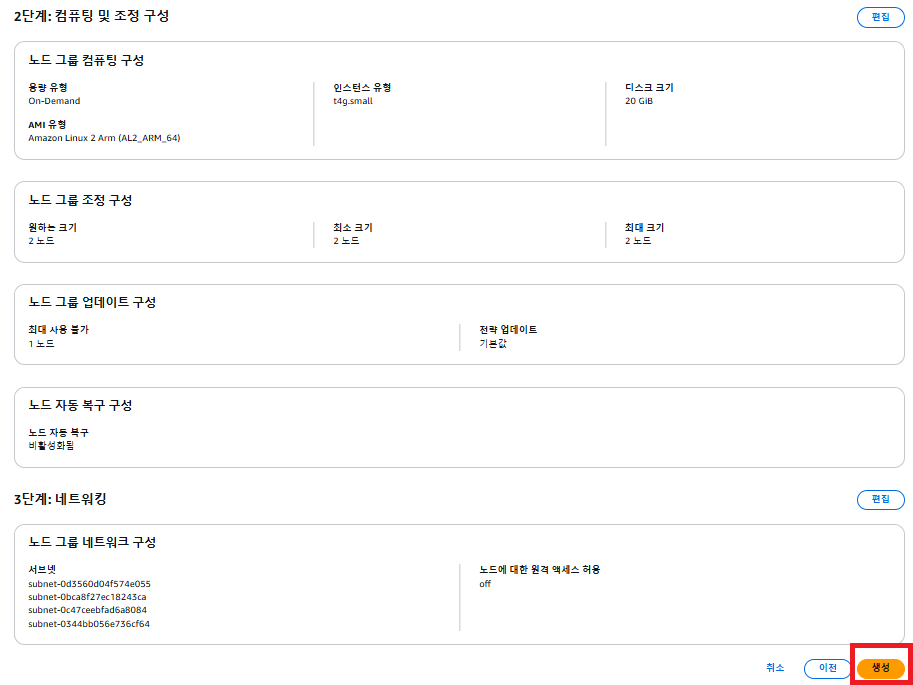

---

### 7. 노드 그룹이 생성될 때까지 기다리기
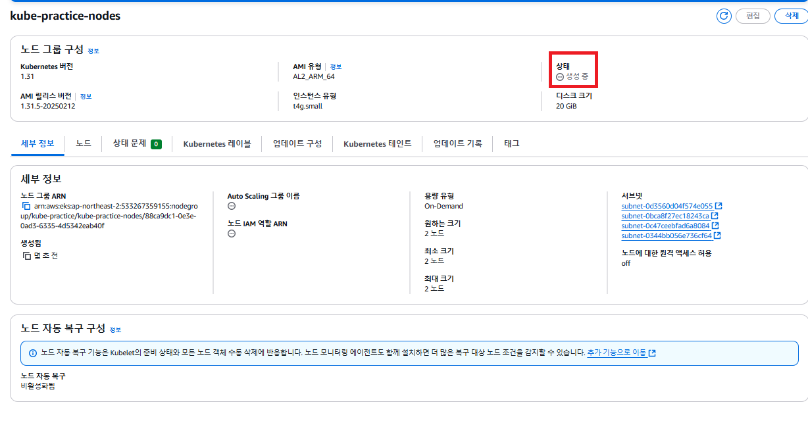

- 10분 정도 기다리면 활성화된다. 
- 만약 20분 정도까지 기다렸는데도 활성화가 되지 않는다면 노드 그룹을 삭제하고 다시 생성해보자.

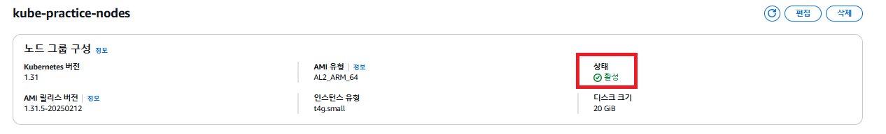

---

### 8. EC2 인스턴스 확인하기
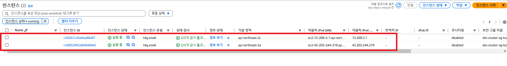

- EC2 인스턴스 페이지에 들어가면 새로운 EC2 인스턴스 2개가 생성되어 있는 걸 확인할 수 있다. 
- EKS 클러스터에서 하나의 워커 노드(Worker Node)가 하나의 EC2 인스턴스에서 실행되는 구조이기 때문이다.

---
