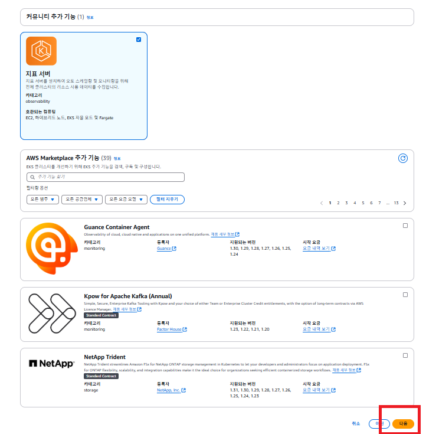

# EKS 클러스터 생성하기

---

#### 1. EKS 서비스로 들어가기

---

#### 2. 클러스터 생성

---

#### 3. 클러스터 구성 셋팅하기

- 사용자 지정 구성
- EKS 자율모드 사용 OFF
- 클러스터명: kube-practice

---

#### 4. EKS 클러스터의 IAM 역할 생성하기
Kubernetes 컨트롤 플레인이 사용자를 대신하여 AWS 리소스를 관리하도록 허용해야하는데 그러기 위한 IAM 역할을 만들고 연결해야한다.

- 역할이름: kube-cluster-role
- 역할 생성

---

#### 5. 방금 생성한 IAM 역할 선택해 지정하기

---

#### 6. 나머지 옵션은 그대로 두고 `다음` 버튼 누르기

---

#### 7. 다음 단계에서도 기본 옵션 그대로 두고 `다음` 버튼 누르기

---

#### 8. 생성이 완료될 때까지 기다리기

- 생성 완료까지 약 10-15분 정도 소요된다.

---
