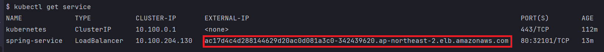
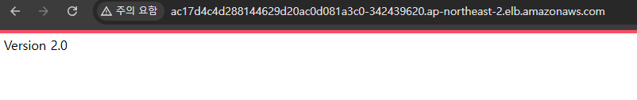
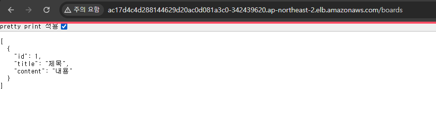
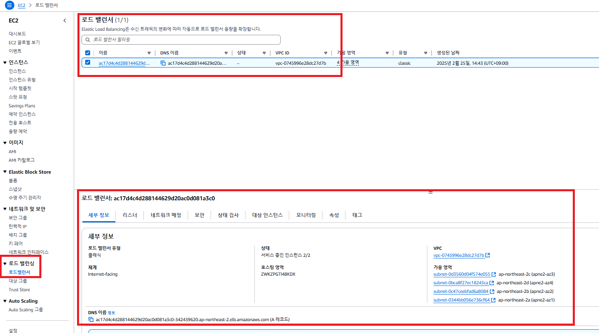
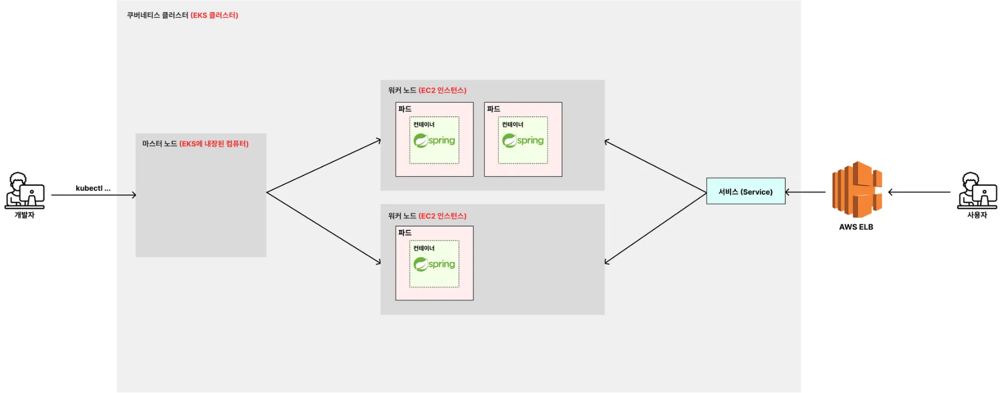

# EKS에 백엔드(Spring Boot) 서버 배포하기 (+RDS,ECR)

---

### 1. 매니페스트 파일 수정하기
- 앞에서 컨텍스트를 EKS쪽으로 전환해둬야한다.
- 로컬에서, EKS 쪽의 컨텍스트에 접근하여 작업하므로 이하의 작업은 로컬에서 작업해야한다.

#### 1.1 `spring-config.yaml`
```yaml
apiVersion: v1
kind: ConfigMap

# ConfigMap 기본 정보
metadata:
  name: spring-config # ConfigMap 이름

# Key, Value 형식으로 설정값 저장
data:
  db-host: "rds.creiw82kitjn.ap-northeast-2.rds.amazonaws.com"
  db-port: "3306"
  db-name: "mydb"
```

#### 1.2 `spring-secret.yaml`
```yaml
apiVersion: v1
kind: Secret
type: Opaque # 임의의 사용자 정의 데이터를 저장할 때 사용하는 타입

# Secret 기본 정보
metadata:
  name: spring-secret # Secret 이름

# Key, Value 형식으로 값 저장
stringData:
  db-username: "admin"
  db-password: "password"
```

#### 1.3 `spring-deployment.yaml`
```yaml
apiVersion: apps/v1
kind: Deployment

# Deployment 기본 정보
metadata:
  name: spring-deployment # Deployment 이름

# Deployment 세부 정보
spec:
  replicas: 3 # 생성할 파드의 복제본 개수
  selector:
    matchLabels:
      app: backend-app # 아래에서 정의한 Pod 중 'app: backend-app'이라는 값을 가진 파드를 선택

  # 배포할 Pod 정의
  template:
    metadata:
      labels: # 레이블 (= 카테고리)
        app: backend-app
    spec:
      containers:
        - name: spring-container # 컨테이너 이름
          image: 533267359155.dkr.ecr.ap-northeast-2.amazonaws.com/kube-ecr:2.0 # 컨테이너를 생성할 때 사용할 이미지
          ports:
            - containerPort: 8080  # 컨테이너에서 사용하는 포트를 명시적으로 표현
          env:
            - name: DB_HOST
              valueFrom:
                configMapKeyRef:
                  name: spring-config
                  key: db-host
            - name: DB_PORT
              valueFrom:
                configMapKeyRef:
                  name: spring-config
                  key: db-port
            - name: DB_NAME
              valueFrom:
                configMapKeyRef:
                  name: spring-config
                  key: db-name
            - name: DB_USERNAME
              valueFrom:
                secretKeyRef:
                  name: spring-secret
                  key: db-username
            - name: DB_PASSWORD
              valueFrom:
                secretKeyRef:
                  name: spring-secret
                  key: db-password
```


#### 1.4 `spring-service.yaml`
```yaml
apiVersion: v1
kind: Service

# Service 기본 정보
metadata:
  name: spring-service

# Service 세부 정보
spec:
  type: LoadBalancer # Service의 종류
  selector:
    app: backend-app # 실행되고 있는 파드 중 'app: backend-app'이라는 값을 가진 파드와 서비스를 연결
  ports:
    - protocol: TCP # 서비스에 접속하기 위한 프로토콜
      port: 80 # 외부에서 사용자가 요청을 보낼 때 사용하는 포트 번호
      targetPort: 8080 # 매핑하기 위한 파드의 포트 번호
```
- `NodePort` : 쿠버네티스 내부에서 해당 서비스에 접속하기 위한 포트를 열고 외부에서 접속 가능하도록 한다.  
  - **들어오는 요청을 여러 Worker Node로 트래픽을 분산시키지는 않는다.**
  - `구체적 NodeIP:NodePort` 로 요청을 하기 때문에 다른 Node 들로 트래픽이 분산되지 않고, 해당 노드가 모든 트래픽을 처리한다.
- `ClusterIP` : 쿠버네티스 내부에서만 통신할 수 있는 IP 주소를 부여. 외부에서는 요청할 수 없다.
- `LoadBalancer` : 외부의 로드밸런서(AWS의 로드밸런서 등)를 활용해 외부에서 접속할 수 있도록 연결한다.   
  - **들어오는 요청을 여러 Worker Node로 트래픽을 분산시켜준다.**
  - `서비스 IP:Port` 로 요청을 하기 때문에, 외부 LoadBalancer(ELB)와 통합적으로 동작하여 여러 노드에 위치한 파드들로 부하가 분산된다.


---

### 2. 매니페스트 파일을 통해 오브젝트 생성하기
```shell
kubectl apply -f spring-secret.yaml
kubectl apply -f spring-config.yaml
kubectl apply -f spring-deployment.yaml
kubectl apply -f spring-service.yaml
```

---

### 3. 잘 생성됐는 지 확인하기
```shell
kubectl get secret
kubectl get configmap
kubectl get deployment
kubectl get pods
```
```shell
kubectl get service
```


- `Service`의 `Type`을 `LoadBalancer`로 했더니 외부에서 접속할 수 있는 주소가 주어졌다.

---

### 4. Service 의 주소로 접속해보기






---

### 5. 정말 로드밸런서가 생성됐는 지 확인하기


---

### 6. 다시 아키텍처 짚어보기


- EKS 클러스터를 생성하고, `Service`의 `Type`을 `LoadBalancer`로 해주면 외부에서 접속할 수 있는 주소가 주어진다.
- 이 주소는 ELB 의 주소가 되며, 이곳을 통해 요청하면 여러 노드들에 위치한 파드들로 로드밸런싱이 된다.

---
