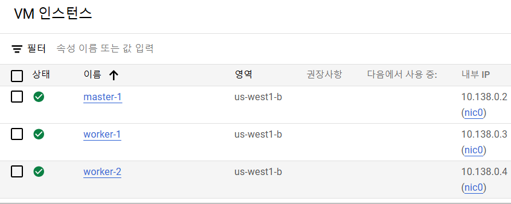
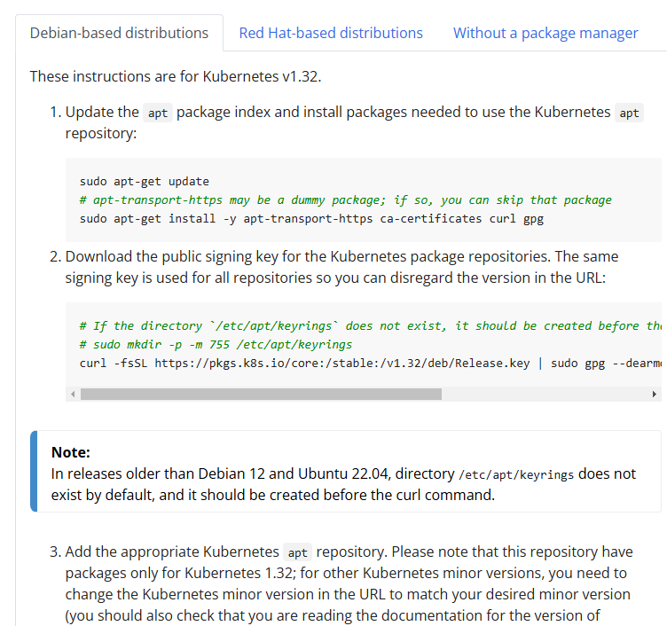

# GCE VM 을 통한 클러스터 구성, 애플리케이션 배포

---

## 1. VM 인스턴스 생성


- Google Cloud 콘솔 > Compute Engine > VM 인스턴스 > 인스턴스 만들기
- 인스턴스 3대 생성(master-1, worker-1, worker-2)
  - 리전 및 영역 : us-west1 - us-west1-b
  - 머신 : EC2 / ec2-medium (CPU 2개, 메모리 4GB)
  - 부팅 디스크 (이미지) : Ubuntu 20.04(x86 64) / 표준 영구 디스크 / 100GB
  - 1대당 월별 예상 가격이 28.46 달러 정도 청구 (금방 끌 것이므로 상관 x)

```shell
# master-1 에서
$ ping 10.138.0.3
$ ping 10.138.0.4
```
- ping 명령을 통해 다른 노드와의 통신상태를 한 번씩 확인해보면 잘 통신되는 것을 알 수 있다.

---

## 2. 쿠버네티스 클러스터 구성
물리적인 베어메탈 VM 세 대를 준비했으므로, 쿠버네티스를 설치해야한다.

### 2.1 쿠버네티스 설치 도구
- kubeadm, kops, kubespray 등…
- 구글 Kubernetes Engine, AWS EKS 역시 이런 쿠버네티스 설치 도구의 일종이라 할 수 있다
- 기본적인 방법 : kubeadm
    - kubernetes install로 구글 검색해보면, [Kubernetes 시작하기문서](https://kubernetes.io/docs/setup/production-environment/tools/kubeadm/install-kubeadm/)
    - 요구 조건
      - [x]  ~~호환되는 리눅스 머신. 쿠버네티스 프로젝트는 데비안 기반 배포판, 레드햇 기반 배포판, 그리고 패키지 매니저를 사용하지 않는 경우에 대한 일반적인 가이드를 제공한다.~~
      - [x]  ~~2 GB 이상의 램을 장착한 머신[. (이 보다 작으면 사용자의 앱을 위한 공간이 거의 남지 않음)~~
      - [x]  ~~2 이상의 CPU.~~
      - [x]  ~~클러스터의 모든 머신에 걸친 전체 네트워크 연결. (공용 또는 사설 네트워크면 괜찮음)~~
      - [x]  ~~모든 노드에 대해 고유한 호스트 이름, MAC 주소 및 product_uuid. 자세한 내용은 [여기](https://kubernetes.io/ko/docs/setup/production-environment/tools/kubeadm/install-kubeadm/#verify-mac-address)를 참고한다.~~
      - [x]  ~~컴퓨터의 특정 포트들 개방. 자세한 내용은 [여기](https://kubernetes.io/ko/docs/setup/production-environment/tools/kubeadm/install-kubeadm/#check-required-ports)를 참고한다.~~
      - [ ]  스왑의 비활성화. kubelet이 제대로 작동하게 하려면 **반드시** 스왑을 사용하지 않도록 설정한다.
        (앞서 수행한 작업을 잘 했다면, 이 부분만 처리해주면 된다.)

### 2.2 swap 비활성화
```shell
# 현재 시스템에 적용(리부팅하면 재설정 필요)
sudo swapoff -a 
sudo sed -i '/ swap / s/^\(.*\)$/#\1/g' /etc/fstab 
```
- 모든 VM 에서 위 명령을 실행해서, swap 을 비활성화한다.

### 2.3 containerd 설치(컨테이너 런타임)
- [How to Install Containerd on Ubuntu 22.04 / Ubuntu 20.04](https://www.itzgeek.com/how-tos/linux/ubuntu-how-tos/install-containerd-on-ubuntu-22-04.html)
- 모든 노드에서 다음을 실행한다.
    ```shell
    # Using Docker Repository
    sudo apt update
    sudo apt install -y ca-certificates curl gnupg lsb-release
    curl -fsSL https://download.docker.com/linux/ubuntu/gpg | sudo gpg --dearmor -o /usr/share/keyrings/docker-archive-keyring.gpg
    echo "deb [arch=$(dpkg --print-architecture) signed-by=/usr/share/keyrings/docker-archive-keyring.gpg] https://download.docker.com/linux/ubuntu $(lsb_release -cs) stable" | sudo tee /etc/apt/sources.list.d/docker.list
    
    # containerd 설치
    sudo apt update
    sudo apt install -y containerd.io
    # sudo systemctl status containerd # Ctrl + C를 눌러서 나간다.
    
    # Containerd configuration for Kubernetes
    cat <<EOF | sudo tee -a /etc/containerd/config.toml
    [plugins."io.containerd.grpc.v1.cri".containerd.runtimes.runc]
    [plugins."io.containerd.grpc.v1.cri".containerd.runtimes.runc.options]
    SystemdCgroup = true
    EOF
    
    sudo sed -i 's/^disabled_plugins \=/\#disabled_plugins \=/g' /etc/containerd/config.toml
    sudo systemctl restart containerd
    
    # 소켓이 있는지 확인한다.
    ls /var/run/containerd/containerd.sock
    ```


### 2.4 kubeadm, kubelet, kubectl 설치


- kubeadm 문서에서는 데비안 기반 배포판, 레드햇 기반 배포판, 패키지 매니저를 사용 안 하는 경우로 나눠서 설명하고 있다.
  - [kubeadm 설치 공식문서](https://kubernetes.io/docs/setup/production-environment/tools/kubeadm/install-kubeadm/)
- kubernetes v1.32 기준 설치법은 다음과 같다.
    ```shell
    cat << EOF > kube_install.sh
    # 1. /etc/apt/keyrings 폴더 생성 및 권한 부여
    sudo mkdir -p -m 755 /etc/apt/keyrings
    
    # 2. apt 패키지 색인을 업데이트하고, 쿠버네티스 apt 리포지터리를 사용하는 데 필요한 패키지를 설치한다.
    sudo apt-get update
    sudo apt-get install -y apt-transport-https ca-certificates curl gpg
    
    # 3. 쿠버네티스 패키지 저장소 공개 서명 키를 다운로드 한다. 모든 저장소에 동일한 서명키가 사용되므로, URL의 버전은 무시할 수 있다.
    curl -fsSL https://pkgs.k8s.io/core:/stable:/v1.32/deb/Release.key | sudo gpg --dearmor -o /etc/apt/keyrings/kubernetes-apt-keyring.gpg
    
    # 4. 쿠버네티스 apt 리포지토리를 추가한다.
    echo 'deb [signed-by=/etc/apt/keyrings/kubernetes-apt-keyring.gpg] https://pkgs.k8s.io/core:/stable:/v1.32/deb/ /' | sudo tee /etc/apt/sources.list.d/kubernetes.list
    
    # 5. apt 패키지 인덱스를 업데이트하고, kubelet, kubeadm, kubectl 을 설치하고 해당 버전을 고정한다.
    sudo apt-get update
    sudo apt-get install -y kubelet kubeadm kubectl
    sudo apt-mark hold kubelet kubeadm kubectl
    EOF
    
    sudo bash kube_install.sh
    ```

### 2.5 넷필터 브릿지 설정
모든 노드에 다음 명령으로 넷필터 브릿지 설정

```shell
sudo -i
```
```shell
modprobe br_netfilter
echo 1 > /proc/sys/net/ipv4/ip_forward
echo 1 > /proc/sys/net/bridge/bridge-nf-call-iptables

exit
```

### 2.6 마스터노드 초기화 (반드시 마스터노드에서 진행할 것)
- 마스터노드에서 다음 명령을 실행한다.(다만 폐쇄망에서 진행할 경우, 작업이 제대로 진행되지 않을 수 있다.)
    ```shell
    sudo kubeadm init
    ```
- 마스터 노드를 여러 대 구성하고 싶다면 이 과정에서 추가 옵션을 기입해야한다.
- 이 과정에서 에러가 발생할 경우
    ```shell
    ttasjwi20250201@master-1:~$ sudo kubeadm init
    [init] Using Kubernetes version: v1.32.1
    [preflight] Running pre-flight checks
    W0201 07:20:21.807089   15463 checks.go:1080] [preflight] WARNING: Couldn't create the interface used for talking to the container runtime: failed to create new CRI runtime service: validate service connection: validate CRI v1 runtime API for endpoint "unix:///var/run/containerd/containerd.sock": rpc error: code = Unimplemented desc = unknown service runtime.v1.RuntimeService
            [WARNING SystemVerification]: cgroups v1 support is in maintenance mode, please migrate to cgroups v2
    [preflight] Pulling images required for setting up a Kubernetes cluster
    [preflight] This might take a minute or two, depending on the speed of your internet connection
    [preflight] You can also perform this action beforehand using 'kubeadm config images pull'
    error execution phase preflight: [preflight] Some fatal errors occurred:
    failed to create new CRI runtime service: validate service connection: validate CRI v1 runtime API for endpoint "unix:///var/run/containerd/containerd.sock": rpc error: code = Unimplemented desc = unknown service runtime.v1.RuntimeService[preflight] If you know what you are doing, you can make a check non-fatal with `--ignore-preflight-errors=...`
    To see the stack trace of this error execute with --v=5 or higher
    ```
    - [이슈](https://github.com/containerd/containerd/issues/4581)가 2020년쯤부터 이미 있는데, 안 고쳐진 것 같다.
      - containerd 데몬에서 cri옵션이 버그를 야기 시키는것으로 보임 (github 토론)
    - 다음 명령을 실행하면 된다.
      ```shell
      sudo rm /etc/containerd/config.toml
      sudo systemctl restart containerd
      sudo kubeadm init
      ```
- 이 과정에서 성공하면 여러가지 안내를 제공한다
    ```shell
    
    Your Kubernetes control-plane has initialized successfully!
    
    # 1) 마스터노드 유저설정 안내사항
    To start using your cluster, you need to run the following as a regular user:
    
      mkdir -p $HOME/.kube
      sudo cp -i /etc/kubernetes/admin.conf $HOME/.kube/config
      sudo chown $(id -u):$(id -g) $HOME/.kube/config
    
    Alternatively, if you are the root user, you can run:
    
      export KUBECONFIG=/etc/kubernetes/admin.conf
    
    # 2) 파드 네트워크 설정 안내사항
    You should now deploy a pod network to the cluster.
    Run "kubectl apply -f [podnetwork].yaml" with one of the options listed at:
      https://kubernetes.io/docs/concepts/cluster-administration/addons/
    
    
    # 3) 워커 노드 조인 방법
    Then you can join any number of worker nodes by running the following on each as root:
    
    kubeadm join 10.138.0.2:6443 --token nmrxa8.ij6qunkn3zn29367 \
            --discovery-token-ca-cert-hash sha256:fb97d1977e39f4ee4bb1d30b116d8e3be5b5a1ee89d5f9bb499a7318164bc928 
    ```

### 2.7 마스터노드 사용자 설정 (마스터노드에서 할 것)
```shell
To start using your cluster, you need to run the following as a regular user:
    
mkdir -p $HOME/.kube
sudo cp -i /etc/kubernetes/admin.conf $HOME/.kube/config
sudo chown $(id -u):$(id -g) $HOME/.kube/config
```
- 클러스터를 사용하기 위해서는 위 명령어를 실행해야한다. (일반사용자 계정에서)
- ChatGPT 설명
  - `mkdir -p $HOME/.kube`: `$HOME/.kube` 디렉토리가 없는 경우 이를 생성합니다. `-p` 옵션은 필요한 경우 중간 디렉토리도 생성합니다.
  - `sudo cp -i /etc/kubernetes/admin.conf $HOME/.kube/config`: `sudo`를 사용하여 `/etc/kubernetes/admin.conf` 파일을 `$HOME/.kube/config`로 복사합니다. `admin.conf` 파일은 Kubernetes 클러스터 관리자 구성 파일입니다.
  - `sudo chown $(id -u):$(id -g) $HOME/.kube/config`: `sudo`를 사용하여 `$HOME/.kube/config` 파일의 소유자를 현재 사용자로 변경합니다. `$(id -u)` 및 `$(id -g)`는 현재 사용자의 UID 및 GID를 가져오는 명령입니다. 이렇게 하면 이후에 `$HOME/.kube/config` 파일에 대한 쓰기 권한이 현재 사용자에게 부여됩니다.
  - 대충 흐름을 해당 일반사용자 계정에서 컨트롤 플레인에 접근할 수 있는 권한을 얻기 위함으로 추정된다.


```shell
$ kubectl get nodes
NAME       STATUS     ROLES           AGE   VERSION
master-1   NotReady   control-plane   8m    v1.32.1
```
- 이 명령 실행에 성공하면, kubectl 명령을 통해 node 들을 조회해 올 수 있다.


### 2.8 워커노드 조인시키기 (워커노드에서 할 것)
```shell
sudo rm /etc/containerd/config.toml
sudo systemctl restart containerd
```
```shell
sudo kubeadm join 10.138.0.2:6443 --token nmrxa8.ij6qunkn3zn29367 \
            --discovery-token-ca-cert-hash sha256:fb97d1977e39f4ee4bb1d30b116d8e3be5b5a1ee89d5f9bb499a7318164bc928 
```
- 루트 사용자 권한으로 실행해야한다.

```shell
$ kubectl get nodes
NAME       STATUS     ROLES           AGE   VERSION
master-1   NotReady   control-plane   11m   v1.32.1
worker-1   NotReady   <none>          25s   v1.32.1
worker-2   NotReady   <none>          8s    v1.32.1
```
- 마스터노드에서 node를 조회해보면 노드들이 join 되어 있는 것을 확인할 수 있다
- NotReady 상태이다.

### 2.9 만약 위에서 실패했을 경우
- init이나 join을 잘못 수행한 경우 `sudo kubeadm reset`을 사용해 초기 설정으로 돌아갈 수 있다.
- join 토큰 다시 확인
  - 토큰 리스트 확인하기: `sudo kubeadm token list`
  - 토큰 재발급하기: `sudo kubeadm token create --print-join-command`

### 2.10 파드 네트워크 배포(마스터노드에서 할 것)
```shell
You should now deploy a pod network to the cluster.
Run "kubectl apply -f [podnetwork].yaml" with one of the options listed at:
  https://kubernetes.io/docs/concepts/cluster-administration/addons/
```
> 지금 클러스터에 pod 네트워크를 배포해야 합니다.
> 다음 중 하나의 옵션을 사용하여 "kubectl apply -f [podnetwork].yaml"을 실행하십시오:
> https://kubernetes.io/docs/concepts/cluster-administration/addons/
> 그런 다음 각각을 루트로 실행하여 여러 작업자 노드를 연결할 수 있습니다.

- 이 과정은 보통 별도의 플러그인을 통해 가능하다. (calico, cilium, weave net, ...)
- cilium 을 사용해볼 것이다. [참고링크](https://kubernetes.io/docs/tasks/administer-cluster/network-policy-provider/cilium-network-policy/)
    ```shell
    curl -LO https://github.com/cilium/cilium-cli/releases/latest/download/cilium-linux-amd64.tar.gz
    sudo tar xzvfC cilium-linux-amd64.tar.gz /usr/local/bin
    rm cilium-linux-amd64.tar.gz
    
    cilium install
    ```
- 시간 경과 후 cilium status 를 통해 상태를 조회해본다.
    ```shell
    $ cilium status
        /¯¯\
     /¯¯\__/¯¯\    Cilium:             OK
     \__/¯¯\__/    Operator:           OK
     /¯¯\__/¯¯\    Envoy DaemonSet:    OK
     \__/¯¯\__/    Hubble Relay:       disabled
        \__/       ClusterMesh:        disabled
    
    DaemonSet              cilium             Desired: 3, Ready: 3/3, Available: 3/3
    DaemonSet              cilium-envoy       Desired: 3, Ready: 3/3, Available: 3/3
    Deployment             cilium-operator    Desired: 1, Ready: 1/1, Available: 1/1
    Containers:            cilium             Running: 3
                           cilium-envoy       Running: 3
                           cilium-operator    Running: 1
    Cluster Pods:          2/2 managed by Cilium
    Helm chart version:    1.16.6
    Image versions         cilium             quay.io/cilium/cilium:v1.16.6@sha256:1e0896b1c4c188b4812c7e0bed7ec3f5631388ca88325c1391a0ef9172c448da: 3
                           cilium-envoy       quay.io/cilium/cilium-envoy:v1.30.9-1737073743-40a016d11c0d863b772961ed0168eea6fe6b10a5@sha256:a69dfe0e54b24b0ff747385c8feeae0612cfbcae97bfcc8ee42a773bb3f69c88: 3
                           cilium-operator    quay.io/cilium/operator-generic:v1.16.6@sha256:13d32071d5a52c069fb7c35959a56009c6914439adc73e99e098917646d154fc: 1
    ```


### 2.11 node 목록 조회
```shell
$ kubectl get nodes
NAME       STATUS   ROLES           AGE   VERSION
master-1   Ready    control-plane   22m   v1.32.1
worker-1   Ready    <none>          11m   v1.32.1
worker-2   Ready    <none>          10m   v1.32.1
```
노드들이 READY 상태가 된 것을 확인할 수 있다

---

## 3. 쿠버네티스 클러스터에 애플리케이션 배포

### 3.1 톰캣 배포
```shell
kubectl create deploy tc --image=consol/tomcat-7.0 --replicas=5
kubectl expose deploy tc --type=NodePort --port=80 --target-port=8080
```
- 톰캣 파드 5대를 생성하고, `--type=NodePort` 로 배포한다.
- GKE 배포 시에는 `--type=LoadBalancer` 였는데, 여기서는 NodePort 인 이유?
  - GKE 는 앞단에 공인 ip 를 할당하고 서비스를 하는 것이 가능했다.
  - 하지만 현재 우리 GCE VM 환경 에서는 외부에 LoadBalancer 를 할당할 수 없다.

### 3.2 파드, 서비스 조회
```shell
ttasjwi20250201@master-1:~$ kubectl get pod,svc
NAME                      READY   STATUS    RESTARTS   AGE
pod/tc-559bdcfc8b-f8s2b   1/1     Running   0          33s
pod/tc-559bdcfc8b-ff8mg   1/1     Running   0          33s
pod/tc-559bdcfc8b-n6kb6   1/1     Running   0          33s
pod/tc-559bdcfc8b-r9r5k   1/1     Running   0          33s
pod/tc-559bdcfc8b-wbsd7   1/1     Running   0          33s

NAME                 TYPE        CLUSTER-IP      EXTERNAL-IP   PORT(S)        AGE
service/kubernetes   ClusterIP   10.96.0.1       <none>        443/TCP        24m
service/tc           NodePort    10.111.56.182   <none>        80:32105/TCP   31s
```
- 서비스가 현재, 32105 포트로 노출되어있는 것을 볼 수 있다.


- 마스터노드가 현재 `10.138.0.2`에 배포되어 있는 것을 볼 수 있는데

```shell
curl 10.138.0.2:32105
```
```html

<!DOCTYPE html>


<html lang="en">
    <head>
        <title>Apache Tomcat/7.0.62</title>
        <link href="favicon.ico" rel="icon" type="image/x-icon" />
        <link href="favicon.ico" rel="shortcut icon" type="image/x-icon" />
        <link href="tomcat.css" rel="stylesheet" type="text/css" />
    </head>

    <body>
        <div id="wrapper">
            <div id="navigation" class="curved container">
                <span id="nav-home"><a href="http://tomcat.apache.org/">Home</a></span>
                <span id="nav-hosts"><a href="/docs/">Documentation</a></span>
                <span id="nav-config"><a href="/docs/config/">Configuration</a></span>
    <!-- 생략 -->
</html>
```
- 마스터노드에서, 해당 위치로 요청을 보내면 톰캣 홈페이지가 응답으로 온다.
- 동일한 명령을 워커노드의 서버에 curl을 실행해도 동일한 응답이 온다
    ```shell
    $ curl 10.138.0.4:32105 | grep title
      % Total    % Received % Xferd  Average Speed   Time    Time     Time  Current
                                     Dload  Upload   Total   Spent    Left  Speed
      0     0    0     0    0     0      0      0 --:--:-- --:--:-- --:--:--     0        <title>Apache Tomcat/7.0.62</title>
    100 11197    0 11197    0     0  1822k      0 --:--:-- --:--:-- --:--:-- 1822k
    ```

### 3.3 배포 원리?
- 우리가 베어메탈에 구축한 네트워크는 로드밸런서를 별도로 지원하지 않는다
- 다만 각 노드들의 32105 포트가 열려있고 이쪽을 통해 접근할 수 있다.
- 각 파드들은 8080 포트가 개방되어있는데, 32105 포트로 요청이 오면 노드에 위치해있는 어떤 프록시가 각 파드의 8080포트로 부하분산을 해준다.
  - 워커노드1 32105 프록시(부하분산) -> 파드 8080
- 마스터노드에는 파드가 없지만, 마스터노드의 프록시가 워커노드의 파드로 부하분산을 해준다.
  - 마스터노드 32105 -> 프록시(부하분산) -> 파드 8080

---
