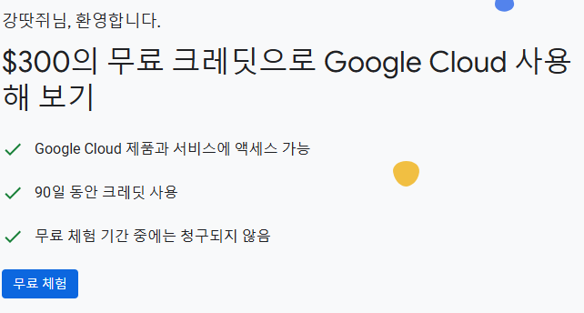
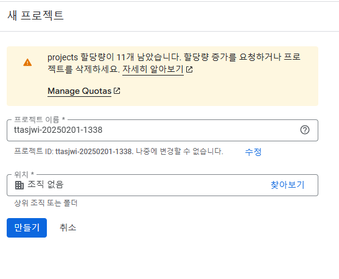
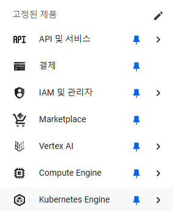
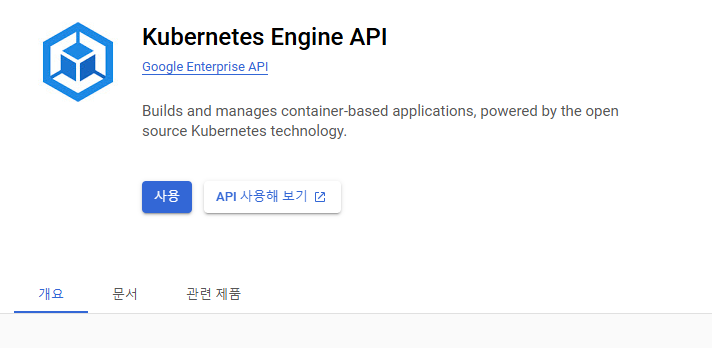
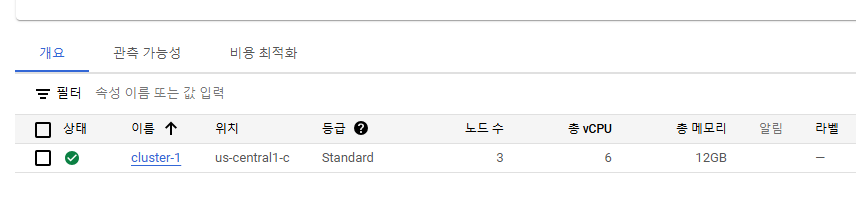

# GKE 쿠버네티스 클러스터 생성

---

### Google Cloud Platform 과 GKE(Google Kubernetes Engine)

- 구글 클라우드 플랫폼
    - https://console.cloud.google.com/
    - 90일 무료 기능 활성화 (카드 필요, 300달러 한도 내 무료 사용)
- Google Kubernetes Engine
    - 구글의 관리형 쿠버네티스 엔진

---

### 프로젝트 생성

- project-id : username-yyyy-MM-dd 형태로 지정하면 겹치지 않게 프로젝트명 생성 가능
- 조직에 포함시키지 않기(특정 회사에 소속된 사람의 경우 자신의 개인 프로젝트가 귀속될 수 있음)

---

### 쿠버네티스 클러스터 활성화

- 좌측바에서, Kubernetes Engine > 클러스터  > Kubernetes Engine API 사용

- 좌측바 클러스터 > Kubernetes 클러스터 ‘만들기’ 버튼 클릭 > Standard
    - Autopilot : Serverless, 구글이 좀 더 많은 것을 관리함. 노드에 직접 접속 불가. 컨테이너 당 비용 발생
    - Standard : 가상머신을 통해 서비스를 제공. 가상머신당 비용 발생
- 생성 범위 : 리전에 지정하면 리전 전체에 걸쳐서 분산해서 생성하는데, 비용한계가 있으므로 영역(AZ)에 지정하여 생성
  - 지역(Region) : 데이터센터가 위치한 지리적 위치
      - 서울 리전, 도쿄 리전, …
  - 영역(Zone, AZ) : 리전 내 데이터센터 1개
- 만들기
  - 참고로 GCP의 무료 기능 체험시  1달 내내 켜두면 170달러 정도 비용이 발생한다. 물론, 실습 용도로 사용할 경우 풀로 켜두진 않으므로
  더 적은 비용이 청구될 것이며, 300달러 한도 내 무료 사용이므로 충분하다.
- 생성확인  
  

---
