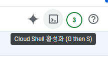
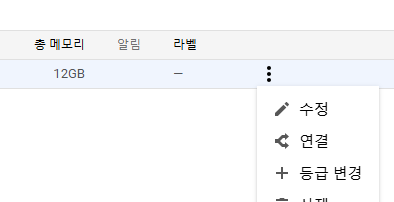
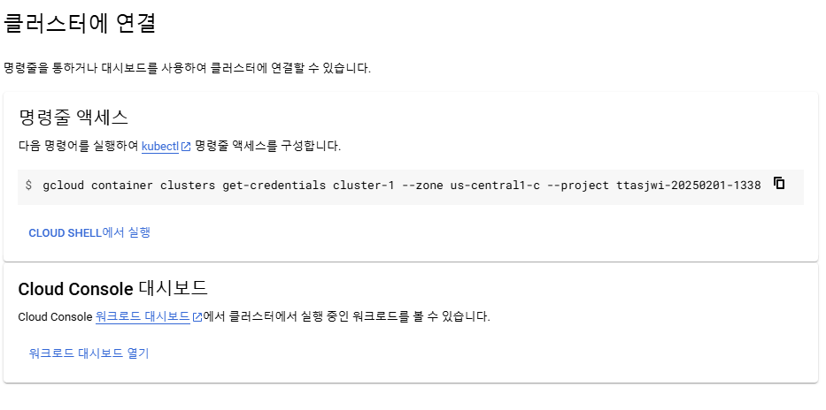
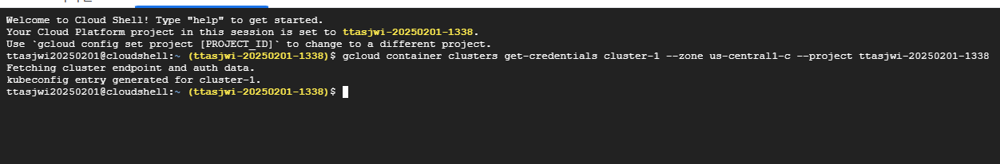
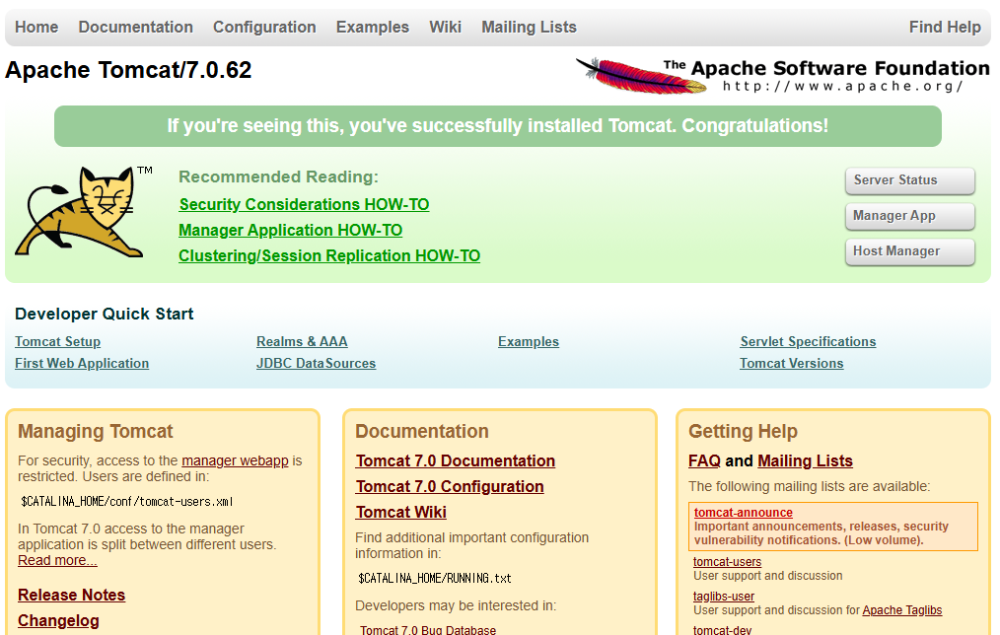
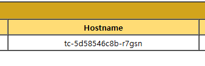
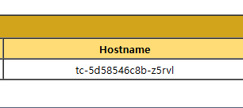

# GKE 클러스터 사용 및 애플리케이션 배포

---

### 클라우드 셸 접속
- 우측 상단 클라우드 셸 활성화  
  
- Cloud Shell을 통해 다음 방법을 통해 접속(연결 - 복사 - 쉘에 붙여넣기)  
      

    

    

---

### 노드 확인
```shell
$ kubectl get nodes
NAME                                       STATUS   ROLES    AGE   VERSION
gke-cluster-1-default-pool-e1aa0166-4q3b   Ready    <none>   23m   v1.31.4-gke.1256000
gke-cluster-1-default-pool-e1aa0166-g9v1   Ready    <none>   23m   v1.31.4-gke.1256000
gke-cluster-1-default-pool-e1aa0166-n1qq   Ready    <none>   23m   v1.31.4-gke.1256000
```

---

### (실습) Tomcat 파드 생성, 배포, 상태 조회
```shell
# tomcat pod를 5대 생성
$ kubectl create deploy tc  --image=consol/tomcat-7.0 --replicas=5
deployment.apps/tc created

# 80번 포트에 로드밸런싱 방식으로 배포
$ kubectl expose deploy tc --type=LoadBalancer --port=80 --target-port=8080
service/tc exposed
```

```shell
$ kubectl get pods,svc
NAME                      READY   STATUS    RESTARTS   AGE
pod/tc-5d58546c8b-krlwd   1/1     Running   0          3m4s
pod/tc-5d58546c8b-l92gc   1/1     Running   0          3m3s
pod/tc-5d58546c8b-r7gsn   1/1     Running   0          3m4s
pod/tc-5d58546c8b-xlhlt   1/1     Running   0          3m4s
pod/tc-5d58546c8b-z5rvl   1/1     Running   0          3m3s

NAME                 TYPE           CLUSTER-IP     EXTERNAL-IP    PORT(S)        AGE
service/kubernetes   ClusterIP      34.118.224.1   <none>         443/TCP        28m
service/tc           LoadBalancer   34.118.237.4   34.70.94.143   80:30214/TCP   2m34s
```
- 톰캣 파드 5대가 생성되었고, tc 서비스로서 LoadBalancer 타입 형태로 배포되었다.
  - 여기서 external-ip 가 실제 외부에 노출되어지고 있는 ip 주소다.







- 퍼블릭 ip로 접속하면 톰캣에 접속된다.
- Server Status 접속 > (admin/admin)
- 여러번 반복 접속해보면 Hostname 이 바뀌는 것을 볼 수 있는데, 로드밸런싱이 일어나면서 실제 다른 파드에 접속하게 되는 것이다.


```shell
$ kubectl get pods -owide
NAME                  READY   STATUS    RESTARTS   AGE   IP          NODE                                       NOMINATED NODE   READINESS GATES
tc-5d58546c8b-krlwd   1/1     Running   0          13m   10.4.1.5    gke-cluster-1-default-pool-e1aa0166-4q3b   <none>           <none>
tc-5d58546c8b-l92gc   1/1     Running   0          13m   10.4.2.13   gke-cluster-1-default-pool-e1aa0166-g9v1   <none>           <none>
tc-5d58546c8b-r7gsn   1/1     Running   0          13m   10.4.0.4    gke-cluster-1-default-pool-e1aa0166-n1qq   <none>           <none>
tc-5d58546c8b-xlhlt   1/1     Running   0          13m   10.4.0.5    gke-cluster-1-default-pool-e1aa0166-n1qq   <none>           <none>
tc-5d58546c8b-z5rvl   1/1     Running   0          13m   10.4.1.6    gke-cluster-1-default-pool-e1aa0166-4q3b   <none>           <none>
```
- 파드의 상태를 다시 조회해보면, 노드 3개에 적절히 분배되어있는 것을 볼 수 있다.

---

### (실습) 주의사항 : 클러스터 정리
- 실습 후 클러스터를 삭제해서 비용 청구를 막을 것.(정확히는 불필요한 사용량 증가 방지)


---
