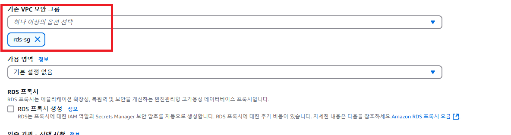

# RDS, ECR 생성하기

---

### 1. RDS 생성
> Amazon Relational Database Service (AWS 에서 제공하는 관계형데이터베이스 서비스)

#### 1.1 RDS 보안그룹 생성

- 보안그룹 이름 : rds-sg
- 아웃바운드 규칙
  - MySQL/Aurora(3306), 대상: **0.0.0.0/0**

#### 1.2 RDS 구성 설정

- 표준 생성 > MySQL

- 템플릿: 프리티어

- 사용의 편의를 위해
  - 마스터 사용자 이름 : admin
  - 마스터 사용자 패스워드 : password

- 실습의 편의를 위해 RDS 퍼블릭 액세스 허용

- 아까 만들어둔 보안그룹(rds-sg) 연결

- 추가구성:  초기데이터베이스 이름 mydb

### 1.3 RDS 잘 접속되는 지 확인

---

### ECR 생성
> Amazon Elastic Container Registry (AWS 에서 제공하는 컨테이너 이미지 레지스트리)

- 리포지토리 이름 : kube-ecr

---
