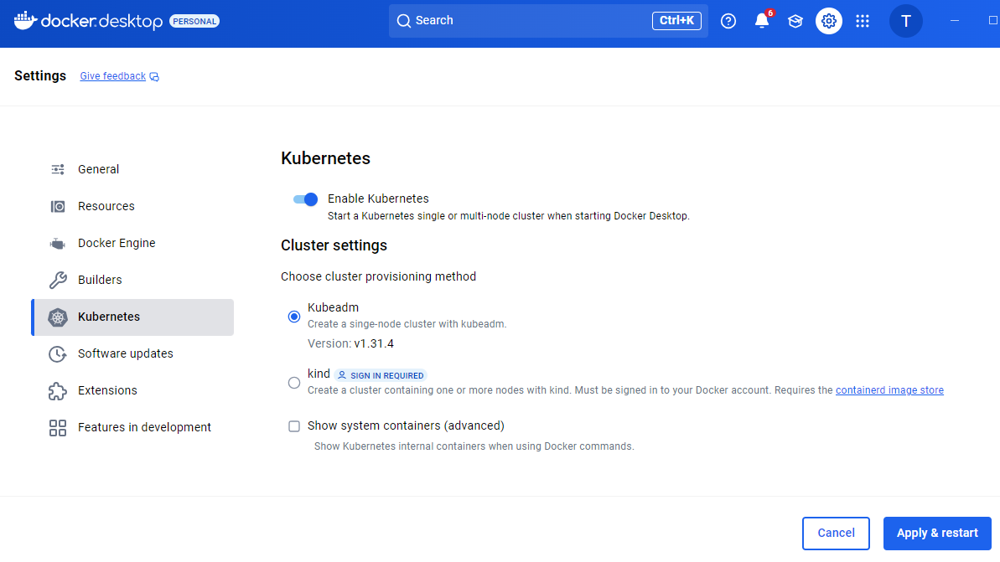

# Windows 에서 쿠버네티스 설치

---

### Windows 에서 쿠버네티스 설치
- 현업으로 가보면 막상 쿠버네티스를 직접 설치할 일은 극히 드물다.
- 그래도 로컬에서 쿠버네티스를 쓸 일이 필요하긴 하다.
  - Docker Desktop 을 활용하면 아주 쉽게 쿠버네티스를 설치해서 사용할 수 있다.

---

### Docker Desktop 설치
- <a href="./../docker/Windows 에서 Docker 설치.md" target="_blank">Windows 에서 Docker 설치</a>

---

### 쿠버네티스(Kubernetes) 활성화


- Docker Desktop 대시보드에 들어가서, 상단 메뉴바에 있는 설정 버튼(톱니바퀴)
- 왼쪽 메뉴에서 Kubernetes를 클릭한 후 'Enable Kubernetes' 체크박스를 체크
- Apply&Restart 버튼을 누르면 설치가 시작

---

### kubectl(Kubernetes Control) 설치
- 쿠버네티스에 명령어를 입력할 수 있게 해주는 CLI 툴이다.
- 참고로 위 과정을 거쳤다면 kubectl 을 사용할 수 있다.
- 그러나, Docker Desktop 을 설치하지 않고 kubectl 을 사용하려면 다음 과정을 거쳐야한다.
  - [공식문서](https://kubernetes.io/docs/tasks/tools/install-kubectl-windows/)

---

### 잘 작동하는 지 확인
```shell
C:\Users\ttasjwi>kubectl cluster-info
Kubernetes control plane is running at https://kubernetes.docker.internal:6443
CoreDNS is running at https://kubernetes.docker.internal:6443/api/v1/namespaces/kube-system/services/kube-dns:dns/proxy

To further debug and diagnose cluster problems, use 'kubectl cluster-info dump'.

C:\Users\ttasjwi>kubectl version
Client Version: v1.31.4
Kustomize Version: v5.4.2
Server Version: v1.31.4
```
- 정상적으로 출력된다면 쿠버네티스 설치가 완료된 것이다. (버전 정보는 어느 시점에 설치했느냐에 따라 달라질 수 있다.)

---

#### 참고자료
- [[Kubernetes] Window에서 Kubernetes 사용하기 (Docker Desktop으로 MiniKube 설치하기)](https://hong-yp-ml-records.tistory.com/127)

---
