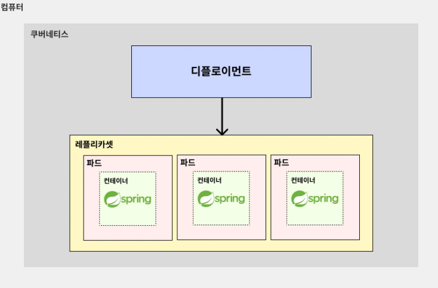

# 디플로이먼트(Deployment)

---

### 디플로이먼트(Deployment)란?
> **디플로이먼트(Deployment)** : **파드를 묶음으로 쉽게 관리할 수 있는 기능**

- 현업에서는 일반적으로 서버를 작동시킬 때 파드(Pod)를 수동으로 배포하진 않는다. 
- **디플로이먼트(Deployment)** 라는 걸 활용해서 파드(Pod)를 자동으로 배포한다.

---

### 디플로이먼트의 장점
- 파드의 수를 지정하는 대로 여러 개의 파드를 쉽게 생성할 수 있음.
  - ex) 파드를 100개를 생성하라고 시키면 디플로이먼트가 알아서 파드를 100개 생성해준다.
- 파드가 비정상적으로 종료된 경우, 알아서 새로 파드를 생성해 파드 수를 유지한다. (셀프 힐링)
- 동일한 구성의 여러 파드를 일괄적으로 일시 중지, 삭제, 업데이트를 하기가 쉽다.
  - ex) 디플로이먼트를 활용하면 ‘100개의 파드로 띄워져있는 결제 서버’를 한 번에 일시 중지/삭제/업데이트하는 게 굉장히 쉽다.

---

### 디플로이먼트(Deployment)의 구조

**디플로이먼트(Deployment)가 레플리카셋(ReplicaSet)을 관리하고, 레플리카셋(ReplicaSet)이 여러 파드(Pod)를 관리하는 구조다.**
- 레플리카(Replica) : 복제본
- 레플리카셋(ReplicaSet) : 복제본끼리의 묶음

---
