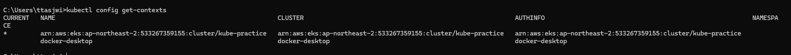

# 로컬에서 EKS 클러스터 조정할 수 있게 셋팅하기

---

### 현재 kubectl이 어떤 클러스터 환경에서 작동되고 있는 지 확인하기
```shell
$ kubectl config get-contexts
CURRENT   NAME             CLUSTER          AUTHINFO         NAMESPACE
*         docker-desktop   docker-desktop   docker-desktop
```
- 현재는 `kubectl`이 Docker Desktop의 쿠버네티스 클러스터를 작동시키고 있는 걸 알 수 있다 .

---

### `kubectl` 에 EKS 클러스터 추가하기
```shell
# aws eks --rgeion ap-northeast-2 update-kubeconfig --name <EKS 클러스터 이름>
$ aws eks --region ap-northeast-2 update-kubeconfig --name kube-practice
```


- EKS 쪽의 쿠버네티스 컨텍스트가 추가되고 전환됐음을 알 수 있다.

---

### \[참고] 컨텍스트 전환, 삭제
```shell
# 다른 클러스터로 전환
$ kubectl config use-context <컨텍스트 이름>

# 특정 컨텍스트 삭제
$ kubectl config unset contexts.<컨텍스트 이름>
```

---
