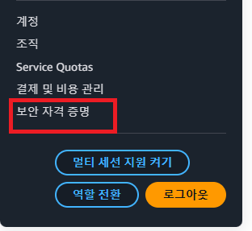
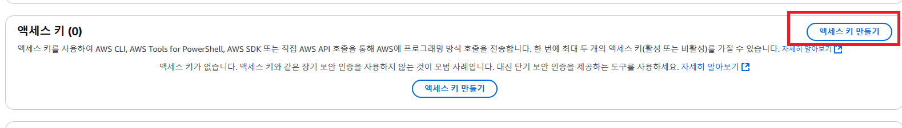
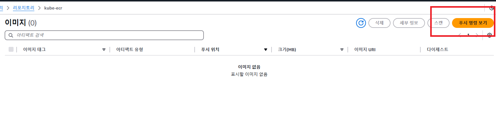
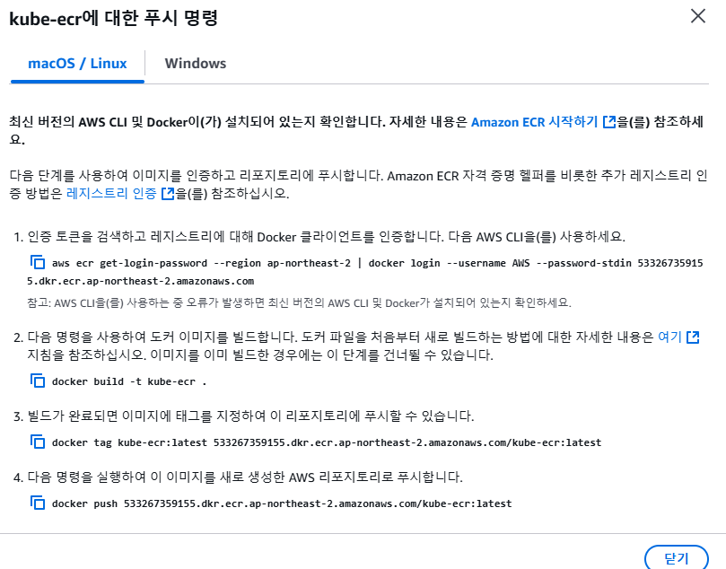
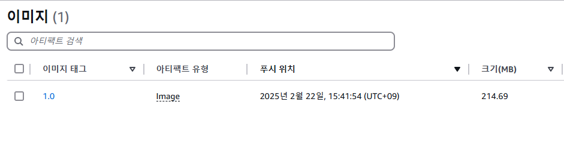

# 백엔드(Spring Boot) 서버 빌드한 후 ECR로 Push하기

---

### 1. AWS AccessKey 발급





- 발급받은 Access Key와 Secret Access Key를 잘 보관해야한다. (유출되면 안 되니 조심해서 관리하자)

---

### 2. 로컬 환경에 AWS CLI 설치
- [AWS CLI 설치](../aws/AWS%20CLI%20설치.md)

---

### 3. AWS CLI 로 액세스 키 등록하기
```shell
$ aws configure
AWS Access Key ID [None]: <위에서 발급한 Key id>
AWS Secret Access Key [None]: <위에서 발급한 Secret Access Key>
Default region name [None]: ap-northeast-2
Default output format [None]:
```

---

### 4. ECR 푸시명령 확인하기

#### 4.1 ECR 에서 생성한 리포지토리로 들어가기


#### 4.2 푸시명령 확인하기


---

### 5. 로컬 환경에서 Spring Boot 프로젝트를 Docker 이미지로 빌드한 후에 ECR로 Push하기

#### 5.1 Docker 에게 ECR 접근 권한 부여
```shell
aws ecr get-login-password --region ap-northeast-2 | docker login --username AWS --password-stdin 533267359155.dkr.ecr.ap-northeast-2.amazonaws.com
```

#### 5.2 빌드, 푸시
```shell
./gradlew clean build
docker build --platform linux/arm64 -t kube-ecr .
docker tag kube-ecr:latest 533267359155.dkr.ecr.ap-northeast-2.amazonaws.com/kube-ecr:1.0

docker push 533267359155.dkr.ecr.ap-northeast-2.amazonaws.com/kube-ecr:1.0
```
- 주의 : 태그명에 `latest`를 쓰지 말고 구체적인 버전명을 작성하기

---

### 6. 정상적으로 이미지가 Push 됐는 지 확인하기


---
