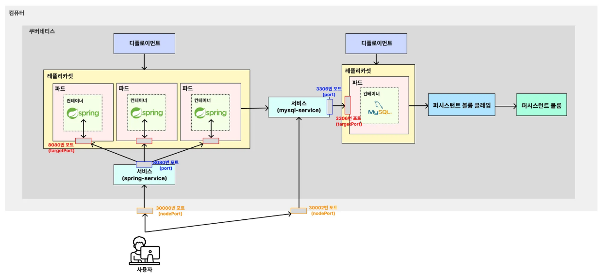
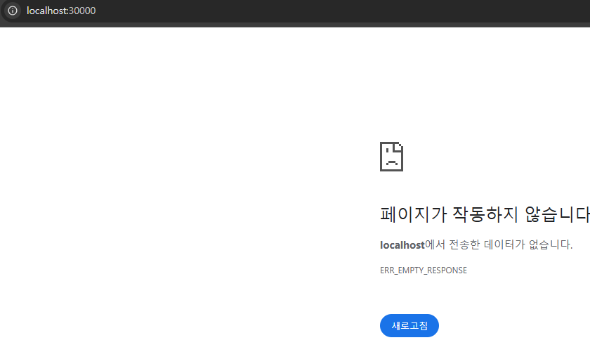
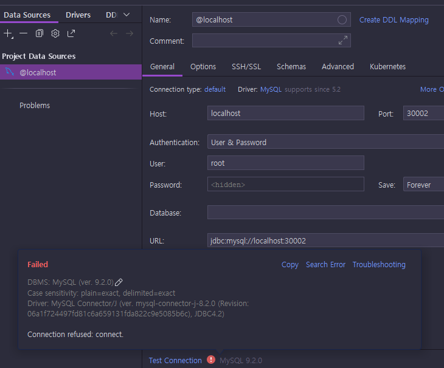
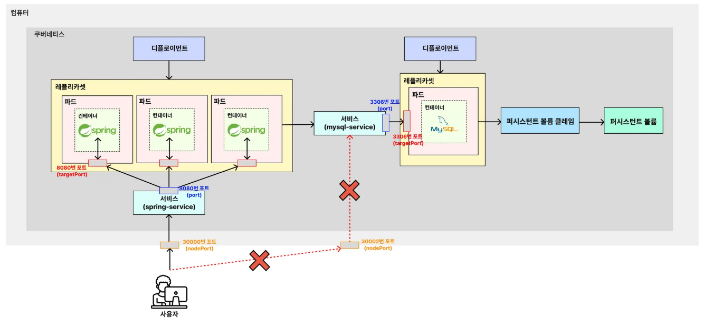
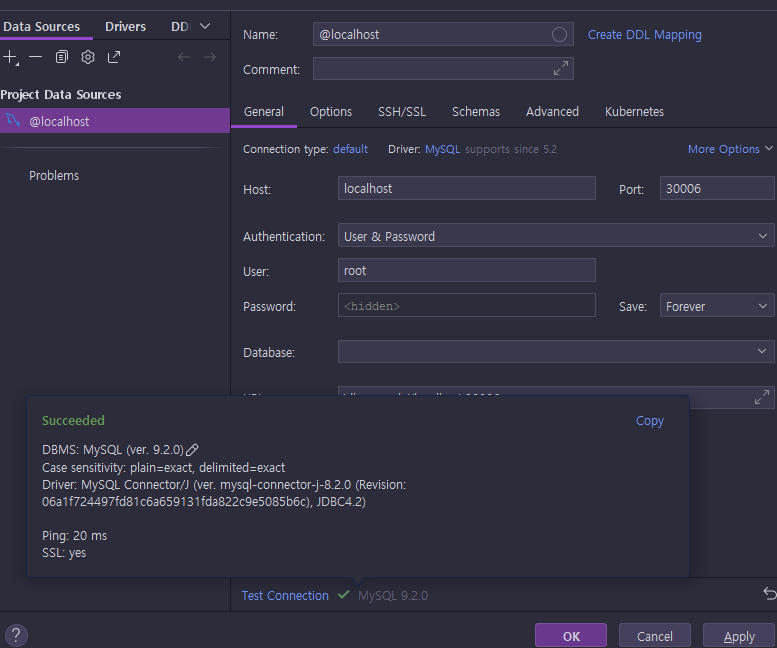

# 보안을 위해 외부에서 MySQL 접근하지 못하도록 막기

---

### 1. 기존 구성의 보안적인 문제점


- 지금까지 만든 구조를 살펴보면 위와 같다. 위의 구조에서 MySQL을 중점적으로 살펴보면 보안에 취약한 점이 있다. 
- `30002`번 포트로 MySQL에 직접적으로 접근할 수 있게끔 보안이 설정되어 있다는 점이다. 
- `Service`의 `NodePort`를 활용해 `30002`번 포트를 외부로 오픈해서 MySQL에 아무나 접근할 수 있게 만들었다.

---

### 2. 다시 복습해보는 Service 의 종류
- `NodePort`: 쿠버네티스 내부에서 해당 서비스에 접속하기 위한 포트를 열고, **외부에서 접속 가능**하도록 한다.
- `ClusterIP` : 쿠버네티스 내부에서만 통신할 수 있는 IP 주소를 부여. 외부에서는 요청할 수 없다. (내부에서만 사용할 것들)
- `LoadBalancer`: 외부의 로드밸런서(AWS의 로드밸런서 ELB 등)를 활용해 외부에서 접속할 수 있도록 연결한다.


---

### 3. 보안적인 문제점 해결
- 보안적인 문제점 해결을 위해 Service의 종류 중 NodePort를 사용하지 않고 ClusterIP를 활용해야 한다. 
- ClusterIP를 활용함으로써 외부에서 아무나 MySQL에 접근하지 못하게 막아야 한다. 

#### 3.1 기존 매니페스트 파일 수정
**mysql-service.yaml**
```yaml
apiVersion: v1
kind: Service

metadata:
  name: mysql-service

spec:
  type: ClusterIP # Service의 종류 변경 : 쿠버네티스 내부에서만 통신 가능
  selector:
    app: mysql-db
  ports:
    - protocol: TCP # 서비스에 접속하기 위한 프로토콜
      targetPort: 3306 # 매핑하기 위한 파드의 포트 번호
      port: 3306 # 쿠버네티스 내부에서 Service에 접속하기 위한 포트 번호
      # nodePort: 30002 <-- 제거
```

#### 3.2 기존 Service 중단하면 작동 안 하는 지 먼저 확인하기
```shell
kubectl delete service mysql-service
kubectl rollout restart deployment spring-deployment
```


#### 3.3 서비스 작동시키기
```shell
kubectl apply -f mysql-service.yaml
kubectl rollout restart deployment spring-deployment
```

#### 3.4 Spring Boot 서버와 잘 연결됐는 지 확인


#### 3.5 Public IP 를 통한 데이터베이스 접속이 안 되는 지 확인


---

### 4. 그림으로 이해하기


---

### 5. DB 를 관리하기 위해 접속해야할 때는?
```shell
# kubectl port-forward pod/[MySQL 파드명] [로컬에서의 포트]:[파드에서의 포트]
kubectl port-forward pod/mysql-deployment-69f8698cc-c7wpk 30006:3306
```
- 쿠버네티스의 포트 포워딩을 활용해서 접속하면 된다. 
- 위 포트 포워딩 명령어를 사용하면 내 로컬 컴퓨터에서만 해당 파드와 연결을 허용시킬 수 있게 된다.



---
