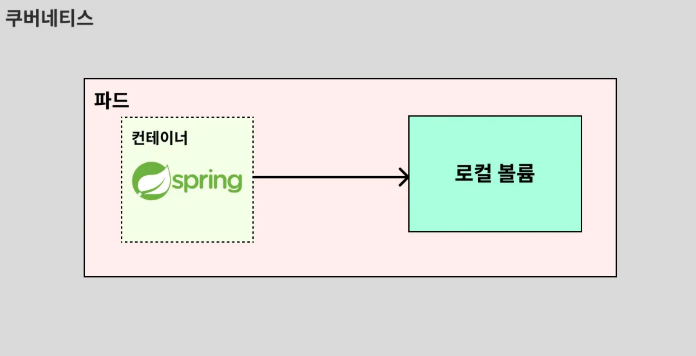
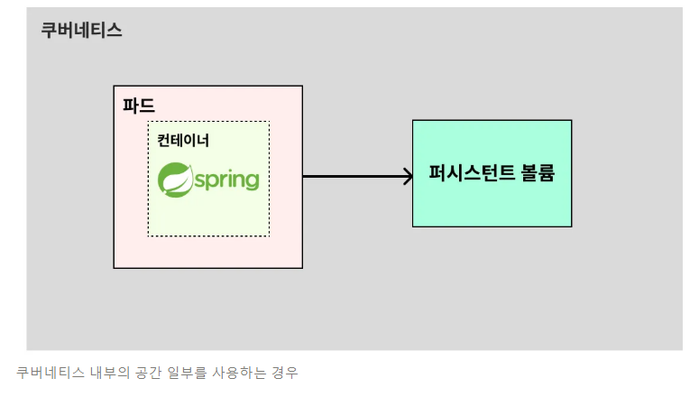
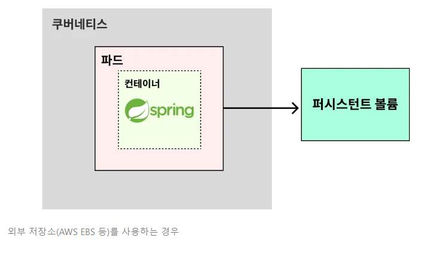
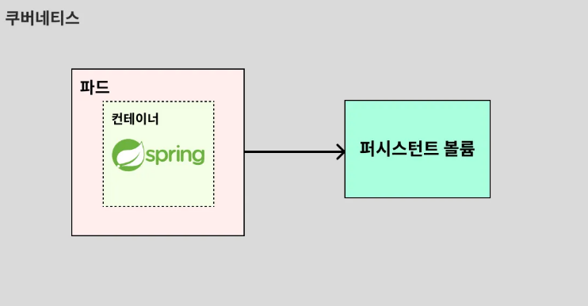
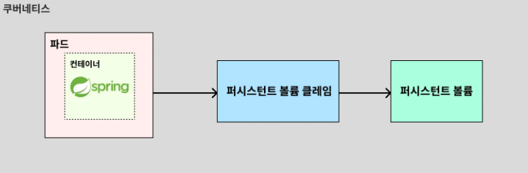

# 볼륨(Volume)

---

## 1. 파드(Pod)가 가진 문제점
- 쿠버네티스를 활용하면 특정 프로그램을 파드로 띄울 수 있다. 프로그램에 새로운 기능이 추가될 경우, 쿠버네티스는 기존 파드에서 변경된 부분을
수정하지 않고, 새로운 파드를 만들어서 통째로 갈아끼우는 방식으로 교체를 한다. 이게 효율적이라고 생각했던 것이다.
- 이런 특징 때문에 기존 파드를 새로운 파드로 교체하면, 기존 파드 내부에 있던 데이터도 같이 삭제된다.
만약 이 파드가 MySQL을 실행시키는 파드였다면 MySQL에 저장된 데이터도 같이 삭제 돼버린다.
- 따라서 파드 내부에 저장된 데이터가 삭제되면 안 되는 경우에는 **볼륨(Volume)** 이라는 개념을 활용해야 한다.

---

## 2. 쿠버네티스의 볼륨(Volume)이란?
**볼륨(Volume)** 이란 데이터를 영속적으로 저장하기 위한 방법이다. 쿠버네티스에서 볼륨은 크게 2가지 종류로 나뉜다.

### 2.1 로컬 볼륨

- 파드 내부의 공간 일부를 볼륨(Volume)으로 활용하는 방식이다. 
- 이 방식은 파드가 삭제되는 즉시 데이터도 함께 삭제된다. 이런 불편함 때문에 실제로 사용되는 일이 잘 없다.

### 2.2 퍼시스턴트 볼륨(Persistent Volume, PV)

- 파드 외부의 공간 일부를 볼륨(Volume)으로 활용하는 방식이다. 
- 이 방식은 파드가 삭제되는 것과 상관없이 데이터를 영구적으로 사용할 수 있다는 장점이 있다. 현업에서는 주로 이 방식을 많이 활용한다.

---

## 3. 퍼시스턴트 볼륨 클레임(Persistent Volume Claim, PVC)이란?

- 퍼시스턴트 볼륨(PV)을 설명할 때 위와 같은 그림으로 도식화 했었는데, 실제로는 파드(Pod)가 퍼시스턴트 볼륨(PV)에 직접 연결할 수 없다.
- 퍼시스턴트 볼륨 클레임(PVC)이라는 중개자가 있어야 한다.

- 그래서 쿠버네티스 구조에서는 위와 같은 구조로 퍼시스턴트 볼륨(PV)을 연결한다.
- 퍼시스턴트 볼륨 클레임(PVC)은 파드(Pod)와 퍼시스턴트 볼륨(PV) 사이에서 중개자 역할을 한다.

---
