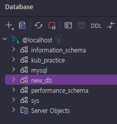
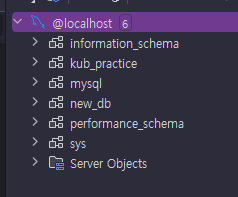

# 볼륨(Volume)을 활용해 MySQL 실행시키기
> 데이터베이스를 확인해보면 이전에 만들었던 `new_db`라는 데이터베이스가 없어졌다.  
> 실제 데이터베이스에서는 데이터가 없어져서는 안 된다. 데이터가 보존되도록 볼륨(Volume)을 설정해보자.

---

### 1. 퍼시스턴트 볼륨(PV), 퍼시스턴트 볼륨 클레임(PVC) 정의하기

#### 1.1 퍼시스턴트 볼륨(PV)
**mysql-pv.yaml**
```yaml
apiVersion: v1
kind: PersistentVolume

# PersistentVolume 기본 정보
metadata:
  name: mysql-pv # Persistent Volume 이름

# PersistentVolume 세부 정보
spec:
  storageClassName: my-storage # PV와 PVC의 storageClassName이 같다면 볼륨이 연결된다.
  capacity:
    storage: 1Gi # 볼륨이 사용할 용량을 설정
  accessModes:
    - ReadWriteOnce
  hostPath: # hostPath 타입을 활용 (hostPath: 쿠버네티스 내부 공간을 활용)
    path: "/mnt/data" # 쿠버네티스 내부 공간에서 /mnt/data 의 경로를 볼륨으로 사용
```

#### 1.2 퍼시스턴트 볼륨 클레임(PVC)
**mysql-pvc.yaml**
```yaml
apiVersion: v1
kind: PersistentVolumeClaim

# PersistentVolumeClaim 기본 정보
metadata:
  name: mysql-pvc

# PersistentVolumeClaim 세부 정보
spec:
  storageClassName: my-storage # PV와 PVC의 storageClassName이 같다면 볼륨이 연결된다. (매칭목적)
  accessModes:
    - ReadWriteOnce # 볼륨에 접근하는 권한
  resources: # PVC가 PC 에 요청하는 리소스의 양을 정의
    requests: # 필요한 최소 리소스
      storage: 1Gi # PVC가 PV에 요청하는 스토리지 양 (PV가 최소 1Gi 이상은 되어야 한다.)
```

---

### 2. 기존 디플로이먼트(Deployment) 수정하기
**mysql-deployment.yaml**
```yaml
apiVersion: apps/v1
kind: Deployment

# Deployment 기본 정보
metadata:
  name: mysql-deployment # Deployment 이름

# Deployment 세부 정보
spec:
  replicas: 1 # 생성할 파드의 복제본 갯수
  selector:
    matchLabels:
      app: mysql-db # 아래에서 정의한 Pod 중 'app: mysql-db'이라는 값을 가진 파드를 선택

  # 배포할 파드 정의
  template:
    metadata:
      labels: # 레이블(카테고리)
        app: mysql-db
    spec:
      containers:
        - name: mysql-container # 컨테이너 이름
          image: mysql
          ports:
            - containerPort: 3306 # 컨테이너에서 사용하는 포트를 명시적으로 표현
          env:
            - name: MYSQL_ROOT_PASSWORD
              valueFrom:
                secretKeyRef:
                  name: mysql-secret
                  key: mysql-root-password
            - name: MYSQL_DATABASE
              valueFrom:
                configMapKeyRef:
                  name: mysql-config
                  key: mysql-database
          volumeMounts:
            - name: mysql-persistent-storage # 밑에서 설정할 volumes.name 과 값이 같아야 함
              mountPath: /var/lib/mysql # mysql 컨테이너 내부에 있는 경로
      volumes:
        - name: mysql-persistent-storage # 위에서 설정할 volumeMounts.name과 일치해야 함
          persistentVolumeClaim:
            claimName: mysql-pvc # 연결시킬 PVC의 name 과 동일해야 함
```

---

### 3. 매니페스트 파일 반영하기
```shell
kubectl apply -f mysql-pv.yaml
kubectl apply -f mysql-pvc.yaml
kubectl apply -f mysql-deployment.yaml
```

---

### 4. 새로운 데이터베이스 생성하기


---

### 5. 디플로이먼트 재시작하기
```shell
kubectl rollout restart deployment mysql-deployment
```

---

### 6. 데이터베이스 다시 확인해보기


- 디플로이먼트를 재시작하기 전에 생성했던 데이터베이스가 삭제되지 않고 그대로 잘 남아있는 걸 확인할 수 있다.

---
