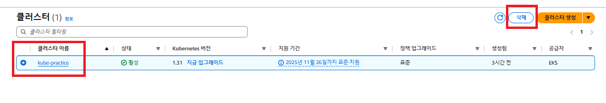

# 비용 나가지 않게 EKS 종료하기

---

### 실행 중인 오브젝트 종료
```shell
kubectl delete all --all
```
- 실행 중인 파드가 있으면 EKS의 노드 그룹이 삭제되지 않는다. 

---

### EKS 노드 그룹 삭제하기


---

### EKS 클러스터 삭제하기
- EKS의 노드 그룹이 삭제가 완료돼야만 EKS 클러스터를 삭제할 수 있다. 
- EKS 노드 그룹이 삭제될 때까지 조금만 기다리자. 



- 노드 그룹이 삭제되면, EKS 클러스터를 삭제한다.

---

### 비용 나가지 않게 EC2 종료하기


---

### 비용 나가지 않게 RDS 종료하기


- 최종 스냅샷 생성과 자동 백업 보존을 체크하면 비용이 나간다. 
- 따라서 실제 운영용 데이터베이스가 아니라면 체크를 해제하고 삭제를 하자.

---

### 비용 나가지 않게 ECR 종료하기


---

### 혹시나 비용 나가는 건 아닌지 체크하는 방법


- 보통 AWS 에서 사용된 리소스들에 대한 비용은 즉각적으로 반영되지 않으므로, 하루 정도 시간을 두고 확인하면 좋다.

---
