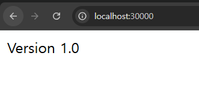

# 새로운 버전의 서버로 업데이트 시키기
> 실제 서버를 운영하다보면 기능을 업데이트를 할 일이 많이 발생한다.  
> 그럼 쿠버네티스에서는 새로운 버전의 백엔드 서버로 어떻게 업데이트 시키는 지 알아보자.

---

### 코드 수정하기
```kotlin
@RestController
class AppController {

    @GetMapping("/")
    fun home(): String {
        return "Version 1.0"
    }
}
```

### 프로젝트 다시 빌드하기
```shell
./gradlew clean build
```

### 빌드된 jar 파일을 기반으로 새로운 이미지 빌드하기
```shell
docker build -t spring-server:1.0 .
```

### 이미지가 잘 생성됐는 지 확인하기
```shell
docker image ls
```

### 기존 디플로이먼트 매니페스트 파일 수정
**spring-deployment.yaml**
```yaml
apiVersion: apps/v1
kind: Deployment

metadata:
  name: spring-deployment

spec:
  replicas: 5
  selector:
    matchLabels:
      app: backend-app

  template:
    metadata:
      labels:
        app: backend-app
    spec:
      containers:
        - name: spring-container
          image: spring-server:1.0
          imagePullPolicy: IfNotPresent
          ports:
            - containerPort: 8080
```
- `spring-server` -> `spring-server:1.0`

### 수정된 매니페스트 파일을 기반으로 업데이트하기
```shell
kubectl apply -f spring-deployment.yaml
```

### 업데이트 확인


---

### 그 외 참고
- 쿠버네티스 디플로이먼트의 기본 배포 전략은 'RollingUpdate' 이다. 순차적으로 구버전-신버전 순으로 업데이트 되는 구조.
- 그런데 현재 상태에서 그냥 배포하면, 도중에 다운타임이 존재한다. 새로 컨테이너가 생성되자마자 바로 트래픽을 그쪽으로 돌리기 때문이다.
```yaml
    spec:
      containers:
        - name: spring-container # 컨테이너 이름
          image: spring-server:1.0 # 컨테이너를 생성할 때 사용할 이미지
          imagePullPolicy: IfNotPresent # 로컬에서 이미지를 먼저 가져온다. 없으면 레지스트리에서 가져온다.
          ports:
            - containerPort: 8080 # 컨테이너에서 사용하는 포트를 명시적으로 표현
          readinessProbe:
            httpGet:
              port: 8080
              path: /
            initialDelaySeconds: 5
            periodSeconds: 10
```
- 이 부분은 ReadinessProbe 설정을 해주면 된다. 새로운 파드(Pod)가 완전히 준비되기 전에는 트래픽을 받지 않도록 보장한다.
  - 새로운 Pod 생성 & Readiness Probe 체크 시작
  - 기존 Pod는 계속 트래픽 처리
  - 새로운 Pod가 Ready 상태가 되면 트래픽 전환
  - 기존 Pod 종료

---
