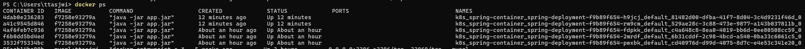
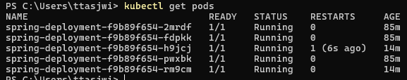

# 서버가 죽었을 때 자동으로 복구하는 기능 (Self-Healing)

---

## 1. 실행되고 있는 파드 내 서버가 비정상적으로 종료된다면?

### 1.1 특정 파드의 컨테이너 종료 시키기
```shell
docker ps
```


```shell
# docker kill [컨테이너 ID]
docker kill 4dab0e236283
```
- `docker ps` 명령을 통해 컨테이너 목록을 조회
- `docker kill` 명령을 통해 컨테이너 종료

### 1.2 파드 조회하기
```shell
kubectl get pods
```


- 파드를 조회해보니 여전히 5개의 파드가 작동하고 있는 걸 알 수 있다. 
- 그런데 제일 세 번째 파드를 보니 `RESTARTS`에 1 이라고 기록되어 있다. 
- 즉, 파드 내에 컨테이너가 작동하지 않음을 인식하고 컨테이너를 새로 만들어 서버를 재시작 시킨 것이다.

---

## 2. 결론
- 쿠버네티스는 파드 내의 컨테이너가 종료되면 자동으로 컨테이너를 재시작시킨다. 
- 이 기능을 보고 쿠버네티스에서는 **셀프 힐링(Self-Healing)** 이라고 한다. 즉, **자동 복구** 기능을 가지고 있다. 

---
