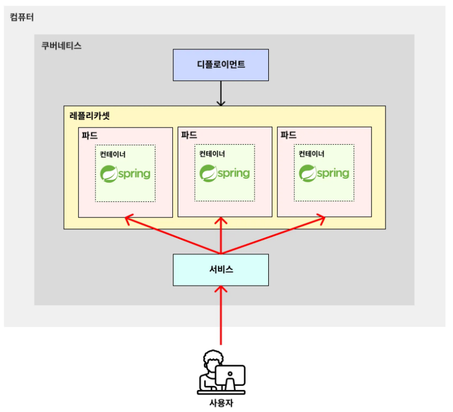

# 서비스(Service)

---

### 서비스(Service)
> **서비스(Service)**  
> 외부로부터 요청을 받는 역할 / 외부로부터 들어오는 트래픽을 받아, 파드에 균등하게 분배해주는 로드밸런서 역할을 하는 기능

- 실제 서비스에서 파드(Pod)에 요청을 보낼 때, 포트 포워딩(port-forward)이나 파드 내로 직접 접근(kubectl exec …)해서 요청을 보내진 않는다. 
- 서비스(Service)를 통해 요청을 보내는 게 일반적이다.

---

### 서비스(Service)의 구조

---
