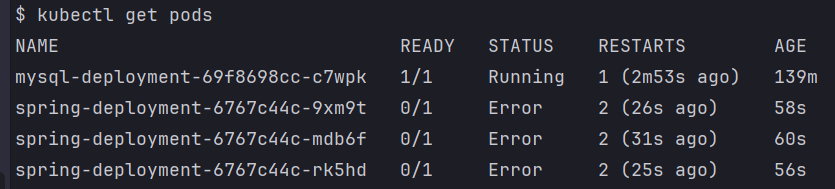
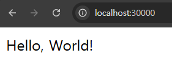

# 스프링 서버와 MySQL 이 제대로 연결되지 않을 때
> 구동 과정에서 에러가 발생했다면, 파드의 로그를 확인해 디버깅 해봐야한다.

---

### 매니페스트 파일 수정하기
**spring-secret.yaml**
```yaml
apiVersion: v1
kind: Secret

# Secret 기본 정보
metadata:
  name: spring-secret # Secret 이름

# Key, Value 형식으로 값 저장
stringData:
  db-username: "root"
  db-password: "wrongpassword"
```
- DB 정보를 일부러 틀리게 바꿔보자. 

---

### 매니페스트 파일 적용 및 재시작
```shell
kubectl apply -f spring-secret.yaml
kubectl rollout restart deployment spring-deployment
```

---

### 잘 작동되는 지 확인
```shell
kubectl get pods
```


---

### 에러메시지 확인하기
```shell
# kubectl logs [파드명]
kubectl logs spring-deployment-6767c44c-9xm9t
```


- DB 정보가 잘못돼서 연결이 제대로 안 되면 위와 같은 에러 메시지가 발생하면서 파드가 실행되지 않는다. 

---

### 다시 DB 정보를 올바르게 바꾸고 실행시키기
**spring-secret.yaml**
```yaml
apiVersion: v1
kind: Secret

# Secret 기본 정보
metadata:
  name: spring-secret # Secret 이름

# Key, Value 형식으로 값 저장
stringData:
  db-username: "root"
  db-password: "db1004"
```
```shell
kubectl apply -f spring-secret.yaml
kubectl rollout restart deployment spring-deployment
```

---

### 정상적 동작 확인
```shell
kubectl get pods
```




---
