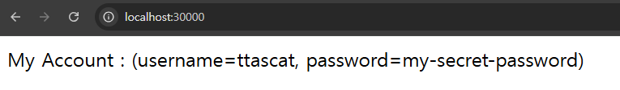

# 시크릿(Secret)을 활용해 '민감한 값'을 환경 변수로 분리하기

---

## 1. 시크릿(Secret) 이란?
- 시크릿(Secret)은 컨피그맵(ConfigMap)과 비슷하게 환경 변수를 분리해서 관리하는 오브젝트이다. 
- 차이점은 시크릿(Secret)은 비밀번호와 같이 보안적으로 중요한 값을 관리하기 위한 오브젝트이다.

---

## 2. 시크릿(Secret)을 활용해 '민감한 값'을 따로 분리하기

### 2.1 기존 매니페스트 파일
**spring-config.yaml**
```yaml
apiVersion: v1
kind: ConfigMap

# ConfigMap 기본 정보
metadata:
  name: spring-config # ConfigMap 이름

# key, value 형식으로 설정값 저장
data:
  security-username: "ttascat"
  security-password: "pwd4567"
```
- 위 매니페스트 파일에서 `security-password`의 값이 보안적으로 중요한 값이라고 가정해보자. 
- 그러면 `security-password`의 값은 컨피그맵(ConfigMap)이 아닌 시크릿(Secret)으로 관리해야 한다.

### 2.2 시크릿(Secret) 매니페스트 파일 생성
**spring-secret.yaml**
```yaml
apiVersion: v1
kind: Secret

# Secret 기본 정보
metadata:
  name: spring-secret

# Key, Value 형식으로 값 저장
stringData:
  security-password: "my-secret-password"
```
- 참고) 시크릿이 잘 적용됐는 지 확인하기 위해 my-password 값 변경

### 2.3 컨피그맵(ConfigMap) 매니페스트 파일 수정
**spring-config.yaml**
```yaml
apiVersion: v1
kind: ConfigMap

# ConfigMap 기본 정보
metadata:
  name: spring-config # ConfigMap 이름

# key, value 형식으로 설정값 저장
data:
  security-username: "ttascat"
```
- `data.security-password` 를 컨피그맵에서 제거했다.

### 2.4 디플로이먼트(Deployment) 매니페스트 파일 수정
```yaml
apiVersion: apps/v1
kind: Deployment
metadata:
  name: spring-deployment

spec:
  replicas: 3
  selector:
    matchLabels:
      app: backend-app

  # 정의할 Pod
  template:
    metadata:
      labels:
        app: backend-app
    spec:
      containers:
        - name: spring-container
          image: spring-server
          imagePullPolicy: IfNotPresent
          ports:
            - containerPort: 8080
          env: # 환경변수 등록
            - name: SECURITY_USERNAME
              valueFrom:
                configMapKeyRef:
                  name: spring-config
                  key: security-username
            - name: SECURITY_PASSWORD
              valueFrom:
                secretKeyRef:
                  name: spring-secret
                  key: security-password
```
- 패스워드 부분 `configMapKeyRef` -> `secretKeyRef`
  - name: spring-secret
  - key: security-password

### 2.4 매니페스트 파일 반영하기
```shell
kubectl apply -f spring-secret.yaml
kubectl apply -f spring-config.yaml
kubectl apply -f spring-deployment.yaml

kubectl rollout restart deployment spring-deployment 
```

---

## 3. 잘 반영됐는 지 확인

### 3.1 시크릿 조회
```shell
kubectl get secret
```

### 3.2 `http://localhost:30000/` 접속



---
