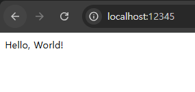
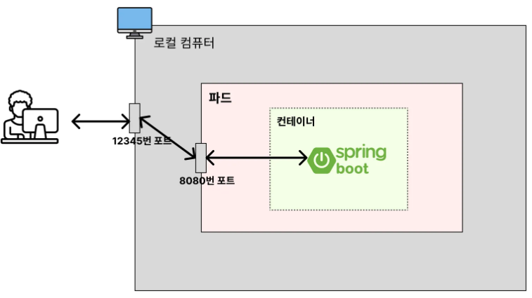

# 이미지가 없다고 에러가 뜨는 이유 (이미지 풀 정책)

---

## 1. 이미지가 없다고 에러가 뜨는 이유
```shell
$ kubectl get pods
NAME         READY   STATUS             RESTARTS   AGE
spring-pod   0/1     ImagePullBackOff   0          20s
```
- Spring Boot 프로젝트를 이미지로 빌드해서 파드로 띄웠으나,  `ImagePullBackOff` 라는 에러가 발생했다.
- 이 문제는 **이미지 풀 정책(Image Pull Policy)** 때문에 발생한 것이다.

---

## 2. 쿠버네티스 이미지 풀 정책(Image Pull Policy)
이미지 풀 정책(Image Pull Policy)이란 쿠버네티스가 yaml 파일을 읽어들여 파드를 생성할 때,  
이미지를 어떻게 Pull을 받아올 건지에 대한 정책을 의미한다.

1. `Always`
   - 로컬에서 이미지를 가져오지 않고, 무조건 **레지스트리(= DockerHub, ECR 과 같은 원격 이미지 저장소) 에서 가져온다.**
2. `IfnotPresent`
   - 로컬에서 이미지를 먼저 가져온다.
   - 로컬에서 이미지가 없는 경우에만 레지스트리에서 가져온다.
3. `Never`
   - 로컬에서만 이미지를 가져온다.

---

## 3. 매니페스트 파일에서 이미지 풀 정책을 설정하는 방법
```yaml
apiVersion: v1
kind: Pod
metadata:
  name: spring-pod
spec:
  containers:
    - name: spring-container
      image: spring-server
      ports:
        - containerPort: 8080
      imagePullPolicy: Always # Always, InNofPresent, Never
```

---

## 4. 기존 매니페스트 파일 다시 살펴보기
**spring-pod.yaml**
```yaml
apiVersion: v1
kind: Pod
metadata:
  name: spring-pod
spec:
  containers:
    - name: spring-container
      image: spring-server
      ports:
        - containerPort: 8080
```
- 위 매니페스트 파일에서는 이미지 풀 정책(ImagePullPolicy) 를 따로 설정하지 않았었다. 이럴 경우 아래와 같이 작동한다.
  - 이미지의 태그가 `lastest` 이거나 명시되지 않은 경우: `imagePullPolicy`가 `Always`로 설정됨
  - 이미지의 태그가 `latest` 가 아닌 경우: `imagePullPolicy` 가 `InNotPresent` 로 설정됨
- 따라서, 기존 매니페스트 파일은 `imagePullPolicy` 가 `Always` 로 작동했던 것이다.
- 로컬에서 이미지를 가져오지 않고 레지스트리에서 가져오려고 시도했다. 하지만 `spring-server` 라는 이미지는 DockerHub 에 올린 적이 없기
때문에 이미지를 못 받아온 것이다. 그래서 아래와 같은 에러가 발생했다.

```shell
$ kubectl get pods
NAME         READY   STATUS             RESTARTS   AGE
spring-pod   0/1     ImagePullBackOff   0          20s
```

---

## 5. 이미지 풀 정책 변경
```shell
apiVersion: v1
kind: Pod
metadata:
  name: spring-pod
spec:
  containers:
    - name: spring-container
      image: spring-server
      ports:
        - containerPort: 8080
      imagePullPolicy: IfNotPresent
```
- 로컬에서 이미지를 가져올 수 있도록 `ImagePullPolicy` 를 변경해야 한다.

---

## 6. 파드 재생성
```shell
kubectl delete pod spring-pod
kubectl apply -f spring-pod.yaml
```
- 기존 파드를 삭제하고, 수정된 `spring-pod.yaml` 로 다시 파드를 생성해본다.

```shell
$ kubectl get pods
NAME         READY   STATUS    RESTARTS   AGE
spring-pod   1/1     Running   0          41s
```
- 파드 목록을 조회해보면 `spring-pod` 파드가 실행 중인 것을 확인할 수 있다.

---

## 7. 파드 내부 프로그램(스프링 부트) 접속
Spring Boot 서버에 요청을 보내서 잘 응답하는 지도 알아보자.

### 7.1 파드 내부로 들어가서 요청 보내기
```shell
$ kubectl exec -it spring-pod -- bash # 이미지 사양에 따라 sh 로 바꿔서 쓰기 

# curl localhost:8080 로도 가능
$ wget -qO- http://localhost:8080 && echo
Hello, World!
```
- 내부 Java 이미지 사양에 따라, bash 명령어를 통해 접속하거나, sh 명령을 통해 접속해야하거나 차이가 있을 수 있다.
- curl 명령이 없을 경우 wget 명령 등의 대체 명령어가 없는 지 확인해 볼 것.

### 7.2 파드 외부(로컬 컴퓨터)에서, 파드 내부로 포트 포워딩
```shell
sudo kubectl port-forward pod/spring-pod 12345:8080
```
- 파드 외부(로컬 컴퓨터)의 12345 포트를 파드 내부의 8080 포트에 포트 포워딩한 뒤 브라우저로 접속해보자.





---

## 8. 파드 삭제
```shell
kubectl delete pod spring-pod
```

---
