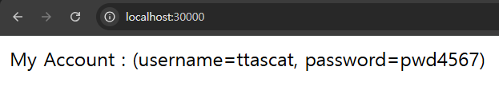

# 컨피그맵(ConfigMap)을 활용해 환경변수 분리하기

---

### 1. 컨피그맵(ConfigMap) 이란?
- 설정을 별도의 파일로 분리를 하여 관리하면 유지보수가 편리해지고 개발, 테스트, 프로덕션과 같은 환경 분리가 편해진다.
  - Spring Boot에서는 설정값을 `application.yml`으로 분리해서 관리한다. 
  - Nest.js에서도 설정값을 `.env`으로 분리해서 관리한다. 
- 쿠버네티스에서는 파드(Pod), 디플로이먼트(Deployment), 서비스(Service)가 각각의 역할을 가지고 있는 것처럼
**환경 변수를 관리하는 역할을 가진 오브젝트**가 따로 존재한다. 그게 바로 **컨피그맵(ConfigMap)** 이다.

---

## 2. 디플로이먼트(Deployment)에 환경 변수의 정보를 같이 작성했을 때의 단점
```yaml
apiVersion: apps/v1
kind: Deployment
metadata:
  name: spring-deployment

spec:
  replicas: 3
  selector:
    matchLabels:
      app: backend-app

  # 정의할 Pod
  template:
    metadata:
      labels:
        app: backend-app
    spec:
      containers:
        - name: spring-container
          image: spring-server
          imagePullPolicy: IfNotPresent
          ports:
            - containerPort: 8080
          env: # 환경변수 등록
            - name: SECURITY_USERNAME
              value: ttasjwi
            - name: SECURITY_PASSWORD
              value: pwd1234
```
- 위 매니페스트 파일을 보면 디플로이먼트(Deployment)에 대한 내용과 환경 변수에 관련된 내용을 같이 작성했다. 
- 이렇게 환경 변수를 디플로이먼트(Deployment) 내부에 작성하면 다른 환경(개발, 테스트, 프로덕션 등)에서
서버를 실행할 때 유연하게 설정 값을 변경하기 어려워진다.

---

## 3. 컨피그맵(ConfigMap)을 활용해 환경변수 분리하기

### 3.1 컨피그맵(ConfigMap) 매니페스트 파일 생성
**spring-config.yaml**
```yaml
apiVersion: v1
kind: ConfigMap

# ConfigMap 기본 정보
metadata:
  name: spring-config # ConfigMap 이름

# key, value 형식으로 설정값 저장
data:
  security-username: "ttascat"
  security-password: "pwd4567"
```
- 참고) 컨피그맵이 잘 적용됐는 지 확인하기 위해 my-account, my-password 값 변경

### 3.2 디플로이먼트(Deployment) 매니페스트 파일 수정
```yaml
apiVersion: apps/v1
kind: Deployment
metadata:
  name: spring-deployment

spec:
  replicas: 3
  selector:
    matchLabels:
      app: backend-app

  # 정의할 Pod
  template:
    metadata:
      labels:
        app: backend-app
    spec:
      containers:
        - name: spring-container
          image: spring-server
          imagePullPolicy: IfNotPresent
          ports:
            - containerPort: 8080
          env: # 환경변수 등록
            - name: SECURITY_USERNAME
              valueFrom:
                configMapKeyRef:
                  name: spring-config # ConfigMap의 이름
                  key: security-username # ConfigMap에 설정되어 있는 Key값
            - name: SECURITY_PASSWORD
              valueFrom:
                configMapKeyRef:
                  name: spring-config
                  key: security-password
```

### 3.3 매니페스트 파일 반영하기
```shell
kubectl apply -f spring-config.yaml
kubectl apply -f spring-deployment.yaml

# kubectl rollout restart deployment [디플로이먼트명]
kubectl rollout restart deployment spring-deployment # Deployment 재시작
```

---

## 4. 잘 반영 됐는 지 확인하기

### 4.1 컨피그맵 조회
```shell
kubectl get configmap
```

### 4.2 `http://localhost:30000/` 접근


---

