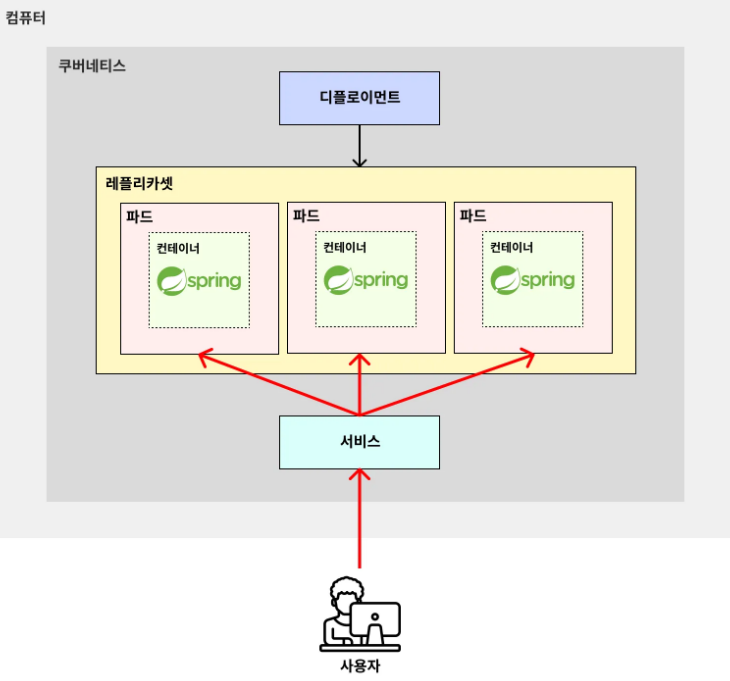

# 쿠버네티스 핵심 개념 - 파드, 디플로이먼트, 서비스

---

### 쿠버네티스에서의 핵심 개념

- 파드(Pod) : 일반적으로 쿠버네티스에서 하나의 프로그램을 실행시키는 단위 (쿠버네티스에서 가장 작은 단위)
- 디플로이먼트(Deployment) : 파드를 묶음으로 쉽게 관리할 수 있는 기능
  - 레플리카셋 : 파드 묶음
- 서비스(Service) : 외부로부터 들어오는 트래픽을 받아, 파드에 균등하게 분배해주는 로드밸런서 역할을 하는 기능
  - 외부 요청 받기, 여러 파드로 트래픽 분배

> 참고: 쿠버네티스에서는 서비스(Service), 디플로이먼트(Deployment), 파드(Pod)와 같은 리소스를 보고 오브젝트(Object)라고 부른다.

---

### 학습 Tip) 쿠버네티스의 핵심 개념에만 우선 집중하자. 
- 쿠버네티스에서 위 개념 말고도 `스테이트풀셋(StatefulSet)`, `잡(Job)`과 같은 다양한 개념이 존재한다.
하지만 이 모든 개념을 처음부터 다 흡수하려고 할 필요 없다. 
- 현업에서 가장 많이 사용되고 중요한 개념 위주로 먼저 배우고 익숙해지는 게 중요하다.
- 쿠버네티스를 학습할 때 발목을 붙잡는 건 모든 개념을 한 번에 다 익히려고 하는 욕심 때문에 발생한다. 
- 자주 쓰이는 개념 가지고 이것저것 만들어보면서 익숙해진 다음에 새로운 개념들을 하나씩 하나씩 추가적으로 학습해나가야 한다.
그래야 빨리 배울 수 있다.

---
