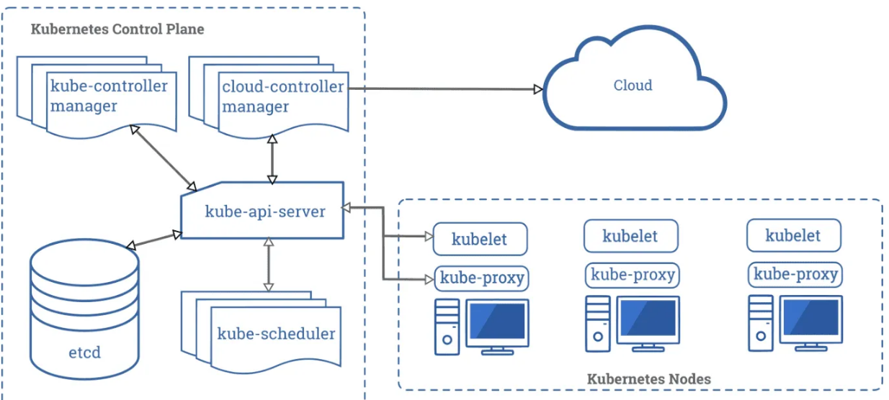
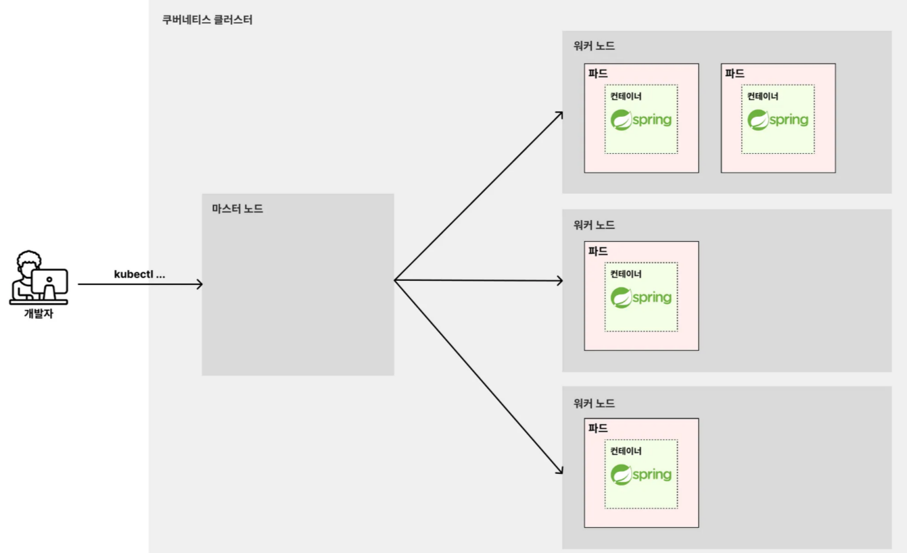
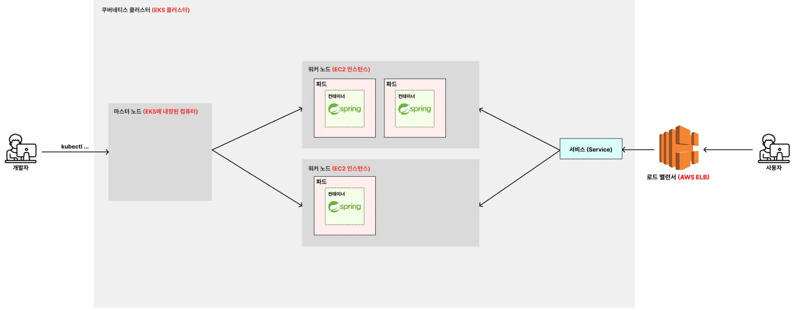

# 쿠버네티스와 EKS의 아키텍처 구조

---

### 쿠버네티스의 복잡한 아키텍처 구조

쿠버네티스를 입문하는 입장에서 위와 같은 복잡한 아키텍처 구조를 전부 이해할 필요는 없다. 그런데 대부분의 책과 강의의 초반부를 보면 일일이 
다 설명하고 있다. `etcd`가 뭔지, `Control Plane`은 뭔지, `kube-scheduler`가 뭔지 하나하나 다 설명한다. 
이렇게 공부하니까 쿠버네티스가 어렵게 느껴지고, 재미도 없고, 진도도 안 나가고, 이해도 안 되는 것이다. 이런 이유 때문에 여태 쿠버네티스 
아키텍처를 굳이 다루지 않았다. 지금까지 쿠버네티스의 핵심 개념을 이해하는 데 크게 문제가 없었음을 느꼈을 것이다.

하지만 EKS를 다룰 때 아키텍처에서 기본적인 부분을 알아야 할 필요가 있다. 입문자 입장에서 알면 되는 부분만 간단화시켜서 살펴보자.

---

### 간단하게 표현한 쿠버네티스 아키텍처 구조

- 쿠버네티스 클러스터: 하나의 **마스터 노드**와 여러 **워커 노드**들을 한 묶음으로 부르는 단위
- 노드 : 쿠버네티스 클러스터에 참여하는 물리적 컴퓨터(베어메탈 서버)나 가상 머신(VM)을 쿠버네티스 클러스터의 개념적 단위로 만든 것
  - 마스터 노드: 쿠버네티스 클러스터 전체를 관리하고 워커노드를 제어하는 서버
    - kubectl 명령을 실행하면 쿠버네티스 클러스터에 위치한 마스터노드들이 이 명령을 받아 처리한다.
  - 워커 노드: 쿠버네티스의 파드를 실행시키는 서버
    - 생성한 파드들은 워커 노드들에 골고루 배치된다.

---

### EKS를 활용해 구성할 아키텍처 구조

- 쿠버네티스 클러스터 => EKS 가 만들고, 관리해주는 쿠버네티스 클러스터
- 마스터 노드 => EKS 에 내장된 컴퓨터
  - 개발자가 직접 마스터노드 초기화를 할 필요 없이, EKS에서 관리해준다.
- 워커 노드 => EKS 가 EC2 인스턴스를 만들어 워커노드로 참여시킴
- 서비스 => ELB(AWS 로드밸런서)가 서비스와 통합되어, 요청을 적절한 파드로 분산시킨다.

---
