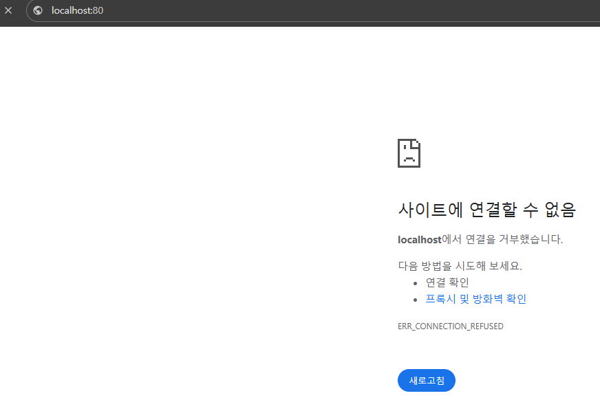

# 파드 생성

> 파드(Pod)를 생성할 때 CLI를 활용하는 방법이 있고, yaml 파일을 활용하는 방법이 있다.  
> **실제 현업에서는 yaml 파일을 활용하는 경우가 많다.** 따라서 yaml 파일을 활용해서 파드(Pod)를 생성해볼 것이다.

---

### 매니페스트 파일(Manifest File)
- 쿠버네티스에서 다양한 리소스(파드, 서비스, 볼륨 등)를 생성하고 관리하기 위해 사용하는 파일
- 파드와 같은 리소스를 정의하는 것은 CLI 로도 가능하지만, 매번 명령어를 수동으로 기입하는 것은 번거롭기 때문에 실무에서는 매니페스트 파일을
통해 문서화해서 관리한다.
- 매니페스트 파일을 사용하면 버전 제어 시스템에 저장 가능하다.
- 보통은 YAML 파일로 관리한다.
- 작성방법: [공식문서](https://kubernetes.io/docs/concepts/workloads/pods/)

---

### 파드(Pod) 생성
```shell
vim nginx-pod.yaml
```
- 우선 매니페스트 파일이 필요하다. `nginx-pod.yaml` 로 파일을 생성하겠다.

```yaml
apiVersion: v1 # Pod를 생성할 때는 v1이라고 기재한다. (공식 문서)
kind: Pod # Pod를 생성한다고 명시
metadata:
  name: nginx-pod # Pod에 이름 붙이는 기능
spec:
  containers:
    - name: nginx-container # 생성할 컨테이너의 이름
      image: nginx # 컨테이너를 생성할 때 사용할 Docker 이미지
      ports:
        - containerPort: 80 # 해당 컨테이너가 어떤 포트를 사용하는 지 명시적으로 표현(그냥 문서화 역할. 가독성)
```
- **주의)** YAML 문법상 들여쓰기를 할 때 **Tab**을 사용하면 안 되고 반드시 **띄어쓰기**를 활용해야 한다.
- `spec.containers.ports.containerPort`
    - 실제 작동에는 영향을 미치지 않는다.
    - 단순히 컨테이너가 어떤 포트를 사용하는 지 명시적으로 나타내기 위한 문서화용이다.
    - (`Dockerfile` 의 `EXPOSE`와 비슷한 역할이다.)

```shell
# kubectl apply -f [파일명]
$ kubectl apply -f nginx-pod.yaml
```
- 이 명령은 파드 뿐만 아니라, 매니페스트 파일에 적혀져있는 리소스(파드 등)를 생성하기 위한 명령이다.

---

### 파드 목록 조회
```yaml
# kubectl get pods (파드 조회)
$ kubectl get pods
NAME        READY   STATUS    RESTARTS   AGE
nginx-pod   1/1     Running   0          4s   
```
- `NAME` : Pod의 이름
- `READY` : (파드 내 준비 완료된 컨테이너 수)/(파드 내 총 컨테이너 수)
- `STATUS` : 파드의 상태 (`Running` : 정상적으로 실행 중)
- `RESTARTS` : 해당 파드의 컨테이너가 재시작된 횟수
- `AGE` : 파드가 생성되어 실행된 시간

---

### 배포된 서버 접속시도


- 방금 배포한 nginx 파드는 80번 포트에서 실행된다.
- 하지만 로컬 컴퓨터에서 `localhost:80` 을 통해 접속하면 접속이 되지 않는다.
- 이 부분이 왜 그런지 뒤에서 살펴보도록 하자.

---
