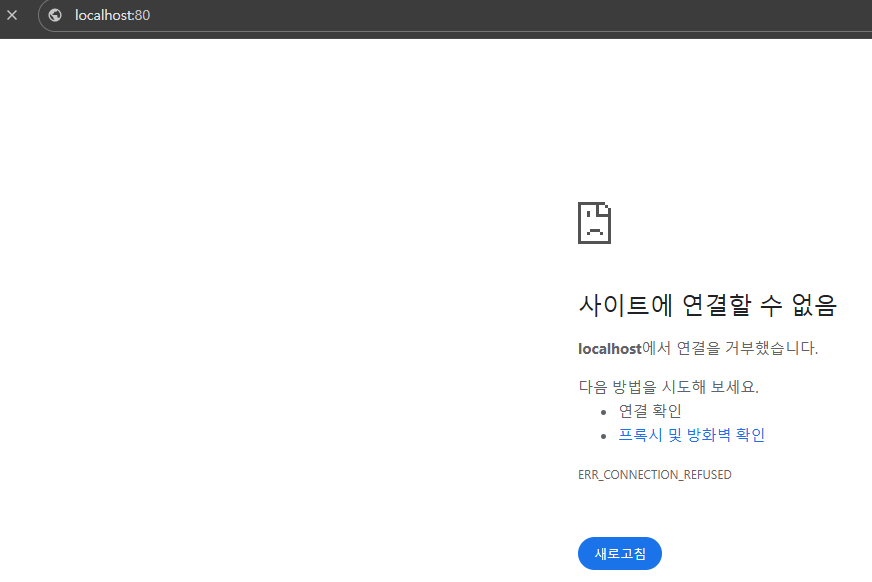

# 파드 외부에서 파드 내부 프로그램에 접근하기(포트 포워딩)

---

### 파드(Pod)로 띄운 프로그램에 외부 접속이 안 되는 이유



- 쿠버네티스에서는 파드(Pod) 내부와 파드 외부의 네트워크가 분리되어있다.
  - 도커에서는 컨테이너 내부와 컨테이너 외부의 네트워크가 독립적으로 분리되어 있었다.
  - (참고로 쿠버네티스에서는 파드 내부의 네트워크를 내부 컨테이너들이 공유해서 같이 사용한다.)
- 때문에 로컬 컴퓨터(파드 외부)에서 Nginx 파드(파드 내부)에 아무리 요청을 보내도 응답이 없었다.

---

### 파드 외부에서 파드 내부 프로그램에 접근하는 방법
1. 파드(Pod) 내부로 들어가서 접속하기
2. 파드(Pod) 내부의 네트워크를 외부에서 접속할 수 있도록, 포트 포워딩(=포트 연결시키기) 활용하기

---

### 파드(Pod) 내부로 들어가서 요청 보내기
- 파드(Pod) 내부로 접속해 Nginx로 요청을 보냈을 때, Nginx가 띄운 웹 페이지를 잘 응답하는 지 확인해보자.

```shell
# kubectl exec -it [파드명] -- bash
# 도커에서 컨테이너로 접속하는 명령어(docker exec -it [컨테이너 ID] bash)와 비슷하다. 
$ kubectl exec -it nginx-pod -- bash # nginx-pod 내부 환경으로 접속

# ---Pod 내부---
$ curl localhost:80 # Nginx로 요청보내기
```


- 쿠버네티스에서는 파드(Pod) 내부의 네트워크를 컨테이너가 공유해서 같이 사용하기 때문에,
파드로 접속해서 Nginx로 요청을 보냈을 때 정상적으로 응답이 날라왔다.
- 도커와 비교해보면, 도커는 컨테이너 내부의 네트워크와 컨테이너 외부 네트워크가 분리되어있기 때문에 외부에서 컨테이너에 접근할 수 없다.

---

### 포트 포워딩을 통해 Nginx 로 요청보내기


포트 포워딩을 활용해 로컬 환경에서도 Nginx로 접속할 수 있게 만들어보자.

```shell
# kubectl port-forward pod/[파드명] [로컬에서의 포트]/[파드에서의 포트]
$ sudo kubectl port-forward pod/nginx-pod 80:80
```

kubectl port-forward 를 통해, 파드 외부의 80번 포트를 파드 내부 80번 포트에 포트 포워딩 했다.


로컬 컴퓨터에서 curl 명령을 통해 `localhost:80` 에 요청을 보내면 성공적으로 응답이 온다.


브라우저를 통해 접속을 시도해도 마찬가지로 성공적으로 웹 페이지 응답이 와서 렌더링 된다.

---

### 파드 삭제하기
```shell
# kubectl delete pod [파드명]
$ kubectl delete pod nginx-pod # nginx-pod라는 파드 삭제

$ kubectl get pods # 파드가 잘 삭제됐는 지 확인
```

---
