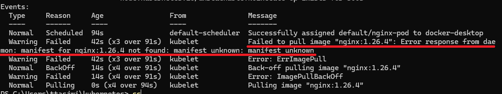

# 파드(Pod) 디버깅하는 방법

> 개발을 하다보면 결국 에러를 디버깅하고 해결하는 데에만 대부분의 시간을 쓴다.  
> 따라서, 어떤 기술을 익힐 때 반드시 에러를 에러를 디버깅 할 수 있는 방법을 정리해두어야 한다.

---

## 1. 파드(Pod)가 정상적으로 실행되지 않았을 때

### 1.1 매니페스트 파일 작성
```yaml
apiVersion: v1 # Pod를 생성할 때는 v1이라고 기재한다. (공식 문서)
kind: Pod # Pod를 생성한다고 명시
metadata:
  name: nginx-pod # Pod에 이름 붙이는 기능
spec:
  containers:
    - name: nginx-container # 생성할 컨테이너의 이름
      image: nginx:1.26.4 # 컨테이너를 생성할 때 사용할 Docker 이미지 (없는 버전)
      ports:
        - containerPort: 80 # 해당 컨테이너가 어떤 포트를 사용하는 지 명시적으로 표현(가독성)
```

### 1.2 파드 생성
```shell
$ kubectl apply -f nginx-pod.yaml
$ kubectl get pods
```
```shell
$ kubectl get pods
NAME        READY   STATUS         RESTARTS   AGE
nginx-pod   0/1     ErrImagePull   0          4s
```
- 파드 생성에 실패했다.
- 파드를 관리하고 생성하다보면 위와 같이 파드 생성에 실패하는 경우가 종종 생긴다. 
  - 위의 출력값을 보면 STATUS가 ErrImagePull 인걸 보고 에러가 발생했음을 짐작할 수 있다. 
- 하지만 구체적인 에러 메시지가 아니기에 `STATUS` 만 보고 문제점을 단번에 알아차리기 어려운 경우가 종종 있다. 어떻게 에러 메시지를 구체적으로 확인하는 지 알아보자.


### 1.3 파드의 에러 메시지 확인하기
```shell
# kubectl describe pods [파드명]
$ kubectl describe pods nginx-pod # nginx-pod 파드의 세부 정보 조회
```


- kubectl describe pods 명령을 통해 파드의 상세 정보를 조회할 수 있는데, 여기서 Events 쪽에서 좀 더 상세한
로그를 확인할 수 있다.

---

## 2. 파드(Pod)의 로그를 확인하고 싶을 때
### 2.1 매니페스트 파일 수정
```yaml
apiVersion: v1 # Pod를 생성할 때는 v1이라고 기재한다. (공식 문서)
kind: Pod # Pod를 생성한다고 명시
metadata:
  name: nginx-pod # Pod에 이름 붙이는 기능
spec:
  containers:
    - name: nginx-container # 생성할 컨테이너의 이름
      image: nginx:1.26.2 # 컨테이너를 생성할 때 사용할 Docker 이미지 (없는 버전)
      ports:
        - containerPort: 80 # 해당 컨테이너가 어떤 포트를 사용하는 지 명시적으로 표현(가독성)
```
- `image: nginx:1.26.4` -> `image: nginx:1.26.2`


### 2.2 변경사항 적용
```shell
$ kubectl apply -f nginx-pod.yaml
```
- `kubectl apply -f` 명령은 파드 생성 뿐만 아니라, 매니페스트 파일 갱신에 따라 파드 설정을 변경하기도 한다.


```shell
$ kubectl get pods
NAME        READY   STATUS    RESTARTS   AGE
nginx-pod   1/1     Running   0          24m
```
- 파드가 정상적으로 실행됐다.

### 2.3 파드의 로그 확인하기
```shell
# kubectl logs [파드명]
$ kubectl logs nginx-pod
```

---

## 3. 파드(Pod)에 접속하고 싶을 때
```shell
# kubectl exec -it [파드명] -- bash
$ kubectl exec -it nginx-pod -- bash

# kubectl exec -it [파드명] -- sh
$ kubectl exec -it nginx-pod -- sh
```
- 도커에서 컨테이너로 접속하는 명령어(`docker exec -it [컨테이너 ID] bash`)와 비슷하다.
- 컨테이너 종류에 따라 컨테이너 내부에 `bash`가 설치되어 있을 수도 있고, `sh`가 설치되어 있을 수도 있다. 만약 `bash`가 설치되어 있지
않은데 `$ kubectl exec -it nginx-pod -- bash` 명령어를 입력하면 에러가 뜨면서 컨테이너로 접속이 안 된다. 그럴 때는
`kubectl exec -it nginx-pod -- sh`으로 접속을 시도해보자.

---
