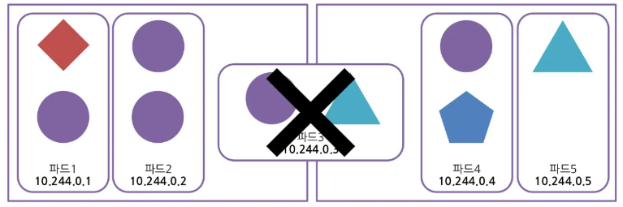
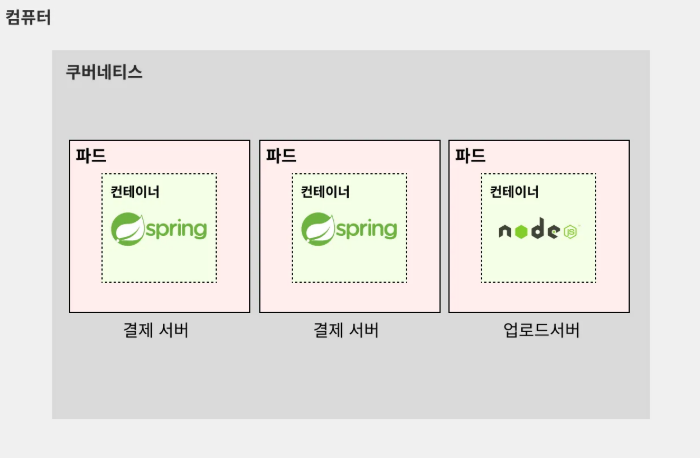
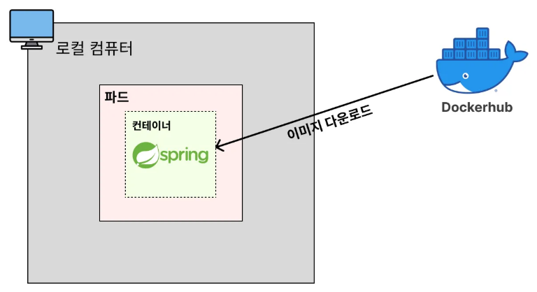
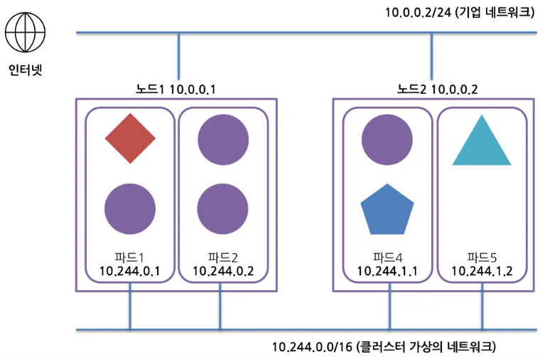
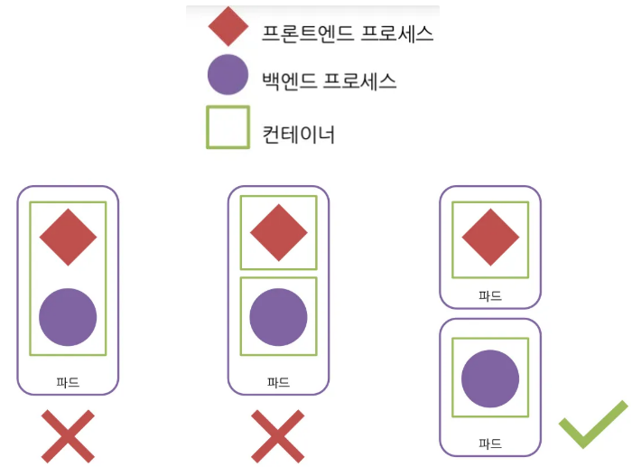

# 파드(Pod)

---

### 파드(Pod)란?

- 쿠버네티스에서 하나의 프로그램을 실행시키는 단위를 파드(Pod)라고 부른다.
  - 도커에서는 하나의 프로그램을 실행시키는 단위를 컨테이너(Container)라고 부른다.
  - 쿠버네티스에서는 하나의 프로그램의 실행 단위가 파드(Pod)가 된다.
- 쿠버네티스에서 가장 작은 단위다. 쿠버네티스는 컨테이너를 개별적으로 배포하지 않고, 파드 단위로 배포하고 운영한다.
- 일반적으로 **하나의 파드**가 **하나의 컨테이너**를 가진다.(예외적으로 하나의 파드가 여러 개의 컨테이너를 가지는 경우도 있다.)
- 파드는 다수의 노드에 걸쳐서 생성되지 않고 단일 노드에서만 실행된다.
- 즉, 한 파드 속에 여러 컨테이너가 있더라도 각 컨테이너는 동일한 리소스 및 로컬 네트워크를 공유한다

---

### 용어에 익숙해지기

- 2개의 결제 서버가 띄워져있다.  
  = 2개의 결제 서버 파드(Pod)가 띄워져있다.
- 1개의 결제 서버가 죽었다.  
  = 1개의 결제 서버 파드(Pod)가 죽었다.
- 업로드 서버를 하나 띄우자.  
  =업로드 서버 하나를 파드(Pod)로 띄우자.

---

### 쿠버네티스도 도커처럼 이미지를 기반으로 파드(Pod)를 띄워 실행시킨다.

- Docker Hub 와 같은 저장소에서 컨테이너 이미지를 가져와서, 이를 기반으로 하여 파드를 실행시킬 수 있다.

---

### 파드의 특징
- 같은 호스트 이름 및 네트워크 인터페이스를 공유한다.
- 개별 파드 내의 컨테이너들은 서로 부분 격리되어 있다.
  - 완전히 격리되어있지는 않음
  - 파드의 모든 컨테이너는 동일한 네트워크 및 UTS 네임스페이스에서 실행된다.
  - 파드내의 컨테이너들은 같은 호스트 이름 및 네트워크 인터페이스를 공유한다. (따라서, 이들끼리는 포트 충돌 가능성 있음에 주의하라.)
  - 파드의 모든 컨테이너는 동일한 IPC 네임스페이스 아래에서 실행되며 IPC를 통해 통신 가능
    - IPC : Inter-Process-Communication : 프로세스 간 통신 경로

---

### 파드 네트워크의 구조

- 파드끼리 연결된 별도의 네트워크 대역대가 존재하고, 이 네트워크를 통해 파드간 통신이 가능하다.
- 하지만 파드 네트워크 상에는 NAT 게이트웨이가 없으므로 그 자체만으로는 외부 네트워크와 통신할 수 없다.
  - NAT (Network Address Translation) 게이트웨이: 사설 네트워크 내부의 여러 장치가 인터넷에 연결될 수 있도록 하는 네트워크 장비
  - 내부 네트워크의 사설 IP 주소를 외부 네트워크에서 사용 가능한 공인 IP 주소로 변환하고, 외부에서 내부 네트워크로 들어오는 트래픽을 올바른 내부 장치로 라우팅
  - NAT 게이트웨이가 없으므로 외부와 기본적으로 격리되어 있고, 별도의 '서비스'가 있어야 통신할 수 있다.

---

### 유지보수성이 좋은 파드 구성 방법

- 다수의 파드로 애플리케이션을 분할하라.
  - 예) 백엔드 프로세스 파드 / 프론트엔드 프로세스 파드
- 각각 스케일 아웃이 가능한 파드로 분할할 것.
- 기본적으로는 하나의 파드에, 하나의 프로세스, 하나의 프로세스
- 하지만 실무에서는 다양한 애플리케이션이 혼합되어 동작하는 경우가 많다. (그림에서는 두번째
  - 두 가지 이상의 컨테이너가 밀접한 관련이 있는 경우
  - 서로의 네트워크 통신이 매우 빨라야하는 경우(같은 노드에 있음이 보장되므로)
  - 예) 리소스 모니터링, side car, 로그 로테이팅, …

---
