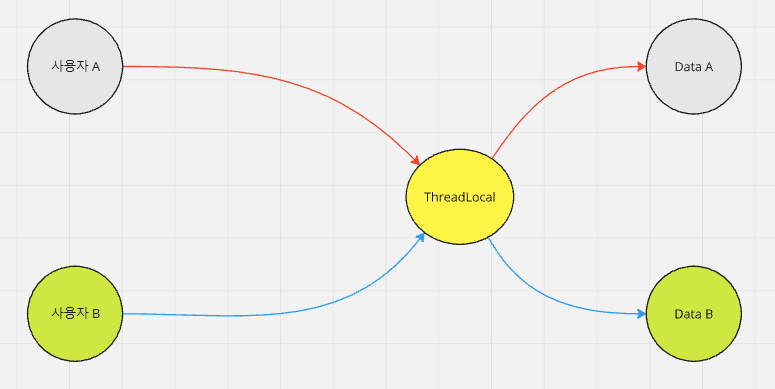

# ThreadLocal

---

### `ThreadLocal<T>` 이란


- java 1.2 부터 제공되는 클래스
- 스레드 별로 격리하여 데이터를 저장/수정/조회/삭제할 수 있다.

---

### ThreadLocal 사용법
```java
// 생성
var threadLocal = new ThreadLocal<SecurityContext>();
// 저장 (or 수정)
threadLocal.set(securityContext);
// 조회
var findSecurityContext = threadLocal.get();
// 삭제 (다 쓴 마지막에 꼭 할 것!!!)
threadLocal.remove();
```

---

### ThreadLocal 의 활용
한 기능을 처리하기 위한 메서드 흐름이 A->B->C-D->E 와 같을 때  
A에서 생성되거나 초기화된 X를 E에서 쓸 수 있게 하려면?
- 가장 쉽게 처리할 수 있는 방법 : 메서드 파라미터를 통해 A->B->C->D->E 로 전달하는 방법
    - 하지만 계속해서 파라미터를 통해 X 를 넘겨줘야하는 것이 부담됨
    - B,C,D도 해당 X를 알고 있어야한다.
```java
SomeHolder.saveSomeThing(X());
X x = SomeHolder.getSomeThing();
```
- ThreadLocal 을 사용하면 A에서 ThreadLocal 을 통해 X를 저장하고 E 에서 꺼내서 쓰게 할 수 있다.
- 정적 유틸 클래스를 정의(위의 예에서는 SomeHolder)하고 내부적으로 ThreadLocal을 사용하게 하는 방식을 사용하면
A, E 에서 SomeHolder 를 알기만 하면 X를 꺼낼 수 있다.

---

### 웹 요청과 ThreadLocal
- Spring Web 사용시, 사용자 요청이 들어올 때 하나의 스레드가 할당된다. 스레드 내에서 ThreadLocal 을 통해 여러가지 유용한 데이터를 보관해둘 수 있다.
- 예) 사용자의 인증 결과물(Spring Security -> SecurityContextHolder -> ThreadLocal -> SecurityContext -> Authentication)
- 예) 사용자의 로케일 정보(LocaleContextHolder -> ThreadLocal -> LocaleContext -> Locale)

---

### ThreadLocal 주의점
- 한 스레드가 여러 사용자에 의해 여러번 재사용되는 구조의 애플리케이션일 경우, **반드시** ThreadLocal 사용 후 Thread 반납 전에
`remove()` 메서드를 호출하여 ThreadLocal 을 정리해야한다.
- 예를 들어 사용자 인증정보를 담은 ThreadLocal 을 제대로 정리하지 않았을 경우 다음에 ThreadLocal 을 사용하는 사용자가 해당 정보를 꺼낼 수 있다.
- 그래서 보통 ThreadLocal 기반으로 작동되는 유틸 클래스들은 호출 후 finally 문 같은 곳에서 자원을 정리하는 메서드를 호출해야한다.

---
