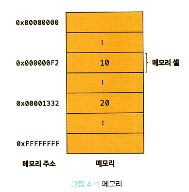
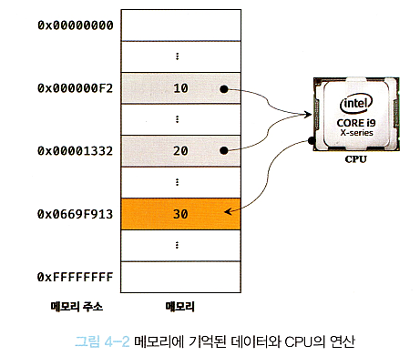
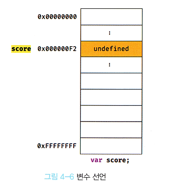

## <a href = "README.md" target="_blank">모던 자바스크립트 Deep Dive</a>
### 04장. 변수
1) 변수란 무엇인가
2) 식별자
3) 변수의 선언
4) 변수 선언의 실행 시점과 변수 호이스팅
5) 값의 할당
6) 값의 재할당
7) 식별자 네이밍 규칙
---

# 04장. 변수

---

## 1) 변수란 무엇인가

<details>
<summary>접기/펼치기</summary>
<div markdown="1">

### 1.1 메모리

- 메모리 : 데이터를 저장할 수 있는 메모리 셀의 집합체
  - 메모리셀 : 1개의 크기는 1byte(8 bit)
- 각 셸은 고유의 메모리 주소를 가진다.
- 컴퓨터는 모든 데이터를 2진수로 저장하므로, 메모리에 저장되는 모든 데이터는 데이터의 종류와 관계 없이 모두 2진수로 저장된다.
- 메모리 주소를 통해 값에 직접 접근하는 것은 치명적 오류를 발생시킬 가능성이 매우 높으므로 메모리 주소 대신 '변수'를 이용함.
  - 자바 스크립트에서는 메모리 주소를 통한 접근을 허용하지 않음. (C와 같은 언어에서는 이런 기능을 제공함.)

### 1.2 변수


```javascript
// 우변의 결과를 통해 생성한 값을 변수 result에 할당하라.
var result = 10 + 20;
```
- 하나의 값을 저장하기 위해 확보한 메모리 공간 자체 또는 그 메모리 공간을 식별하기 위해 붙인 이름, 수단.
  - 변수에 여러 개의 값을 저장하려면, 여러 변수를 사용하거나 배열 또는 객체 등의 자료 구조를 통해 여러 값을 그룹화해서 하나의 값처럼 사용할 수 있다.
- 값의 위치를 가리키는 상징적인 이름
- 사용목적
  - 기억하고 싶은 값을 메모리에 저장, 저장된 값을 읽어 들여 재사용하기 위함

### 1.3 할당(assignment)

- 변수에 값을 저장하는 것. 변수에 저장된 값을 변수값이라고 한다.
- 동의어 : 대입, 저장

### 1.4 참조(reference)
- 변수에 저장된 값을 읽는 것

</div>
</details>

---

## 2) 식별자(변수명, 함수명, 클래스명, ...)


<details>
<summary>접기/펼치기</summary>
<div markdown="1">

### 식별자(identifier)
- 변수에 붙인 이름
- 메모리 주소에 붙인 이름.
- 메모리 상에 존재하는 어떤 값을 식별할 수 있는 이름.
  - (cf) 함수 역시 자바스크립트에서는 값으로 취급됨
- 단순히 변수에만 국한되지 않고, 변수/함수/클래스 명... 등도 모두 식별자

### 식별자는 메모리 주소에 붙인 이름이다.
- 식별자를 알고 있다 = 식별자가 가리키고 있는 메모리 공간에 저장된 값에 접근할 수 있다.

</div>
</details>

---

## 3) 변수의 선언

<details>
<summary>접기/펼치기</summary>
<div markdown="1">

### 3.1 변수 선언

- 변수를 생성하는 것
- 세부적인 과정
  1. 값을 저장하기 위해 메모리 공간을 확보
  2. 변수 이름 - 확보된 메모리 공간 주소를 연결 (값을 저장할 수 있게 준비)

### 3.2 변수 선언 방법
> [var/let/const] 식별자;
```javascript
var score; // 변수 선언문
```
- var : ES6 이후에는 쓰지 않는게 좋다. (let, const 키워드의 문제점은 이후에 다룸)
- let : 가변
- const : 불변

### 3.3 변수의 초기화
- 변수가 선언된 이후 최초로 값을 할당하는 것
- `var` 키워드를 사용한 변수 선언은 선언, 초기화가 동시에 진행됨. 어떤 값도 할당하지 않더라도 `undefined`가 할당된다.
  - undefined : 자바스크립트에서 지원하는 원시타입의 값(primitive value)

### 3.4 실행 컨텍스트
- 변수명을 비롯한 모든 식별자가 등록되는 곳.
- 자바스크립트 엔진이 소스코드를 평가하고 실행하기 위해, 필요한 환경을 제공
- 코드의 실행 결과를 실제로 관리하는 영역
- 자바스크립트 엔진은 실행 컨텍스트를 통해 식별자, 스코프를 관리

### 3.5 참조 에러(ReferenceError)
- 선언하지 않은 식별자에 접근하려 할 때 발생하는 에러
- 자바스크립트 실행 엔진이 등록된 식별자를 찾을 수 없을 때 발생

</div>
</details>

---

## 4) 변수 선언의 실행 시점과 변수 호이스팅
```javascript
console.log(score); // undefined
var score; // 변수 선언문
```
- 변수 선언의 실행 시점 : 런타임 이전 단계에서 먼저 실행됨. 
  - 자바스크립트 엔진은 소스코드를 실행하기 전에, 소스코드의 평가과정을 거치면서 모든 선언문을 실행함.
- 변수 호이스팅(variable hoisting) : 변수 선언문이 코드의 선두로 끌어올려진 것처럼 동작하는 자바스크립트 고유의 특징
- 변수 선언뿐 아니라 var, lete, const, function, class 키워드를 사용하는 모든 식별자(변수, 함수, 클래스)는 호이스팅 됨.

---

## 5) 값의 할당

```javascript
var score; // 변수의 선언
score = 80; // 값의 할당
```
- 변수 선언 : 런타임 이전
- 값의 할당 : 소스코드가 순차적으로 실행되는 런타임에 실행
- var 변수는 선언과 동시에 undefined로 초기화됨

---

## 6) 값의 재할당

```javascript
console.log(score); // undefined

score = 80; // 값의 재할당
var score; // 변수 선언
console.log(score); // 80 
```
- var 키워드 변수는 선언과 동시에 undefined로 초기화되기 때문에 엄밀히 말하면 처음으로 값을 할당하는 것도 재할당이다.
- 변수에 값을 재할당하면 값만 변경하는 것이 아니라 메모리 주소도 변경됨
  - **값을 지우고 그 자리에 할당되지 않음!!**
- 어떤 변수도 값으로 가지고 있지 않을 경우 가비지 컬렉터(garbage collector)에 의해 메모리에서 자동 해제됨.
  - 가비지컬렉터 : 더 이상 참조되지 않는 메모리를 해제하는 기능. 메모리 누수를 방지하기 위함.
- const 키워드는 값의 재할당이 금지됨.

---

## 7) 식별자 네이밍 규칙
<details>
<summary>접기/펼치기 버튼</summary>
<div markdown="1">

### 네이밍 규칙
- 특수문자를 제외한 문자, 숫자, 언더스코어(`_`), 달러 기호(`$`) 포함 가능
    - 단, 숫자로 시작하는 것은 허용되지 않는다.
- 예약어 금지 : [예약어 목록](https://www.w3schools.com/js/js_reserved.asp)
  - 예약어 : 프로그래밍 언어에서 사용되고 있거나 사용될 예정인 단어들
  - 예) if, case,  catch, class, const, else, do, ...

### 변수는 한 문장에서 한 번에 여러개 선언 가능
```javascript
var person, $elem, _name, first_name, val1;
```

### 알파벳 이외의 유니코드 문자 허용(권장 x)
```javascript
var 이름, なまえ;
```
- ES5부터 지원, 하지만 권장 x

### 대소문자를 구분한다
```javascript
var firstname;
var firstName;
var FIRSTNAME;
```
- 위의 변수는 각각 별개의 변수이다.

### 네이밍 컨벤션
- 하나 이상의 영어 단어로 구성된 식별자를 만들 때, 가독성 좋게 단어를 한 눈에 구분하기 위해 규정한 명명 규칙.
- 네이밍 컨벤션을 잘 지켜서 읽기 좋은 변수명을 짓자.
- 일반적으로 다음 4가지 규칙이 자주 사용됨.
    - 카멜 케이스 : 일반적으로 변수, 함수명에 사용됨
      ```javascript
      var firstName; // 카멜 케이스
      ```
    - 스네이크 케이스
      ```javascript
      var first_name; // 스네이크 케이스
      ```
    - 파스칼 케이스 : 일반적으로 생성자 함수, 클래스 명에 사용됨
      ```javascript
      var FirstName; // 파스칼 케이스
      ```
    - 헝가리언 케이스
      ```javascript
      var strFirstName; // type + identifier
      var $elem = document.getElementById('myId'); // DOM 노드
      var observable$ = fromEvent(document, 'click'); // RxJs 옵저버블
      ```
- 코드 전체의 가독성을 높이기 위해서는 카멜 케이스, 파스칼 케이스를 사용하는 것이 유리
    - ECMAScript에 정의되어 있는 객체, 함수들도 카멜 케이스, 파스칼 케이스를 사용하고 있음

</div>
</details>


---
