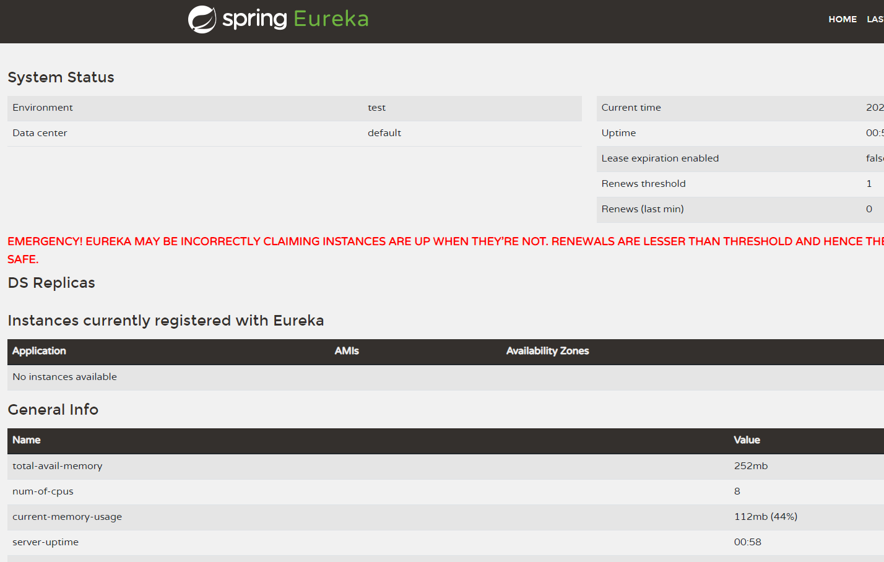
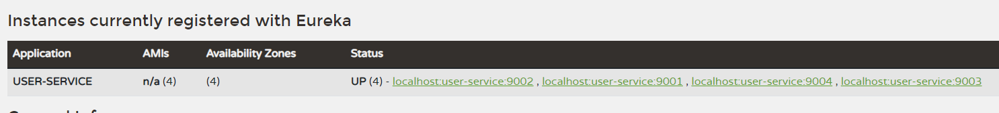

# 서비스 디스커버리 - Spring Eureka Server 실습

---

## 1. Spring Eureka Server
- Netflix 에서 Spring 에 기부하고, 그 후 발전해온 서비스 디스커버리
  - Eureka Server : 서비스 디스커버리 역할을 하는 서버
  - Eureka Client : 서비스 디스커버리에 스스로를 등록하는 서버

---

## 2. Eureka Server 프로젝트 생성 및 설정

### 2.1 프로젝트 생성
- 프로젝트명 : discovery-service
- 패키지: `com.example.ecommerce`
- 의존성
  - Spring Eureka Server

### 2.2 `build.gradle.kts`
```kotlin
extra["springCloudVersion"] = "2024.0.0"

dependencies {
    implementation("org.jetbrains.kotlin:kotlin-reflect")
    implementation("org.springframework.cloud:spring-cloud-starter-netflix-eureka-server")
    testImplementation("org.springframework.boot:spring-boot-starter-test")
    testImplementation("org.jetbrains.kotlin:kotlin-test-junit5")
    testRuntimeOnly("org.junit.platform:junit-platform-launcher")
}

dependencyManagement {
    imports {
        mavenBom("org.springframework.cloud:spring-cloud-dependencies:${property("springCloudVersion")}")
    }
}
```
- `springCloudVersion` : [버전참고](https://spring.io/projects/spring-cloud)
  - Spring Boot 3.4.1 기준 "2024.0.0"
- 의존성
  - 유레카 서버 : `org.springframework.cloud:spring-cloud-starter-netflix-eureka-server`

### 2.3 `application.yml`
```yaml
server:
  port: 8761

spring:
  application:
    name: discoveryService # 마이크로서비스 이름 -> 실제 등록은 대소문자 구분 없이 대문자로 등록됨

eureka:
  client:
    register-with-eureka: false # 유레카 서버에 해당 서비스를 등록할 것인가? -> false
    fetch-registry: false # 유레카 서비스 레지스트리 변경 사항을 주기적으로 로컬에 fetch
```
- 환경 설정 파일이므로 코드 베이스(github)에 push하면 안 됨
- 설정 설명
    - `server.port` : 유레카 서버의 포트
    - `spring.application.name` : 해당 서비스의 이름
    - `eureka.client.register-with-eureka` : 유레카 서버에 해당 서비스를 등록할 것인가?
    - `eureka.client.fetch-registry`
        - 클라이언트 소프트웨어는 30초마다 유레카 서비스에 레지스트리 변경 사항을 확인
        - 레지스트리를 검색할 때마다, 유레카 서비스를 호출하는 대신 레지스트리를 로컬에 캐싱
        - 30초마다 갱신된 정보를 받아 로컬에 캐싱한다.

### 2.4 DiscoveryServiceApplication
```kotlin
@SpringBootApplication
@EnableEurekaServer // 유레카 서버 기능을 활성화하기 위해서, 반드시 활성화해야함
class DiscoveryServiceApplication

fun main(args: Array<String>) {
    runApplication<DiscoveryServiceApplication>(*args)
}
```
- `@EnableEurekaServer` : 스프링 서버에서 유레카 서버 활성화

### 2.5 기동


스프링 부트를 기동하여, localhost의 8761번 포트로 접속하면 스프링 유레카 페이지가 뜬다.

---

## 3. User Service 프로젝트 생성

### 3.1 프로젝트 생성
- 프로젝트명 : user-service
- 패키지: `com.example.ecommerce`
- 의존성
    - Eureka Discovery Client
    - Spring Web

### 3.2 `build.gradle.kts`
```kotlin
dependencies {
	implementation("org.springframework.boot:spring-boot-starter-web")
	implementation("com.fasterxml.jackson.module:jackson-module-kotlin")
	implementation("org.jetbrains.kotlin:kotlin-reflect")
	implementation("org.springframework.cloud:spring-cloud-starter-netflix-eureka-client")
	testImplementation("org.springframework.boot:spring-boot-starter-test")
	testImplementation("org.jetbrains.kotlin:kotlin-test-junit5")
	testRuntimeOnly("org.junit.platform:junit-platform-launcher")
}

dependencyManagement {
	imports {
		mavenBom("org.springframework.cloud:spring-cloud-dependencies:${property("springCloudVersion")}")
	}
}
```

### 3.3 application.yml
```yaml
server:
  port: 9001

spring:
  application:
    name: user-service # 마이크로서비스 이름(실제 등록 시 대소문자 구분 안 됨)

eureka:
  client:
    register-with-eureka: true # 유레카 서버에 등록할 것인가? -> true
    fetch-registry: true # 유레카 서버로부터 인스턴스들의 정보를 주기적으로 가져올 것인가 -> true
    service-url:
      defaultZone: http://127.0.0.1:8761/eureka # 유레카 서비스의 위치, 엔드포인트
```
- 유레카 서버에 등록하기 위해, register-with-eureka 옵션을 활성화한다.
- 다른 인스턴스들의 정보를 주기적으로 가져오기 위해 fetch-registry 옵션을 활성화한다.


### 3.4 `@EnableDiscoveryClient` : 유레카 Discovery 클라이언트 활성화
```java

@SpringBootApplication
@EnableDiscoveryClient
public class UserServiceApplication {

    public static void main(String[] args) {
        SpringApplication.run(UserServiceApplication.class, args);
    }

}
```
- `@EnableDiscoveryClient` 옵션을 활성화하면, 스프링 클라우드 로드 밸런서 클라이언트에 등록된 모든 서비스와 해당 URL을 쿼리할 수 있다.
- 스프링 클라우드에서, 애플리케이션이 Discovery Client 및 스프링 클라우드 로드 밸런서 라이브러리를 사용할 수 있게 함
- 이를 통해 애플리케이션에서 Discovery 서비스로부터, 서비스 인스턴스를 검색할 수 있게 된다.

### 3.5 실행


- 9001번 포트에서 user service를 실행시킨 결과, 해당 인스턴스가 유레카에 등록된 것을 확인할 수 있음
- 인스턴스가 'USER-SERVICE'로 추상화됨

---

## 4. User Service 여러대 동시 실행
이번에는 User Service를 여러대 동시 실행했을 때 서비스 디스커버리에 어떻게 등록되는 지 확인해보자.


### 4.1 실행 방법
일단 여러 대의 User Service를 실행시켜야하는데 실행 방법도 여러가지가 존재한다.
- IDE 실행 방식
  - 이때 실행 변수로 `-Dserver.port=90xx` 를  전달하면 기존 application.yml 설정을 덮어쓰고 실행한다.
- bootRun 실행 방식 : 빌드하지 않고 소스코드로부터 바로 실행한다.
  ```shell
  ./gradlew bootRun --args='--server.port=9003'
  ```
- jar 빌드 실행방식 : jar 빌드 후 실행한다.
  ```shell
  ./gradlew clean
  ./gradlew build  # ./gradlew clean build 로 해도 됨
  
  # 빌드된 폴더로 이동 후 실행
  java -jar -Dserver.port=9004 ./build/libs/userservice-0.0.1-SNAPSHOT.jar
  ```

### 4.2 Eureka 등록 확인


- USER-SERVICE로 4개의 인스턴스가 등록된 것을 확인할 수 있다.
- 4개의 인스턴스가 추상화된 것이다.


---

## 5. 랜덤포트 실행 및 서비스 이름 동적 지정
매번 인스턴스를 만들 때마다 이렇게 수동으로 포트 번호를 개발자가 지정해서 실행해야하는 것이 매우 번거롭다.


### 5.1 랜덤 포트 설정
```yaml
server:
  port: 0 # 0으로 지정하면 랜덤 포트로 실행됨
```
- port를 0으로 지정하면 랜덤 포트로, **충돌되지 않게** 바인딩하여 실행한다.

### 5.2 실행 및 문제점


- 하나의 애플리케이션은 IDE에서 실행
- 하나의 애플리케이션은 터미널에서 실행
- 이렇게 할 경우 두개의 애플리케이션이 동시에 정상적으로 실행되어 있는 것을 확인할 수 있다.
- 하지만 Eureka의 레지스트리를 확인해보면, 마지막에 실행한 인스턴스만 등록되어 있다.
- 이것은 Eureka가 `host명 - 서비스명:yml에 등록된 포트번호`로 인식하여 등록하기 때문이다.


### 5.3 인스턴스 id 랜덤 생성을 통해 중복 문제 해결
```yml
eureka:
  instance:
    instance-id: ${spring.cloud.client.hostname}:${spring.application.instance_id:${random.value}}
```
- 인스턴스 각각에게 고유한 식별자를 부여할 수 있도록, `eureka.instance.instance-id` 설정에서, 매번 랜덤한 인스턴스 id를 가지도록 한다.

### 5.4 애플리케이션 여러개 기동


```shell
./gradlew clean build
cd ./build/libs
java -jar user-service-0.0.1-SNAPSHOT.jar
```
- 동일한 소스코드를 기반으로 애플리케이션을 두개 실행한다.
- 실행결과 두개의 인스턴스가 구별되어 등록된 것을 확인할 수 있다. 실제 포트도 각각 다르다.
- 매 순간 다른 포트에 바인딩된, 다른 이름의 인스턴스를 연속해서 생성할 수 있게 됐다.

---
