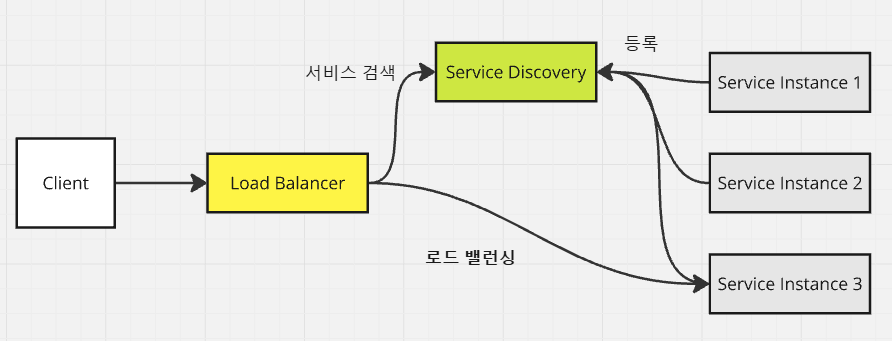

# 서비스 디스커버리(Service Discovery)

---

### Service Discovery

- 여러 마이크로 서비스를 서비스 디스커버리에 등록하고, 검색할 수 있다.
    -  key로 서비스 이름을 보관하고, value에 해당 서비스 이름을 가진 인스턴스들을 매핑해둔다.
- 각각의 서비스의 물리적 주소가 Service Discovery에 의해 추상화된다.
- 서비스들은 동적으로 생성되고, 제거되어야하는데 이런 서비스를 라우팅 테이블과 같은 곳에 일일이 등록하는 것은 서비스 확장관점에서 유연하지
못하다. 서비스 디스커버리측에 서비스들이 스스로를 등록한다.

---

### 수평 확장/축소의 편리함
- 실제 서비스 소비자는, 실제 서비스 인스턴스의 물리적 위치를 알 필요가 없고, 각각의 서비스 인스턴스는
  서비스 풀에 추가되거나 제거될 수 있다. 덕분에, **서비스 인스턴스의 수를 빠르게 수평 확장, 축소할 수 있다.**

---

### 회복성 향상
- 서비스 인스턴스가 비정상적이거나 가용 불가능한 상태가 될 경우, 서비스 디스커버리 엔진은
해당 인스턴스를 가용 서비스 목록에서 제거한다.

---

### 제품군
- Netflix Eureka Service Discovery
- etcd, Consul, Apache, Zookeeper, ...

---
