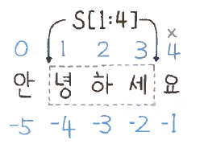

# 문자열

---

### 문자와 아스키코드
- 문자의 아스키코드 값 : `ord('a')` -> 97
- 아스키코드 값을 통해 문자 얻기 : `chr(97)` -> a
- 자주 쓰이는 아스키코드 값
  - '0' : 48
  - 'A' : 65
  - 'a' : 97

---

### 역 인덱스
```python
s = "안녕하세요"
print(s[-1]) # 요
print(s[-2]) # 세
```
- 파이썬에서 문자열, 리스트에 대해서 -1 번째 인덱스를 지정하면 뒤에서 1 번째 인덱스를 가리키게 된다.
- -2, -3, ..., -n 와 같이 지정하는 것도 가능한데 이 경우 뒤에서 n 번째 인덱스를 가리키게 된다.
  
---

### 문자열 슬라이싱


- `문자열[a:b]` : a(시작) ~ b(미포함)
- `문자열[a:b:k]` : a(시작) ~ b(미포함), k 간격(k가 음수이면 음의 방향)
- `문자열[a:]` : a(시작) ~ 끝
- `문자열[:b]` : 처음 ~ b(미포함)
- `문자열[::k]` : 처음 ~ 끝, k 간격(k가 음수이면 음의 방향)
- `문자열[:]` : 사본 복사

---
