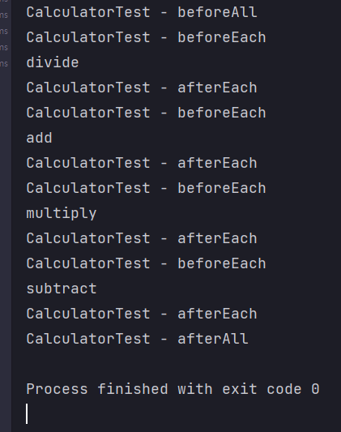

# <a href = "../README.md" target="_blank">자바 웹 프로그래밍 Next Step - 하나씩 벗겨가는 양파껍질 학습법</a>
## Chapter 02. 문자열 계산기 구현을 통한 테스트와 리팩토링
### 2.2 JUnit을 활용해 main() 메서드 문제점 극복
1) JUnit, AssertJ 라이브러리 의존성 추가
2) 메서드 하나씩 테스트
3) 결과 값을 눈이 아닌 프로그램을 통해 자동화
4) 테스트 코드 중복 코드 제거 - beforeEach, beforeAll, afterEach, afterAll
5) AssertJ를 활용하여 테스트 코드 가독성 향상
---

# 2.2 JUnit을 활용해 main() 메서드 문제점 극복

---

## 1) JUnit, AssertJ 라이브러리 의존성 추가
```groovy
dependencies {
    testImplementation 'org.junit.jupiter:junit-jupiter-api:5.8.1'
    testRuntimeOnly 'org.junit.jupiter:junit-jupiter-engine:5.8.1'
    testImplementation group: 'org.assertj', name: 'assertj-core', version: '3.22.0'
}
```
- gradle 기준 `build.gradle`의 dependencies에 위의 의존관계를 추가한다. (시기별로 적절한 버전을 맞춰서 사용)
  - junit-jupiter-api : https://mvnrepository.com/artifact/org.junit.jupiter/junit-jupiter-api
  - junit-jupiter-engine : https://mvnrepository.com/artifact/org.junit.jupiter/junit-jupiter-engine
  - assertj-core : https://mvnrepository.com/artifact/org.assertj/assertj-core
- Assertj는 JUnit 기반으로, 더 가독성 높은 테스트 코드를 작성하기 위해 사용함

### 스프링 부트에서
- 기본적으로 JUnit5, AssertJ가 지원되므로 별도의 의존성 추가가 필요 없다.

---

## 2) 메서드 하나씩 테스트

```java

@DisplayName("Calculator의")
class CalculatorTest {

    @Test
    @DisplayName("add 메서드 인자로 9,3이 주어지면 12를 반환해야한다.")
    void addTest() {
        Calculator cal = new Calculator();
        System.out.println(cal.add(9, 3));
    }

    @Test
    @DisplayName("subtract 메서드 인자로 9,3이 주어지면 6을 반환해야한다.")
    void subtractTest() {
        Calculator cal = new Calculator();
        System.out.println(cal.subtract(9, 3));
    }

    @Test
    @DisplayName("multiply 메서드 인자로 9,3이 주어지면 27을 반환해야한다.")
    void multiplyTest() {
        Calculator cal = new Calculator();
        System.out.println(cal.multiply(9, 3));
    }

    @Test
    @DisplayName("divide 메서드 인자로 9,3이 주어지면 3을 반환해야한다.")
    void divideTest() {
        Calculator cal = new Calculator();
        System.out.println(cal.divide(9, 3));
    }
}
```
### 기본 사용법
- `@Test` : 테스트 메서드 선언
- `@DisplayName` : 테스트 설명

### JUnit 도입의 효과
- 전체 메서드를 한 번에 실행할 수 있고, 메서드 하나씩 실행할 수 있음
- 테스트 메서드를 독립적으로 실행할 수 있기 때문에, 구현하고 있는 프로덕션 코드의 메서드만 실행해볼 수 있음
- 다른 메서드의 영향을 받지 않기 때문에, 구현하고 있는 프로덕션 코드에 집중할 수 있음

---

## 3) 결과 값을 눈이 아닌 프로그램을 통해 자동화
```java
package tdd;

import org.junit.jupiter.api.DisplayName;
import org.junit.jupiter.api.Test;

// import static 문으로 Assertions를 호출하는 것을 간소화
import static org.junit.jupiter.api.Assertions.assertEquals;

@DisplayName("Calculator의")
class CalculatorTest {

    @Test
    @DisplayName("add 메서드 인자로 9,3이 주어지면 12를 반환해야한다.")
    void addTest() {
        Calculator cal = new Calculator();
        assertEquals(12, cal.add(9,3));
    }

    @Test
    @DisplayName("subtract 메서드 인자로 9,3이 주어지면 6을 반환해야한다.")
    void subtractTest() {
        Calculator cal = new Calculator();
        assertEquals(6, cal.subtract(9,3));
    }

    @Test
    @DisplayName("multiply 메서드 인자로 9,3이 주어지면 27을 반환해야한다.")
    void multiplyTest() {
        Calculator cal = new Calculator();
        assertEquals(27, cal.multiply(9,3));
    }

    @Test
    @DisplayName("divide 메서드 인자로 9,3이 주어지면 3을 반환해야한다.")
    void divideTest() {
        Calculator cal = new Calculator();
        assertEquals(3, cal.divide(9,3));
    }
}
```

- JUnit이 지원하는 테스트 메서드를 활용
  - Assertions.assertEquals(기댓값, 메서드 결과 값)
  - cf) import static 문으로 Assertions를 호출하는 것을 간소화
- 눈으로 테스트하지 않고, 결과가 맞으면 통과. 결과가 다르면 통과되지 않음
- assertEquals, assertTrue, assertFalse, assertNull, assertNotNull, assertArrayEquals 등 제공

---

## 4) 테스트 코드 중복 코드 제거 - beforeEach, beforeAll, afterEach, afterAll
```java
package tdd;

import org.junit.jupiter.api.*;

import static org.junit.jupiter.api.Assertions.assertEquals;

@DisplayName("Calculator의")
class CalculatorTest {

    private Calculator cal;

    @BeforeAll
    public static void beforeAll() {
        System.out.println("CalculatorTest - beforeAll");
    }

    @BeforeEach
    public void beforeEach() {
        System.out.println("CalculatorTest - beforeEach");
        cal = new Calculator();
    }

    @Test
    @DisplayName("add 메서드 인자로 9,3이 주어지면 12를 반환해야한다.")
    void addTest() {
        assertEquals(12, cal.add(9,3));
    }

    @Test
    @DisplayName("subtract 메서드 인자로 9,3이 주어지면 6을 반환해야한다.")
    void subtractTest() {
        assertEquals(6, cal.subtract(9,3));
    }

    @Test
    @DisplayName("multiply 메서드 인자로 9,3이 주어지면 27을 반환해야한다.")
    void multiplyTest() {
        assertEquals(27, cal.multiply(9,3));
    }

    @Test
    @DisplayName("divide 메서드 인자로 9,3이 주어지면 3을 반환해야한다.")
    void divideTest() {
        assertEquals(3, cal.divide(9,3));
    }

    @AfterEach
    public void afterEach() {
        System.out.println("CalculatorTest - afterEach");
    }

    @AfterAll
    public static void afterAll() {
        System.out.println("CalculatorTest - afterAll");
    }
}
```

- 각 메서드에서 공통적으로 사용하는 인스턴스를 필드에서 관리하여 중복 제거
- 각 테스트별로 독립적으로 초기화된 인스턴스를 사용하기 위해 beforeEach 메서드를 통해 매번 필드 초기화
  - 필드에서 초기화하면 매 테스트마다 인스턴스의 상태가 변경되고, 다음 테스트에 영향을 미칠 수 있기 때문
- JUnit은 beforeEach, beforeAll, afterEach, afterAll 메서드를 지원
  - beforeAll : 모든 테스트가 실행되기 전(제일 처음, static)
  - beforeEach : 각 테스트가 실행되기 직전
  - afterEach : 각 테스트가 실행된 직후
  - afterAll : 모든 테스트가 실행된 후(제일 마지막, static)

---

## 5) AssertJ를 활용하여 테스트 코드 가독성 향상
```java
// 생략

import static org.assertj.core.api.Assertions.assertThat;

@DisplayName("Calculator의")
class CalculatorTest {
    
    // 생략
  
    @Test
    @DisplayName("add 메서드 인자로 9,3이 주어지면 12를 반환해야한다.")
    void addTest() {
        assertThat(cal.add(9,3)).isEqualTo(12);
    }
    
    // 생략
}

```
- JUnit은 테스트 코드의 가독성이 좋지 못 함
  - Junit : Assertions.assertEquals(기댓값, 메서드 결과 값)
- AssertJ를 사용하여 Assertions의 불편한 가독성을 개선
  - AssertJ : Assertions.assertThat(메서드 결과값).isEqualsTo(기댓값)
  - AssertJ도 import static 문을 지원
- 국내 많은 개발자들은 순수 JUnit을 사용한 테스트보다 AssertJ를 사용하여 테스트하는 것을 선호

---
