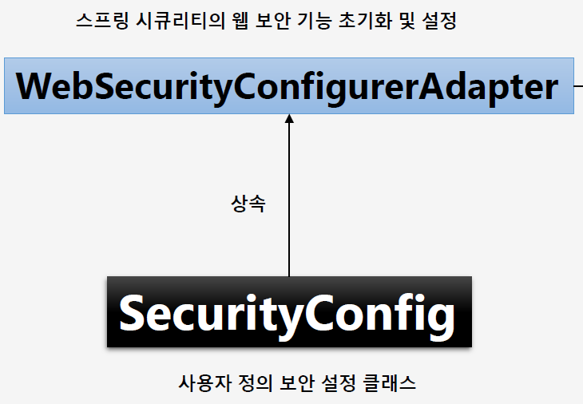
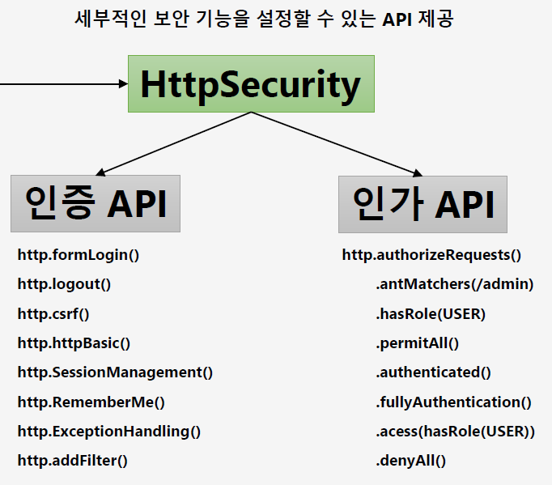

# <a href = "../README.md" target="_blank">Core Spring Security</a>
## Chapter 01. 스프링 시큐리티 기본 API 및 Filter 이해
### 1.02 사용자 정의 보안 기능 구현
1) WebSecurityConfigurerAdapter
2) HttpSecurity : 보안 설정 편의 API 제공
3) 사용자 정의 보안 기능 구현하기
4) 디폴트 자격증명 사용자 id, password 지정

---

# 1.02 사용자 정의 보안 기능 구현

---

## 1) WebSecurityConfigurerAdapter



```shell
SecurityBuilder <- SecurityConfigurer <- WebSecurityConfigurer <- WebSecurityConfigurerAdapter
```
- 대부분의 기본 보안 기능은 WebSecurityConfigurerAdapter를 통해 구현되어 있다.
- 이를 상속하여 인증/인가 등의 메서드를 오버라이드하여, 커스텀한 보안 기능을 구현하면 된다.

---

## 2) HttpSecurity : 보안 설정 편의 API 제공



- Http 요청에 대한 보안을 설정할 수 있는 클래스
- 인증(Authentication), 인가(Authorization) 관련하여 여러가지 설정들을 할 수 있는 API를 제공한다.

---

## 3) 사용자 정의 보안 기능 구현하기
```java
@Configuration
@EnableWebSecurity
public class SecurityConfig extends WebSecurityConfigurerAdapter {

    @Override
    protected void configure(HttpSecurity http) throws Exception {
        // 인가 정책 : 모든 요청 -> 인증 필요
        http.authorizeRequests(requests -> requests.anyRequest().authenticated());

        // 인증 정책 : Form 로그인 방식으로 인증
        http.formLogin();
    }
}
```
- `@EnableWebSecurity` : 이 어노테이션을 `@Configuration`이 걸린 클래스에 추가 하여 기본 클래스를
확장하고, 개별 메서드를 오버라이드하여 스프링 보안 구성을 정의할 수 있다.
- `configure(HttpSecurity http)` : 이 메서드를 오버라이드하여, 커스텀 보안 기능을 구현할 수 있다.
  - 인가(권한부여): 모든 요청에 인증을 필요로 함
  - 인증: 폼 로그인 방식으로 인증

---

## 4) 디폴트 자격증명 사용자 id, password 지정
```yaml
spring:
  security:
    user:
      name: user
      password: 1111

```
- 자격증명이 있는 사용자(name: user, password: 랜덤) 스프링 시큐리티가 자동으로 생성하는데,
실습의 편의를 위해 name, password를 수동으로 지정하였다.

---
