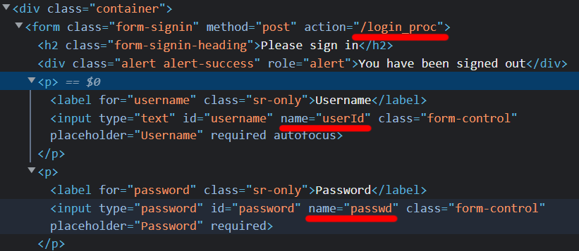

# <a href = "../README.md" target="_blank">Core Spring Security</a>
## Chapter 01. 스프링 시큐리티 기본 API 및 Filter 이해
### 1.03 Form Login 인증
1) Form Login 흐름
2) Form Login 관련 스프링 시큐리티 API

---

# 1.03 Form Login 인증

---

## 1) Form Login 흐름


1. 사용자가 GET 메서드로, `/home`으로 접근
2. 사용자는 인증 권한이 없으므로 로그인 페이지로 리다이렉트
3. Form을 통해 POST 메서드로 로그인(username + password) 시도
   - 인증 정보가 맞을 경우, 인메모리에 session 및 인증 토큰을 생성, 저장
4. 사용자는 이후 요청할 때마다, 세션에 저장된 인증 토큰으로 접근, 인증 유지

---

## 2) Form Login 관련 스프링 시큐리티 API

### 2.1 Form Login API
```java
    @Override
    protected void configure(HttpSecurity http) throws Exception {
        // 인가 정책 : 모든 요청 -> 인증 필요
        http.authorizeRequests(requests -> requests.anyRequest().authenticated());

        // 인증 정책 : Form 로그인 방식으로 인증
        http.formLogin()
                .loginPage("/loginPage")
                .defaultSuccessUrl("/")
                .failureUrl("/login")
                .usernameParameter("userId")
                .passwordParameter("passwd")
                .loginProcessingUrl("/login_proc")
                .successHandler(loginSuccessHandler())
                .failureHandler(loginFailureHandler())
                .permitAll(); // form 로그인과 관련된 요청은 모두 허락
    }
```


- `http.formLogin()` : Form 로그인 인증 기능이 동작함
- `http.loginPage(...)` : 로그인 페이지 화면 경로 지정
- `http.defaultSuccessUrl(...)` : 로그인이 성공한 이후에 이동할 페이지 경로
- `http.failureUrl(...)` : 로그인 실패 후 이동할 페이지 경로
- `http.usernameParameter("태그명")` : form 태그 안에서 username에 해당하는 값을 의밋값으로 변경하면 "태그명"을 똑같이 적어야 함
- `http.passwordParameter("태그명")` : form 태그 안에서 password에 해당하는 값을 의밋값으로 변경하면 form "태그명"을 똑같이 적어야 함
- `http.loginProcessingUrl(...)`: form 태그 안에서 action 정보 url(로그인 Post 요청 url). form 정보와 값이 동일해야 함.
  - `username`, `password`, `action url` 3개 값은 form 태그와 같아야함.
  - 여기서는 기본 페이지가 제공되는데, 기본 페이지의 parameter 값이 우리가 명시한 파라미터명으로 하여 생성된다.
  

- `http.successHandler(...)` : 로그인 성공했을 때 호출할 핸들러
- `http.failureHandler(...)` : 로그인 실패했을 때 호출할 핸들러 
  - 핸들러는 로그인 성공, 실패 이후 할 작업을 명시할 수 있음
- `.permitAll()` : form 로그인과 관련된 요청은 모두 허락

### 2.2 successHandler
```java
    private static AuthenticationSuccessHandler loginSuccessHandler() {
        return (request, response, authentication) -> {
            log.info("authentication : {}", authentication.getName());
            response.sendRedirect("/");
        };
    }
```
- 인증에 성공했을 때 적용할 로직을 이곳에서 구현

### 2.3 failureHandler
```java
    private static AuthenticationFailureHandler loginFailureHandler() {
        return (request, response, exception) -> {
            log.info("exception : {}", exception.getMessage());
            response.sendRedirect("/login");
        };
    }
```
- 인증에 실패했을 때 적용할 로직을 이곳에서 구현

---
