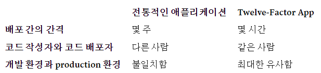
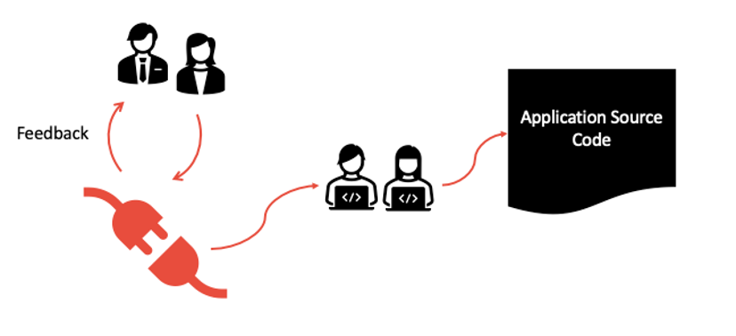

# <a href = "../README.md" target="_blank">Spring Cloud로 개발하는 마이크로서비스 애플리케이션(MSA)</a>
## Chapter 01. Microservice와 Spring Cloud의 소개
### 1.4 12 Factors
1) Codebase : 코드베이스
2) Dependencies : 명시적인 종속성 선언 및 격리
3) Config : 환경설정의 외부 관리
4) Backing services : 보조 서비스를 연결된 리소스로 취급한다
5) Build, release, run : 빌드, 릴리즈, 실행 단계를 엄격히 분리하라
6) Stateless Processes : 무상태 프로세스
7) Port binding : 포트 바인딩을 통한 프로세스 격리, 구별
8) Concurrency : 프로세스 모델(Process Model)을 통한 수평 확장
9) Disposability : 빠른 시작/종료, graceful shutdown을 통한 안정성 극대화
10) Dev/prod parity : 서비스의 개발/스테이징/운영 환경을 최대한 비슷하게 유지
11) Logs : 로그를 이벤트 스트림으로 처리하고, 실행환경에서 수집하여 외부에 병합
12) Admin processes : 어드민, 메인터넌스 작업을 일회성 프로세스로 실행
13) API First : API의 명확한 설계가 중요하다.
14) Telemetry : 원격 분석
15) Authentication and authorization : 인증과 인가

---

# 1.4 12 + 3 Factors
- 클라우드 애플리케이션을 구축함에 있어 고려해봐야할 12가지 항목들 : https://12factor.net/
- Beyond the 12 factors: 15-factor cloud-native Java applications : https://developer.ibm.com/articles/15-factor-applications/

---

## 1) Codebase : 코드베이스
> One codebase tracked in revision control, many deploys  
> "버전 관리되는 하나의 코드베이스와 다양한 배포"  

### 1.1 하나의 코드 베이스에 하나의 애플리케이션
- 소스 코드를 버전 관리(VCS)되는 리포지토리에 두어, 추적하게 하고 관리하게 할 수 있는데, 이렇게 관리되는 소스 코드를 코드베이스라고 한다.
- 12 factors를 준수하는 애플리케이션은 1개의 버전관리 되는 코드 베이스를 가진다.
- 개발환경/스테이징/프로덕션 환경에 배포할 때 코드의 통일된 관리가 필요한데 이를 위해 반드시 하나의 코드 베이스를 사용하는 원칙을 지켜야한다.
- 코드 베이스와 애플리케이션의 관계는 1:1이며, 여러 애플리케이션이 하나의 코드베이스를 공유하는 것은
12 factors를 위반하는 것이다.

### 1.2 하나의 코드 베이스를 기반으로 여러 곳에 배포
애플리케이션의 코드베이스는 한개여야 하지만, 이를 기반으로 동작하는 애플리케이션은 여러 곳에 배포할 수 있다.
- 개발 서버(테스트 서버) : 개발자들이 사용하는 서버.
- 스테이징 서버 : 실제 운영환경의 데이터를 특정 주기마다 덤프를 떠서 데이터까지 실제 운영과 거의 비슷하게 맞추는 서버
- 운영 서버 : 실제 운영되어, 사용자들이 이용하는 서버
- 개발자 자신의 로컬 개발 환경에서 애플리케이션을 실행하는 것 역시 배포라고 할 수 있다.

### 1.3 버전 관리 시스템(VCS)을 통해 관리
- 버전관리 시스템을 통해 소스코드의 변화를 추적할 수 있다.
- 배포마다 다른 버전이 활성화 될수 있지만, 코드베이스 자체는 모든 배포에 대해 동일하다.
예를 들어, 개발자는 아직 스테이징 환경에 배포하지 않은 커밋이 있을 수 있으며, 스테이징 환경에는 아직 운영 환경에 배포되지 않은 커밋이 있을 수 있다.
하지만 이 모든 것들이 같은 코드베이스를 공유하고, 같은 앱의 다른 배포라고 할 수 있다.

---

## 2) Dependencies : 명시적인 종속성 선언 및 격리
> Explicitly declare and isolate dependencies  
> '명시적으로 선언되고, 격리된 의존성'

### 2.1 Dependency : 종속성, 의존성, 의존관계
- 앱의 개발, 실행에 필요한 라이브러리들에 대한 의존 관계
- 대부분의 언어들은 라이브러리 배포를 패키징 시스템을 제공한다.
- java는 gradle, maven과 같은 툴 및 그 설정 파일을 이용해 의존 라이브러리를 관리하고, 빌드할 수 있다.

### 2.2 모든 종속성은 명시적으로 선언하고, 시스템 환경과 격리해야한다.
- Twelve-Factor App은 전체 시스템에서, 특정 패키지가 '암묵적으로 존재하는 것'에 절대 의존하지 않는다.
- 여기서 말하는 암묵적인 것이라 함은, 그 애플리케이션의 실행 환경의 요소가 될 수 있고, 별도로 선언하지 않고 시스템 환경에
특정 라이브러리를 설치하여 이를 사용하게 하는 것이 될 수 있다.
- 예를 들어, curl과 같은 시스템 명령어는 대부분의 시스템 환경에 존재하지만, 모든 시스템에 존재하는 것이 보장되는 것은 아니다. 미래의 시스템에서는 존재하지 않을 수 있으며,
호환되는 버전이 있으라는 보장도 없다. 애플리케이션에게 시스템 환경의 도구가 필요하다면, 그 도구를 애플리케이션과 통합해야한다.

### 2.3 명시적인 종속성 선언, 분리의 장점
- 애플리케이션 개발에 새로 참가하게 된 개발자가 설치를 간단하게 할 수 있다.
- 새로 참여한 개발자는 애플리케이션의 코드베이스를 개발 머신에 체크아웃 하고, 언어의 런타임 환경과, Dependencies 매니저만 미리 설치하면 된다.
- 개발자는 정해져있는 빌드 명령어만 입력하면 애플리케이션의 코드를 실행하는 데 필요한 모든 것을 설치할 수 있다. 
예를 들어, Ruby의 빌드 명령어는 `bundle install`이며, `Clojure/Leiningen`에서는 `lein deps`이다.

### 2.4 어떻게 준수하는가?
- `pom.xml`, `build.gradle`, `package.json` 과 같은 파일에 명시적으로 Dependencies를 명시한다.

---

## 3) Config : 환경설정의 외부 관리
> Store config in the environment  
> "설정을 환경에 보관하라"

### 3.1 Config : 환경 설정, 배포 환경마다 달라질 수 있는 모든 것들
- 여기서 말하는 Config(환경 설정)은 배포 환경(스테이징, 프로덕션, 개발 환경 등)마다 달라질 수 있는 모든 것들을 말한다.
- 예를 들어 데이터베이스 접근 설정, S3, OAuth2 등 외부 서비스 인증 정보, 특정 배포환경의 호스트명/실행 포트번호 등이 이에 해당된다.
- 애플리케이션 내부에서 사용하는 설정이나, 소스 코드 모듈이 서로 연결되는 방식을 정의한 코드들은 환경 설정에 해당하지 않는다.
대표적으로 Spring IoC 컨테이너에서 사용하는 Bean Configuration 등이 이에 해당한다.
- 이 기준이 헷갈리면 "소스 코드를 언제든지 오픈 소스로 만들 수 있는가?"를 생각해본다.

### 3.2 설정은 코드 베이스에 포함되어선 안 된다.
- 설정은 애플리케이션을 실행하는 환경 각각마다 각각 달라질 수 있으므로 코드 베이스에 포함해선 안 된다.
- 필요한 환경 설정값을 각 환경 측에서 자신에 맞게 작성하고 연결하여 사용할 수 있도록 해야한다.
- **각 환경에서 적절한 설정값을 연결하기만 하면, 동일한 배포가 전파될 수 있다.**

### 3.3 실현하는 방법
- 방법1 : 설정 정보를 외부 파일로 분리하고 이를 배포에 포함하지 않게 하기
  - 버전 관리 시스템에 등록되지 않은 설정 파일(`application.yml, ...`)을 이용하는 것
  - 실수로 코드 베이스에 함께 포함되어 배포될 수 있는 위험성이 존재한다.
  - 설정 파일이 여러 위치에 여러 포맷으로 작성될 수 있고, 모든 설정을 한 곳에서 확인하고 관리하기 어렵게 만드는 경향이 있다.
  - 게다가, 이러한 형식들은 언어와 프레임워크에 맞게 종속되는 경향이 있다.
- 방법2 : 배포 환경의 환경변수에 설정 값을 저장하기
- 방법3 : Spring Cloud Config 과 같은, 구성 관리 도구를 이용

---

## 4) Backing services : 보조 서비스를 연결된 리소스로 취급한다
> Treat backing services as attached resources   
> "보조 서비스를 연결된 리소스로 취급하라"

### 4.1 Backing Service (보조 서비스)
- 애플리케이션 정상 동작 중 네트워크를 통해 이용하는 모든 서비스
- DB(MySQL, Oracle, ...), 캐싱(MemCached, ...), 메시징 서비스 브로커(RabbitMQ, ...) , ...
- 로컬 보조 서비스 : 애플리케이션의 런타임을 동일한 시스템 관리자가 관리하는 서비스(자사 관리하는 서비스, 예를 들면 데이터베이스 등)
- 서드파티 보조 서비스 : 타사의 제3자에 의해 관리되고 제공되는 서비스

### 4.2 로컬 보조 서비스와, 서브파티 보조 서비스를 구분하지 않고, 그저 연결된 리소스로 취급한다.
- 12 factors를 준수하는 애플리케이션은 로컬 서비스와 타사의 서드파티 서비스를 구분하지 않는다.
이들 모두 애플리케이션에 연결된 리소스로 간주한다.
- config에 저장된 url 또는 기타 로케이터/자격증명을 통해 연결하여 연결된 리소스에 접근한다.

### 4.3 느슨한 결합, 편리한 보조 서비스 분리/교체
- 설정 정보를 변경하기만 하면 애플리케이션 코드를 변경하지 않고 사용하는 보조 서비스를 다른 서비스로 교체할 수 있다.
- 데이터베이스를 사용하다가, 성능 이슈나 하드웨어적인 문제가 발생하였다면 최신 백업으로부터 새로운 데이터베이스 서버를 시작하게 하고 이쪽에 연결하는 식으로 교체할 수 있다.
로컬 DB를 사용하다가, 서드 파티의 Amazon RDS로 전환할 수 있다.

---

## 5) Build, release, run : 빌드, 릴리즈, 실행 단계를 엄격히 분리하라
> Strictly separate build and run stages  
> "빌드, 실행 단계를 엄격하게 분리하라."

코드 베이스는 이하의 3단계를 거쳐, (개발용이 아닌) 배포 결과물로 변환된다.

### 5.1 build (빌드 단계)
- 코드 베이스를 실행 가능한 빌드 결과물인 'build'로 변환하는 단계(jar 파일로 생각하면 될듯. 아래의서 문맥을 볼 때 이걸 '릴리즈'라고도 하는 듯)
- 빌드는 새로운 코드가 배포 될 때마다 개발자에 의해 시작된다.
- 커밋된 코드 중, 배포 프로세스에서 지정된 버전을 이용하여 빌드한다.
- 이 시점에 종속성(dependencies)들을 가져와, binary, assert 들과 결합하여 컴파일한다.

### 5.2 release(릴리즈 단계)
- 이전의 빌드 단계에서 만들어진 build(예 : jar파일...)와 배포의 현재 환경설정을 결합함
- 완성된 릴리즈와 Config을 포함하여, 실행환경에서 바로 실행될 수 있도록 준비된다.

### 5.3 run(실행 단계)
- 흔히 런타임이라 부르는 단계
- 선택된 realease에 대하여, 일부 앱 프로세스 집합을 실행하여 실행환경에서 애플리케이션을 실행한다.
- 애플리케이션을 실행 환경에서 실제로 실행함. 

### 5.4 한번 단계를 거치면 되돌릴 수 없고(불가역), 새로 변경하려면 다시 새로운 릴리즈를 빌드해야한다.
- 한번 단계를 거치면, 이전 단계로 되돌릴 수 없다. 릴리즈는 추가만 가능하고, 변경할 수 없다.
- 즉, 릴리즈(단계로서의 릴리즈)나 실행단계에서 코드가 변경되지 않는다. 변경 사항을 빌드단계로 다시 전파할 방법이 없기 때문이다.
- 새로 변경하려면, 다시 새로운 릴리즈를 빌드해야한다.

### 5.5 매 릴리즈는 유일해야한다.
- 모든 릴리즈는 항상 유니크한 릴리즈 id를 지녀야 한다.
- 예를 들어, 릴리즈 시점의 타임 스탬프(예: 2011-04-06-20:32:17)나
증가하는 번호(예: v100, v101) 등으로 식별자를 지정하면 된다.

### 5.6 릴리즈 관리 도구 
- 배포 도구는 일반적으로 릴리즈 관리 도구를 제공한다.
- 릴리즈 관리 도구의 가장 대표적인 기능은 롤백 기능이 있다. 예를 들어, Capistrano라는 배포 툴은
릴리즈를 releases라는 하위 디렉토리에 저장시키고, 현재 릴리즈는 현재 릴리즈 디렉토리로 심볼릭 링크로 연결한다.
이 툴의 rollback 명령어는 이전 버전으로 쉽고 빠르게 이전 릴리즈로 롤백할 수 있도록 해준다.
- CI/CD 툴에서 위의 build-release-run 단계의 역할들을 수행해준다고 보면 된다.

---

## 6) Stateless Processes : 무상태 프로세스
> Execute the app as one or more stateless processes  
> "애플리케이션을 하나 혹은 여러개의 무상태 프로세스로 실행"

### 6.1 무상태(stateless) 
- 12 factor를 만족하는 프로세스는 무상태(stateless)이며, 각 프로세스들은 아무 것도 공유하지 않는다.

### 6.2 프로세스의 메모리 공간, 파일 시스템은 단일 트랜잭션을 위해서만 사용되어야한다.
- 짧은 단일 트랙잭션 내에서, 캐시로 프로세스의 메모리 공간이나 파일시스템을 사용해도 된다.
- 큰 파일을 받고, 해당 파일을 처리하고, 그 결과를 데이터베이스에 저장하는 트랜잭션이 이에 해당된다.

### 6.3 매 요청-응답 트랜잭션이 종료되면 프로세스의 메모리, 디스크에 상태가 남아선 안 된다.
- **절대로 메모리나 디스크에 캐시된 내용이 미래의 요청이나 작업에서도 유효할 것이라고 가정해서는 안 된다.**
- 12 factors 애플리케이션은 메모리나 디스크에 캐시된 모든 항목이 향후 요청 또는 작업에서 사용 가능하다고 가정하지 않는다.
- 하나의 마이크로서비스를, 하나의 프로세스로만 실행하는 경우에도 다시 시작(코드 배포, 구성 변경 또는 프로세스를 다른 물리적 위치로 재배치하는 실행 환경에 의해 트리거됨) 시
일반적으로 모든 로컬(예: 메모리 및 파일 시스템) 상태를 지우게 된다. 캐싱된 메모리가 언제든 지워질 수 있다.
- 대표적으로 일부 웹 애플리케이션 '고정 세션' 방식은 애플리케이션 메모리에 사용자의 세션 데이터를 캐싱하고 동일한 방문자의 향후 요청이 동일한 프로세스로 라우팅될 것을 전제로 작동되는데
이는 12 factors를 위반하는 것이며 절대 사용하거나 의존해서는 안 된다.

### 6.4 유지될 필요가 있는 데이터, 세션 상태 데이터들은 다른 보조 서비스를 사용해야 함
- 유지될 필요가 있는 모든 데이터는 데이터베이스 같은 안정된 보조 서비스에 저장되어야 한다.
- 지속적으로 저장해야 할 데이터는 데이터베이스에 보관하고, 세션 상태를 가지는 데이터들은 Memcached 또는
Redis 와 같이, 만료 시간을 제공하는 데이터 저장소에 보관하면 된다.
- 여러 프로세스에서 데이터를 동기화할 때는 위의 보조 서비스를 통해 가져오면 된다.

---

## 7) Port binding : 포트 바인딩을 통한 프로세스 격리, 구별
> Export services via port binding  
> "서비스를 포트 바인딩을 통해 내보내야한다."

### 7.1 다른 방식 : 웹 서버 컨테이너 안의 웹 애플리케이션
- 웹 애플리케이션은 외부 컨테이너 내부에서 실행되기도 한다.
- 예를 들어 PHP 앱은 Apache HTTPD의 내부 모듈로서 실행될 수도 있고, 기존 Java 앱은 Tomcat 컨테이너 내부에서 실행될 수도 있다.
- 즉, 위의 방식은 프로세스가 외부 컨테이너에 종속적이다. 제대로 동작하기 위해서는 외부 환경인 웹 서버 컨테이너에 의존해야한다.

### 7.2 자체 완결성 : 스스로 특정 포트에 바인딩하여 요청을 기다림
- 12 factors 애플리케이션은 자체 완결성을 가진다.
- 웹에 노출되는 서비스를 만들기 위해, 컨테이너가 실행 환경에 웹 서버 런타임 주입하는 것을 의지하지 않는다.
- 웹 애플리케이션은 자신 스스로 특정 포트에 바인드 하는 것으로 HTTP를 서비스로서 공개해, 그 포트에 요청이 오는 것을 기다린다.

### 7.2 각각을 특정 포트에 바인딩함으로서 각각의 프로세스를 격리, 구별할 수 있음
- 각 프로세스 별로 고유한 특정 포트에 바인딩 함으로서 서로를 격리, 구별할 수 있게 된다.
- 예를 들면 로컬 개발 환경에서는 `http://localhost:8080`과 같은 주소를 통해 개발자가 애플리케이션 서비스에
접근할 수 있고, 8081, 8082, ... 포트 번호를 통해 각각의 서비스를 구별할 수 있다.

### 7.3 배포 환경 : 웹 서버 라이브러리를 통하여 요청을 라우팅
- 배포 환경에서는 Routing Layer의 웹 서버 라이브러리에서 외부에 공개된 호스트명으로 들어온 요청을 바인딩 된
웹 프로세스에 전달하도록 한다. 예를 들어 80번 포트로 들어온 요청을 8080, 8081, 8082번에 바인딩된 웹 프로세스에
요청을 전달할 수 있다.
- 이는 일반적으로 dependency 선언을 통해, 웹 서버 라이브러리를 애플리케이션에 추가함으로서 구현된다.

### 7.4 각각의 프로세스를 격리, 구별(식별)할 수 있기에 다른 애플리케이션의 보조 서비스가 될 수 있다.
- 포트 바인딩을 통해 각각의 애플리케이션을 식별할 수 있다는 것은, 하나의 애플리케이션이 다른 애플리케이션을 위한
보조 서비스가 될 수 있다는 것을 의미한다.
- 서비스를 식별할 수 있는 URL(라우팅 URL로 추정)을, 다른 애플리케이션의 환경설정(Config)에 리소스 핸들로 추가함으로서 애플리케이션이 다른 애플리케이션을
백엔드 서비스로 사용할 수 있다.

---

## 8) Concurrency : 프로세스 모델(Process Model)을 통한 수평 확장
> Scale out via the process model  
> "프로세스 모델을 통한 수평 확장"

### 8.1 웹 애플리케이션의 다양한 실행 방식
- PHP 프로세스 : Apache의 자식 프로세스로 실행됨. 요청량에 따라 필요한 만큼 시작된다.
- Java 프로세스 : JVM이 시작될 때 큰 시스템 리소스(CPU와 메모리) 블록을 예약하는 하나의 거대한 부모 프로세스를 제공하고,
내부 스레드를 통해 동시성(concurrency)을 관리한다.
- 두 경우 모두 실행중인 프로세스가 애플리케이션 개발자에게 최소한으로만 노출된다.

### 8.2 프로세스 모델

- https://adam.herokuapp.com/past/2011/5/9/applying_the_unix_process_model_to_web_apps/
- 12 factors 애플리케이션에서의 프로세스는 작업을 적절한 '프로세스 타입'에 할당하여, 다양한 작업 부하를 처리할 수 있도록 설계
- 단순한 HTTP 웹요청은 웹 프로세스가 처리하고, 시간이 오래 걸리는 백그라운드 작업은 worker 프로세스가
처리할 수 있도록 할 수 있음
- 여러개의 물리적인 머신에서 돌아가는 여러개의 프로세스로 넓게 퍼지는 아키텍쳐를 권장 (수평 확장 권장)
- 런타임 VM 내부의 스레드(java, ...)나 EventMachine, Twisted, Node.js에서 구성된 것 처럼
async/evented 모델처럼 개별 프로세스가 내부적으로 동시에 처리하는 것을 금지하는 것은 아니다. 하지만
이 방식은 개별 VM이 너무 커질 수 있다.

### 8.3 수평 확장(Scaling Out)
- 수평 확장(Scale Out) : 많은 수의 동일한 프로세스를 복사해서 확장
- 하나의 서비스가 여러가지 인스턴스에 동일한 형태로 복사되어 운영됨으로서 부하분산을 할 수 있음
- 같은 서비스를 여러 프로세스로 동시 운영되기에 동시성, 확장성을 가질 수 있다. 위에서 언급한 '무상태 프로세스 원칙'을 유지하면
동시성을 유지하면서 확장하는데 어려움이 없다.

---

## 9) Disposability : 빠른 시작/종료, graceful shutdown을 통한 안정성 극대화
> Maximize robustness with fast startup and graceful shutdown  
> "빠른 시작과 그레이스풀 셧다운(graceful shutdown)을 통한 안정성 극대화"

### 9.1 Disposability : 프로세스를 빠르게 시작하고, 삭제할 수 있어야함.
- Disposability : 처분의 용이성
- 12 factors 프로세스는 간단하게 폐기 가능하다. 즉, 프로세스는 바로 시작하거나 종료될 수 있어야 한다.
- 이러한 속성은 신축성 있는 확장과 코드나 설정의 변화를 빠르게 배포하는 것을 쉽게 하며, production 배포를 안정성 있게 해준다.
- 시작 시간을 최소화하도록 노력해야한다. 이상적으로, 프로세스는 실행 커맨드가 실행된 뒤 몇 초만에 요청이나 작업을 받을 수 있도록 준비 되어야 한다.
- 짧은 실행 시간은 릴리즈 작업과 확장(scale up)이 더 민첩하게 이루어질 수 있게 한다.
또한 프로세스 매니저가 필요에 따라 쉽게 프로세스를 새로운 머신으로 프로세스를 옮길 수 있기 때문에 안정성도 높아진다.

### 9.2 graceful shutdown
- Graceful Shutdown : 애플리케이션 서버 종료 신호가 들어왔을 때 바로 종료하지 않고, 기존 수행 중인 요청을 완전히 처리한 이후 서버를 종료하는 것
- 프로세스는 프로세스 매니저로부터 프로세스 종료 신호(SIGTERM) 신호를 받았을 때 그레이스풀 셧다운(graceful shutdown)을 해야한다.
- 웹 프로세스의 그레이스풀 셧다운 과정에서는 서비스 포트의 수신을 중지하고(그럼으로써 새로운 요청을 거절함),
현재 처리 중인 요청이 끝나길 기다린 뒤에 프로세스가 종료 되도록 해야한다.
이 모델은 암묵적으로 HTTP 요청이 짧다는 가정(기껏해야 몇 초)을 전제로 하고 있다. long polling의 경우에는 클라이언트가 연결이 끊긴 시점에 바로 다시 연결을 시도해야 한다.
  - long polling : [참조 링크](https://kamang-it.tistory.com/entry/Webhttp%ED%86%B5%EC%8B%A0%EC%9D%84-%EC%9D%B4%EC%9A%A9%ED%95%9C-%EC%96%91%EB%B0%A9%ED%96%A5-%ED%86%B5%EC%8B%A0%EA%B8%B0%EB%B2%95-long-polling)
- worker 프로세스의 경우, 그레이스풀 셧다운은 현재 처리중인 작업을 작업 큐로 되돌리는 방법으로 구현된다.
예를 들어, RabbitMQ에서는 worker는 NACK을 메시지큐로 보낼 수 있다.
Beanstalkd에서는 woker와의 연결이 끊기면 때 자동으로 작업을 큐로 되돌린다.
Delayed Job와 같은 Lock-based 시스템들은 작업 레코드에 걸어놨던 lock을 확실하게 풀어놓을 필요가 있다.
- 이 모델은 암묵적으로 모든 작업은 재입력 가능(reentrant)하다고 가정한다. 이는 보통, 결과를 트랜잭션으로 감싸거나 요청을 멱등(idempotent)하게 함으로써 구현될 수 있다.

### 9.3 컨테이너 제품 사용 사용
- 도커, containerd, 클리오 등의 제품을 사용하여, 서비스 인스턴스 등록, 실행, 삭제 등을 쉽게 할 수 있다.

---

## 10) Dev/prod parity : 서비스의 개발/스테이징/운영 환경을 최대한 비슷하게 유지 
> Keep development, staging, and production as similar as possible  
> "development, staging, production 환경을 최대한 비슷하게 유지"

### 10.1 기존 방식 : 개발환경과 배포 환경의 크나큰 gap
- 시간 gap : 개발자가 작성한 코드는 프로덕션에 반영되기까지 며칠, 몇 주, 때로는 몇 개월이 걸릴 수 있었다.
- 담당자 gap : 개발자가 작성한 코드를 시스템 엔지니어가 배포한다.
- tool gap : 프로덕션 배포는 apache, mysql, linux 등을 사용하는데 개발자는 nginx, h2 db, macOS를 사용하는 등의
차이가 존재한다.

### 10.2 development 환경과 production 환경의 차이를 작게 유지하여 지속적인 배포가 가능하도록 디자인

- 시간의 gap 최소화: 개발자가 작성한 코드는 몇 시간, 심지어 몇 분 후에 배포됩니다.
- 담당자의 gap 최소화: 코드를 작성한 개발자들이 배포와 production에서의 모니터링에 깊게 관여
- tool gap 최소화: 개발과 production 환경을 최대한 비슷하게 유지

### 10.3 가벼운 로컬 서비스를 사용하는 대신, 약간 무겁더라도 개발 환경/프로덕션 환경을 일치시키는 것이 낫다.
- 각각의 언어별로 다른 보조 서비스 구현체를 추상화한 어댑터 라이브러리를 제공한다는 점에 착안해 로컬 개발 환경에서는 가벼운 보조 서비스를
사용하고, 프로덕션에서는 무거운 보조 서비스를 사용한다거나, 개발 중에는 로컬 메모리를 캐싱용으로 사용하고 프로덕션 환경에서는 Redis, Memcached를
사용하는 경우가 종종 있다.
- 하지만 이론적으로는 어댑터가 보조 서비스 간의 차이를 추상화해준다거나, 가벼운 로컬 
보조 서비스 간의 약간의 불일치로 인해 개발 환경과 스테이징 환경에서는 동작하고 테스트에 통과된 코드가 production 환경에서 오류를 일으킬 수 있다.
이런 종류의 오류는 지속적인 배포를 방해한다. 애플리케이션의 생명 주기 전체를 보았을 때, 이러한 방해와 지속적인 배포의 둔화가
발생시키는 손해는 엄청나게 크다.
- 가벼운 로컬 서비스는 예전처럼 필수가 아니다. Memcache, PostgreSQL, RabbitMQ와 같은 현대적인
보조 서비스들은 Homebrew나 apt-get와 같은 현대적인 패키징 시스템 덕분에 설치하고 실행하는데 아무런 어려움이 없다.
혹은 Chef and Puppet와 같은 선언적 provisioning 툴과 Vagrant등의 가벼운 가상 환경을 결합하여 로컬 환경을 production 환경과 매우 유사하게 구성할 수 있다.
dev/prod 일치와 지속적인 배포의 이점에 비하면 이러한 시스템을 설치하고 사용하는 비용은 저렴하다.
- 여러 백엔드 서비스에 접근할 수 있는 어댑터는 여전히 유용하긴 하다. 새로운 백엔드 서비스를 사용하도록 포팅하는 작업의 고통을 낮춰주기 때문이다.
하지만, 모든 애플리케이션의 배포들(개발자 환경, 스테이징, production)은 같은 종류, 같은 버전의 보조 서비스를 이용하는 것이 낫다.

---

## 11) Logs : 로그를 이벤트 스트림으로 처리하고, 실행환경에서 수집하여 외부에 병합
> Treat logs as event streams  
> 로그를 이벤트 스트림으로 처리

### 11.1 기존 방식의 로그(Log)
- 로그는 실행 중인 app의 동작을 확인할 수 있는 수단이다. 서버 기반 환경에서 로그는 보통 **디스크에 파일(로그 파일)로 저장한다.**
- 로그는 모든 실행중인 프로세스와 백그라운드 서비스의 아웃풋 스트림으로부터 수집된 이벤트가 시간 순서로 정렬된 스트림이다.
가공되지 않는 로그는 보통, 하나의 이벤트가 하나의 라인으로 기록된 텍스트 포맷이다.
(예외(exception)에 의한 backtrace는 여러 라인에 걸쳐 있을 수도 있다.)
- 로그는 고정된 시작과 끝이 있는 것이 아니라, app이 실행되는 동안 계속 흐르는 흐름이다.
- 하지만 각각의 애플리케이션이 로깅을 수행하게 됐을 경우 애플리케이션 각각이 로그를 작성하기 때문에 로그가 분산되고,
한 요청에 대한 로그를 연결지어 트랜잭션의 처음부터 끝까지 순서대로 추적해내는 것은 매우 어렵다.

### 11.2 이벤트 스트림(Event Stream)
- 이벤트 : 어떤 일이 일어났을 때, 그 사건
- 이벤트 스트림 : 사용자의 요청이 들어오고, 응답되기까지 일련의 과정을 연속된 이벤트의 흐름

### 11.3 실행환경이 이벤트 스트림 수집
- 애플리케이션은 로그 파일을 작성하거나, 관리하려고 해서는 안 된다. 대신, 각 프로세스는 이벤트 스트림을 버퍼링 없이 stdout에 출력한다.
- 로컬 개발환경에서 : 작업 중인 개발자는 애플리케이션의 동작을 관찰하기 원하면 각자의 터미널에 출력되는 이벤트 스트림을 볼 수 있다.
- 스테이징이나 production 배포에서
  - 각 프로세스의 스트림은 실행 환경(외부)에 의해서 수집된 후, 앱의 다른 모든 스트림과 병합되어 열람하거나 보관하기 위한 하나 이상의 최종 목적지로 전달된다.
  - 이러한 목적지들은 애플리케이션이 열람하거나 설정할 수 없지만, 대신 실행 환경(외부)에 의해서 완벽하게 관리된다.
  - 이를 위해 오픈 소스 로그 라우터를 사용할 수 있다.(예: (Logplex, Fluentd))

### 11.4 외부 서비스로 보내, 로그를 보다 체계적으로 관리할 수 있음
앱의 이벤트 스트림은 파일로 보내지거나 터미널에서 실시간으로 보여질 수 있다.  
가장 중요한 점은 스트림은 Splunk같은 로그 분석 시스템과 Hadoop/Hive같은 범용 데이터 보관소에 보내질 수 있다는 점이다.  
이러한 시스템은 장기간에 걸쳐 앱의 동작을 조사할 수 있는 강력함과 유연성을 가지게 된다.  
- 과거의 특정 이벤트를 찾기
- 트렌드에 대한 거대한 규모의 그래프 (예: 분당 요청 수)
- 유저가 정의한 휴리스틱에 따른 알림 (예: 분당 오류 수가 임계 값을 넘는 경우 알림을 발생시킴)

---

## 12) Admin processes : 어드민, 메인터넌스 작업을 일회성 프로세스로 실행
> Run admin/management tasks as one-off processes  
> "admin/maintenance과 같은 작업들 조차 1회성 프로세스로 실행"

### 12.1 일회성 관리, 유지보수 작업
프로세스 포메이션은 애플리케이션의 일반적인 기능들(예: Web request의 처리)을 처리하기 위한 프로세스들의 집합이다.  
이와는 별도로, 개발자들은 종종 일회성 관리나 유지 보수 작업이 필요하다. 예를 들면 다음과 같은 작업들이 이에 해당한다.
- 데이터베이스 마이그레이션(예: Django에서 `manage.py migrate`, Rail에서 `rake db:migrate`)
- 임의의 코드를 실행하거나 라이브 데이터베이스에서 앱의 모델을 조사하기 위해 콘솔을 실행한다.
대부분의 언어에서는 인터프리터를 아무런 인자 없이 실행하거나(예: python, perl)
별도의 명령어로 실행(예: ruby의 irb, rails의 rails console)할 수 있는 REPL를 제공한다.
  - REPL(Read-Eval-Print Loop) : 프로그래밍의 단일 표현식을 입력하면, 바로 평가되어 결과를 출력하는 도구
- 애플리케이션 리포지토리에 커밋된 일회성 스크립트 실행(예: php scripts/fix_bad_records.php)

### 12.2 일회성 관리 프로세스 조차도 1회성 프로세스로 실행하도록 한다. 
- 일회성 관리 프로세스는 앱 의 일반 장기 실행 프로세스 와 동일한 환경에서 실행되어야한다.
- 일회성 admin 프로세스들은 릴리즈를 기반으로 실행되며, 해당 릴리즈를 기반으로 돌아가는 모든 프로세스처럼 같은 코드베이스와 설정를 사용해야 한다.
- admin 코드는 동기화 문제를 피하기 위해 애플리케이션 코드와 함께 배포되어야 한다.

### 12.3 동일한 종속성 분리 기술 사용 
- 모든 프로세스 타입들에는 동일한 dependency 분리 기술이 사용되어야 한다.
- 예를 들어, 루비 웹 프로세스가 `bundle exec thin start` 명령어를 사용한다면,
데이터베이스 마이그레이션은 `bundle exec rake db:migrate` 를 사용해야한다. 마찬가지로, `virtualenv`를 사용하는 파이썬 프로그램은
`tornado` 웹 서버와 모든 `manage.py` admin 프로세스가 같은 `virtualenv`에서의 `bin/python`을 사용해야 한다?

### 12.4 REPL shell을 제공하는 언어를 강하게 선호
- 12 factor 애플리케이션은 별도의 설치나 구성없이 REPL shell을 제공하는 언어를 강하게 선호함
- 이러한 점은 일회성 스크립트를 실행하기 쉽게 만들어주기 때문
- 실행
  - 로컬 배포에서, 개발자는 앱을 체크아웃한 디렉토리에서 일회성 admin 프로세스를 shell 명령어로 바로 실행
  - production 배포에서, 개발자는 ssh나 배포의 실행 환경에서 제공하는 다른 원격 명령어 실행 메커니즘을 사용하여
  admin 프로세스를 실행

---

## 13) API First : API의 명확한 설계가 중요하다.

### 13.1 API의 명확한 설계가 중요하다.
- API가 애플리케이션 내에서 명확하게 정의되지 않으면 이 마이크로 서비스 생태계 내에서 통합 실패로 이어질 수 있다.
- 사용자(여기서는 이 api를 가져다 쓰는 다른 개발자라고 생각하면 좋을듯) 측에서 API를 어떻게 사용할 것인지를 먼저 고민해야함

### 13.2 API 설명 언어를 적극적으로 활용할 것
- API 설명 언어(API Description Language)는 API 작동 방식에 대한 계약을 설정하고 다른 이에게 설명하는데 도움이 될 수 있다. 
- API 개발자, API 디자이너 및 API 설계자가 쉽게 작성하고 읽고 이해할 수 있는 직관적인 언어다.
- 프로그래밍 언어 또는 API 구현 언어와 비교하여 API 설명 언어는 더 높은 수준의 추상화 및 선언적 패러다임을 사용한다.
- 요청에 대한 응답이 어떻게 계산되는 지 설명하는 대신, 응답되는 데이터 구조 및 형식이 무엇인지 설명한다.
- API 초기 설계 단계부터, API 규격을 정해두면 mock api를 만들고, 이 api를 사용하는 관계자들로부터 피드백을 수집하는데 유용할 수 있다.
- 대표적인 API 설명 언어의 예로는 OpenAPI, swagger, RAML 등이 있다.

---

## 14) Telemetry : 원격 분석

### 14.1 기존의 로컬 애플리케이션의 내부 분석
- 로컬에서 애플리케이션을 빌드하면 개발자가 애플리케이션 내부를 검사하고,
디버거를 실행하고, 앱 내에서 깊숙이 가시성을 제공하고 상대적으로 쉽게 동작하는 수백 가지 다른 작업을 수행할 수 있었다.

### 14.2 마이크로서비스에서의 애플리케이션 : 모니터링/ 원격 측정에 곤란
- 클라우드에서 실행되는 애플리케이션에는 위와 같은 작업들에 대한 직접 액세스 권한이 없으며 앱 인스턴스는 경고 없이 전 세계 어디든 이동할 수 있다.
이 외에도 하나의 앱 인스턴스로 시작할 수 있으며 몇 분 후에 수백 개의 애플리케이션 복사본이 실행될 수 있다.
- 이들은 모두 매우 강력하고 유용한 기능이지만 실시간 애플리케이션 모니터링 및 원격 측정에 있어 곤란한 부분이 많다.

### 14.3 별도의 툴을 통해 시각화
- 원격 측정에는 도메인별 메트릭(특정 조직, 부서 또는 팀에서 필요하거나 필요한 것)과
애플리케이션의 상태 및 시스템 메트릭이 포함될 수 있다.
  - 메트릭 : 대시보드를 볼때 특정 수치들을 그래프로 보여주는 일종의 시각화
- 상태 및 시스템 메트릭에는 애플리케이션 시작, 종료, 확장, 웹 요청 추적 및 정기 상태 확인 결과가 포함됩니다.
- 별도의 외부 툴을 통해 이를 수행한다.

---

## 15) Authentication and authorization : 인증과 인가

### 15.1 보안의 중요성
- 보안은 모든 애플리케이션 및 클라우드 환경의 중요한 부분이다.
해당 앱이 기업용인지, 모바일 장치용인지 또는 클라우드용인지에 관계없이 보안은 결코 뒤늦게 고려되어서는 안 된다.
- cloud native application은 RBAC(Role-Based Access Control : 역할 기반 액세스 제어)로 엔드포인트를 보호할 수 있다.
- 역할(Role)은 호출 클라이언트가 응용 프로그램이 요청을 수락할 수 있는 충분한 권한을 가지고 있는지 여부를 지정하고
감사 목적으로 요청한 사람을 추적하는 데 도움이 된다.

### 15.2 JWT 토큰
- 사용자를 인증, 권한 부여 및 확인하는 토큰 기반 인증 메커니즘인
MicroProfile JWT(JSON Web Token)는 이 요소를 활성화하는 데 유용한 오픈 소스 Java API가 될 수 있다.
- JWT(JSON Web Token)는 JSON 객체로 정보를 안전하게 전송하도록 설계된 독립형 토큰이다.
- 이 JSON 개체의 정보는 디지털 서명되어 있으며 받는 사람이 신뢰할 수 있고 확인할 수 있다.
- 마이크로서비스에서 토큰 기반 인증 메커니즘을 사용하면, 각각의 마이크로서비스 간에 토큰 전파를 통해 보안 제어를
좀 더 손쉽게 할 수 있게 된다.
- JWT는 잘 정의되고 알려진 표준을 따르기 때문에 가장 일반적인 토큰 형식이 되고 있다.
- MicroProfile JWT 표준은 인증 및 권한 부여에 필요한 JWT 형식을 정의한다.

---
