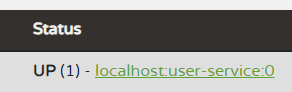

# <a href = "../README.md" target="_blank">Spring Cloud로 개발하는 마이크로서비스 애플리케이션(MSA)</a>
## Chapter 02. Service Discovery
### 2.5 User Service - 랜덤 port에 여러 인스턴스 기동
1) 랜덤 포트 실행
2) 인스턴스 id 랜덤 생성을 통해 중복 문제 해결

---

# 2.5 User Service - 랜덤 port에 여러 인스턴스 기동

---

## 1) 랜덤 포트 실행

### 1.1 랜덤 포트 설정
```yaml
server:
  port: 0 # 0으로 지정하면 랜덤 포트로 실행됨
```
- port를 0으로 지정하면 랜덤 포트로, **충돌되지 않게** 바인딩하여 실행한다.

### 1.2 실행 및 문제점

- 하나의 애플리케이션은 ide에서 실행
- 하나의 애플리케이션은 터미널에서 실행
- 이렇게 할 경우 두개의 애플리케이션이 동시에 정상적으로 실행되어 있는 것을 확인할 수 있다.
- 하지만 Eureka의 레지스트리를 확인해보면, 마지막에 실행한 인스턴스만 등록되어 있다.
- 이것은 Eureka가 `host명 - 서비스명:yml에 등록된 포트번호`로 인식하여 등록하기 때문이다.

---

## 2) 인스턴스 id 랜덤 생성을 통해 중복 문제 해결

### 2.1 인스턴스 id 랜덤 생성
```yml
eureka:
  instance:
    instance-id: ${spring.cloud.client.hostname}:${spring.application.instance_id:${random.value}}
```
- 인스턴스 각각에게 고유한 식별자를 부여할 수 있도록, `eureka.instance.instance-id` 설정에서, 매번 랜덤한 인스턴스 id를 가지도록 한다.

### 2.2 애플리케이션 여러개 기동


- 동일한 소스코드를 기반으로 애플리케이션을 두개 실행한다.
- 실행결과 두개의 인스턴스가 구별되어 등록된 것을 확인할 수 있다. 실제 포트도 각각 다르다.
- 매 순간 다른 포트에 바인딩된, 다른 이름의 인스턴스를 연속해서 생성할 수 있게 됐다.

---
