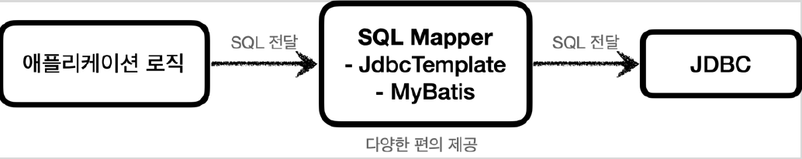

# <a href = "../README.md" target="_blank">스프링 DB 1편 - 데이터 접근 핵심 원리</a>
## Chapter 01. JDBC 이해
### 1.4 JDBC와 최신 데이터 접근 기술
1) 순수 JDBC(1997)
2) SQL Mapper
3) ORM(Object Relational Mapping)
4) 결국 모든 기술 기반에 JDBC가 있다.

---

# 1.4 JDBC와 최신 데이터 접근 기술

---

## 1) 순수 JDBC(1997)

- 애플리케이션 로직에서 JDBC 인터페이스를 호출하여 DB에 접근
- 오래된 기술이고, 사용하는 방법도 복잡하다
- 최근에는 JDBC를 직접 사용하기 보다는 JDBC를 편리하게 사용하는 다양한 기술(SQL Mapper, ORM)을 사용

---

## 2) SQL Mapper

- 애플리케이션 로직과 JDBC 중간 단계에서 여러 편의 기능을 제공함
- JDBC를 편리하게 사용하도록 도와준다.
- 대표 기술: 스프링 JdbcTemplate, MyBatis

### 2.1 SQL Mapper - 장점

- SQL 응답 결과를 객체로 편리하게 변환해준다.
- JDBC의 반복 코드를 제거해준다.
- SQL만 직접 작성하면 나머지 번거로운 일은 SQL Mapper가 대신 해결해준다.
  - SQL만 작성할 줄 알면 금방 배워서 사용할 수 있다.

### 2.2 SQL Mapper - 단점
- 여전히 개발자가 SQL을 직접 작성해야한다.

---

## 3) ORM(Object Relational Mapping)
  

- 객체(Object)를 관계형 데이터베이스 테이블(RDBMS Table)과 매핑해주는 기술 
- 자바에서는 ORM 표준 인터페이스로 JPA(Java Persistence API)를 제공하며, 이를 구현한 구현체로는 **하이버네이트**, 이클립스 링크가 있다.

### 3.1 ORM - 장점
- 개발자는 반복적인 SQL을 직접 작성하지 않고, ORM 기술이 개발자 대신에 SQL을 동적으로 만들어 실행해준다.
- SQL 자체를 작성하지 않아도 되어서 개발 생산성이 매우 높아진다.
- 각각의 데이터베이스마다 다른 SQL(데이터 베이스 방언)을 사용하는 문제도 중간에서 해결해준다.

### 3.2 ORM - 단점
- 편리한 반면에 쉬운 기술은 아니므로 실무에서 사용하려면 깊이있게 학습해야 한다.

---

## 4) 결국 모든 기술 기반에 JDBC가 있다.
- 이런 기술들도 내부에서는 모두 JDBC를 사용한다.
- JDBC를 직접 사용하지는 않더라도, JDBC가 어떻게 동작하는지 기본 원리를 알아두어야 한다. 그래야 해당 기술들을 더 깊이있게 이해할 수 있고, 무엇보다 문제가 발생했을 때 근본적인 문제를 찾아서 해결할 수 있다.
- JDBC는 자바 개발자라면 꼭 알아두어야 하는 필수 기본 기술이다.

---
