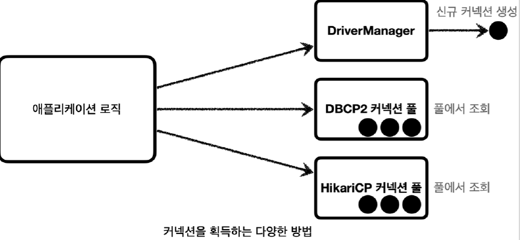
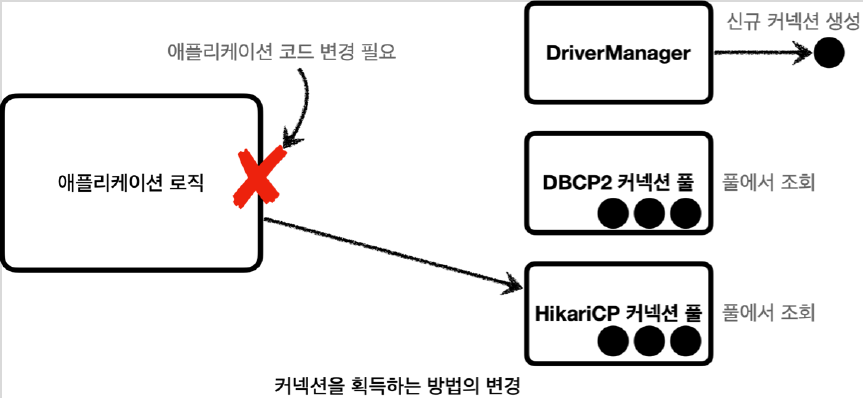
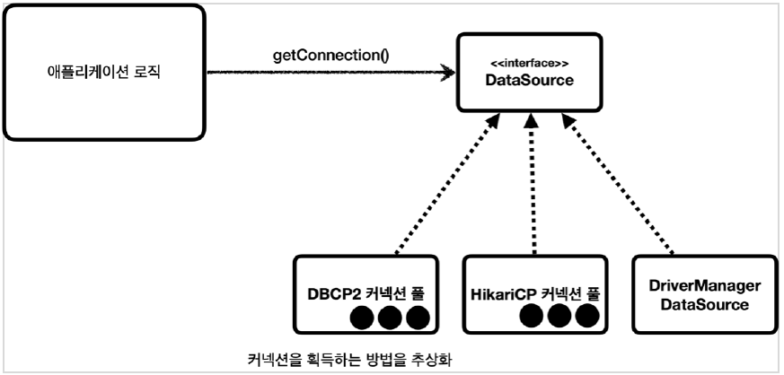

# <a href = "../README.md" target="_blank">스프링 DB 1편 - 데이터 접근 핵심 원리</a>
## Chapter 02. 커넥션 풀과 DataSource 이해
### 2.2 DataSource 이해
1) 커넥션을 획득하는 다양한 방법
2) 커넥션을 획득하는 방법을 변경 시 문제점
3) DataSource : 커넥션을 획득하는 방법을 추상화
4) 커넥션 풀 라이브러리들은 이미 DataSource를 구현함
5) DriverManagerDataSource : Spring의 지원

---

# 2.2 DataSource 이해

---

## 1) 커넥션을 획득하는 다양한 방법


- DriverManager : 요청마다 커넥션을 새로 생성 후 제거
- 각각의 커넥션 풀 라이브러리 : 커넥션 풀 방식으로 커넥션 대여, 반납

---

## 2) 커넥션을 획득하는 방법을 변경 시 문제점




- 구현(DriverManager)을 의존하고 있기 때문에 다른 구현(`HikariCP`, `DBCP2`, ...)으로 변경하려면, 변경할 때마다 클라이언트 측의 코드를 매번 변경해야한다.
  - 두 클래스의 사용법은 각각 조금씩 다를 것이기 떄문이다.

---

## 3) DataSource : 커넥션을 획득하는 방법을 추상화

```java
public interface DataSource {
    
    Connection getConnection() throws SQLException;
    
    // 다른 메서드 생략
}
```
- 자바에서는 커넥션 획득 방법을 변경할 때 생기는 문제를 해결하기 위해 `javax.sql.DataSource` 라는 인터페이스를 제공한다.
- `DataSource` 는 커넥션을 획득하는 방법을 추상화 하는 인터페이스이다. 
  - 이 인터페이스의 핵심 기능은 "커넥션 조회" 하나다.
  - 다른 일부 기능도 있지만 크게 중요하지 않다.
- 이제 애플리케이션 로직은 `DataSource` 인터페이스에만 의존하면 된다.
  - 덕분에 `DriverManagerDataSource`를 통해서 DriverManager 를 사용하다가 커넥션 풀을 사용하도록 코드를 변경(구현체 변경)해도 애플리케이션 로직은 변경하지 않아도 된다.

---

## 4) 커넥션 풀 라이브러리들은 이미 DataSource 인터페이스를 구현함
```java
public class HikariDataSource extends HikariConfig implements DataSource, Closeable {

    // 생략

    @Override
    public Connection getConnection() throws SQLException {
        // 생략
    }
}
```
- 대부분의 커넥션 풀은 DataSource 인터페이스를 이미 구현해두었다.
- 개발자는 `DBCP2 커넥션 풀`, `HikariCP 커넥션 풀`의 코드를 직접 의존하는 것이 아니라 `DataSource` 인터페이스에만 의존하도록 애플리케이션 로직을 작성하면 된다.
- 커넥션 풀 구현 기술을 변경하고 싶으면 해당 구현체로 갈아끼우기만 하면 된다.

---

## 5) DriverManagerDataSource : Spring의 지원
```java
package org.springframework.jdbc.datasource;

public class DriverManagerDataSource extends AbstractDriverBasedDataSource {
    // 생략
}
```
- `DriverManager` 는 `DataSource` 인터페이스를 사용하지 않는다.
- 따라서 `DriverManager` 는 직접 사용해야 한다. 따라서 `DriverManager` 를 사용하다가 `DataSource` 기반의 커넥션 풀을 사용하도록 변경하면 관련 코드를 다 고쳐야 한다.
- 이런 문제를 해결하기 위해 스프링은 DriverManager 도 DataSource 를 통해서 사용할 수 있도록 DriverManagerDataSource 라는 DataSource 를 구현한 클래스를 제공한다.

---

